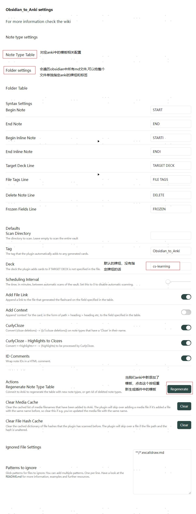

# 核心插件
## 反向链接
## 出链
## 标签列表
## 大纲
点击这里展开  默认就是这四个

## 工作区
Workspaces 插件允许您根据任务（例如日记、阅读或写作）在不同的应用程序布局之间进行管理和切换。
工作区包含有关打开的文件和窗格的信息，以及每个侧边栏的宽度和可见性。

# 第三方插件

## 编辑增强类
### Advanced Tables
使用最多的就是最实用的东西
| 姓名 | 年龄 | 性别 |
| ---- | ---- | ---- |
| 1    | 2    | 3    |
| 4    | 5    | 6    |

### 编辑时自动滚动
typewrite scroll

## 同步类
### obsidian git
如果不用官方的收费同步服务的话  git无疑是最好的选择，用了这个插件  操作能更丝滑一些，不喜欢的话其实命令行也无所谓

## 文件/附件管理类

### 文件树
file tree alternative

### consistent-attachments-and-links

[obsidian-consistent-attachments-and-links](https://github.com/dy-sh/obsidian-consistent-attachments-and-links)

保持附件的一致性  使用markdown
#### 安装前需要先配置：
Required Obsidian settings for the plugin to work properly:  
插件正常工作所需的黑曜石设置：

- **"Files & Links > Automatically update internal links": disabled.** The plugin itself is responsible for updating the links. When Obsidian shows a dialog asking to update links, refuse.  
    “文件和链接>自动更新内部链接”：已禁用。插件本身负责更新链接。当黑曜石显示要求更新链接的对话框时，请拒绝。
    
- **"New link format": Relative path to file.** Otherwise, strict compliance of the links cannot be guaranteed.  
    “新链接格式”：文件的相对路径。否则，无法保证严格遵守链接。
    
- **"Use [Wikilinks](Wikilinks)": disabled**. Wikilinks are not a markdown standard.  
    “使用[维基链接](维基链接)”：禁用。维基链接不是降价标准。
    

Recommended additional settings (not required for the plugin to work):  
建议的附加设置（插件工作不需要）：

- **"Default location for new attachments":In subfolder under current folder**. This is not required, but this ensures that attachments are always next to your notes. The option "Same folder as current file" is also suitable.  
    “新附件的默认位置”：在当前文件夹下的子文件夹中。这不是必需的，但这可确保附件始终位于笔记旁边。选项“与当前文件相同的文件夹”也是合适的。
    
- **"Subfolder name": "_attachments"**. Or any other.  
    “子文件夹名称”：“_attachments”。或任何其他。

## 音视频

### media extended

https://github.com/aidenlx/media-extended

演示视频：

[[00-obsidian的使用/assets/实测！房东送的五级能效空调，到底赚走多少电费？.mp4#t=05:16.150]]

**注意：**
	1. 需要将视频单独打开一个tab页并且要关联两个tab页
	2. 以上生成的链接  需要预览模式才能跳转到指定的分钟数

## 脑图/流程图类

### excalidraw

## 发布

### digital garden

[02-免费直接把笔记发布成网站Obsidian&GitHub&Netlify](99-剪藏/02-免费直接把笔记发布成网站Obsidian&GitHub&Netlify.md)

# 记忆
## obsidian_to_anki
现在叫 `Export to Anki` 
###  1. anki上安装 AnkiConnect(2055492159) 
配置

### 2. obsidian上安装 Export to Anki插件 

插件使用教程参考：
[wiki](https://github.com/ObsidianToAnki/Obsidian_to_Anki/wiki)

一下是简化版的
安装后打开插件的设置页面

模板的配置打开后，会列出anki中的所有模板
下图配置的正则 就是会把当前打开的md文件中符合正则的内容 制作成anki卡片，推送到指定/默认的牌组中；
正则参见：
[wiki/Regex](https://github.com/ObsidianToAnki/Obsidian_to_Anki/wiki/Regex)

比如上图中 配置的是闪卡的正则，
当我们在有如下内容 点击 推送按钮后 就会生成卡片

生成后，会在卡片内容后追加id 后续再推送时就不是新增卡片 而是更新卡片

