来源网址: https://zhuanlan.zhihu.com/p/508345279
裁剪时间: 2023-08-28 15:54:08

# 我的obsidian插件开发的学习过程

## 前言

我学习javascript编程的最终目标是为了能够给自己做obsidian的插件，当我第一个插件做出来，我就明白要实现我的插件梦其实只需要时间了。因为obsidian的九成的插件都是开源的，你有大量的各种类型的源程序可以学习和借鉴。MDN和菜鸟上有最基础的语言知识。现在真是一个学习时代，影响学习效率最大的瓶径是我们自己。我尽量把插件开发相关的内容都放在这一篇文章里，所以这个文章是迭代。之所以这些方式来写文章，主要因为如果等所有任务完成再写文章，可能并不能如实反应真实的过程。如果有前后矛盾之处，我尽量不改原文，只是在后面补充内容并标注补充的时间。2022-05-03

## 准备

### 官网

[Vault | Obsidian Plugin Developer Docs](https://link.zhihu.com/?target=https%3A//marcus.se.net/obsidian-plugin-docs/concepts/vault)

上面链接一个爱好者发布的obsidian开发文档，其实也来自官网的github的内容，它不象MDN对每个函数和变量的属性和方法都有描述和示例，这个网站只是把所有的api罗列清单，网站上api说明我没发现有什么价值，因为vscode查找定义结果是一样的。我只推荐学习这个网站的guide目录的内容，对开发插件涉及几个模块都有详细的说明及示例。建议在阅读其他人的插件源程序之前应该认真把上面每篇文章都认真学习一遍。可以少走很多弯路。

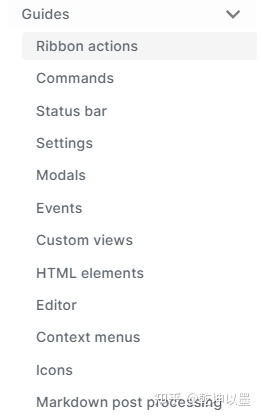

### 环境

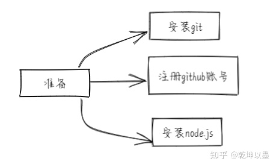

*   git

因为我在研究obsidian同步的时候对git有深入的了解，在插件开发之初git主要是用来下载源程序，方便不同场合代码同步。git其实比较简单，而且网上资源比较丰富，将来在很多地方都会用到，所以早学早享受。经过我测试，用git clone来下载程序经常因为网络的原因而报致命错误，直接在github的代码菜单里下载其压缩包成功率奇高。

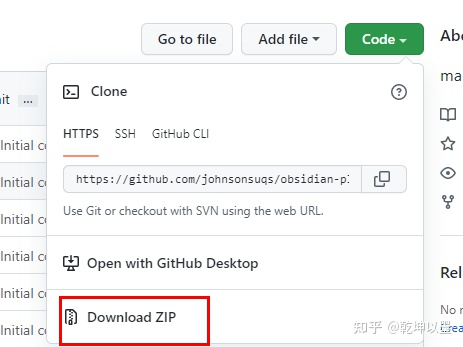

*   node.js和typescript

对于初学者node.js这是必须要安装的项目，因为根据官网的指南在本地把ts编译成js的npm命令都依赖node.js环境。如果开发工具用vscode开发最好把node.js和typescript的环境配置好，至于ES6还是typescript的选择，我在github上看大部分插件源程序repo都显示typescript占了八九成。不过国外obsidian论坛里有一个用户发言我觉得还是很中肯的，其实真正高手只要写原生的javascript就够了。不过根据我的经验，刚入门就如此，有点难度，没有指南很多流程都要自己琢磨，而且源代码的语法格式也不太一样。所以有时候我们选择某个流程或工具，不是因为它是最好，而是用得人多而己。这样我们在遇到问题时，至少还能找到资料。

[How to get started with developing a custom Plugin?](https://link.zhihu.com/?target=https%3A//forum.obsidian.md/t/how-to-get-started-with-developing-a-custom-plugin/8157/5)

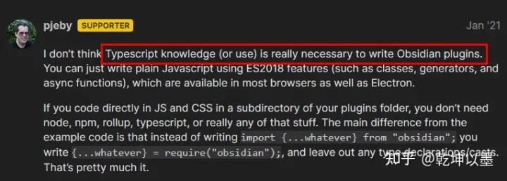

### 建库

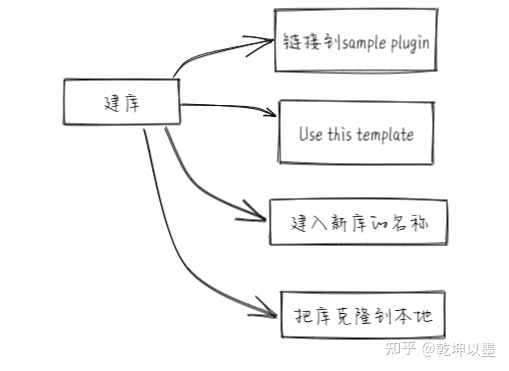

[GitHub - obsidianmd/obsidian-sample-plugin​github.com/obsidianmd/obsidian-sample-plugin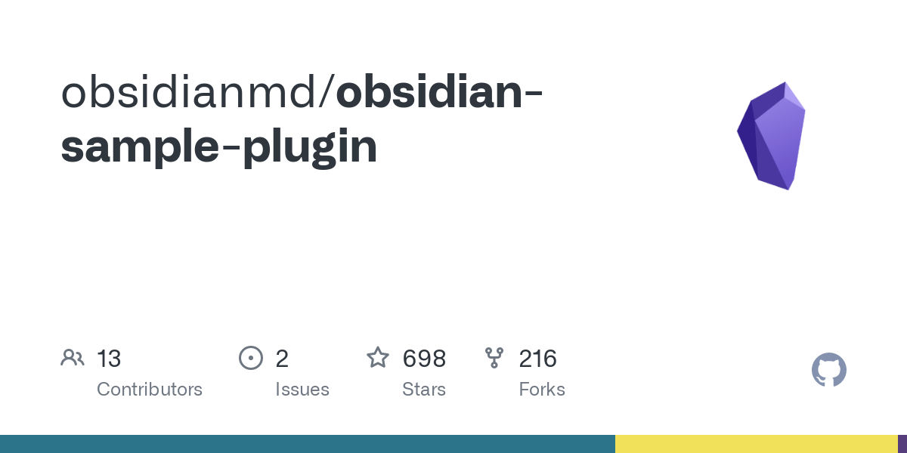](https://link.zhihu.com/?target=https%3A//github.com/obsidianmd/obsidian-sample-plugin)

官网建议开发之前先把sample库复制到自己github的库中。上面是obsidian sample-plugin库的链接地址，按步骤以此为模板在github创建一个自己的库。记住要改成自己的库的名字，如果看不到"use this template"这个菜单，是因为你没有登录github上。我自己在开发插件的时候，并没有创建这个库，直接把库复制到本地。放到测试库里插件目录(plugins)里，直接进行开发，我主要在单位就是学习知识和背诵卡片，在家里开发代码。如果你两边都要开发，还是码云上创建一个库更靠谱一点。

### 模块

编程所需要引用三种模块：一个obsidian自身库中所有模块，node.js内置的四个模块，还有包括用户自定义模块的外置模块。引用语法common和es6都兼容，我开始编译时老早不到obsidian的库，后来发现有一些插件的源程序并不有把obsidian自带库上传到github上去，所以建议初学者务必按官网流程下载obsidian sample-plugin库，这个插件库最完整。初学者开始严格按官网流程，可以规避很多坑。

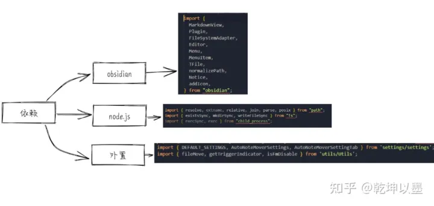

### 测试框架

我是修改Note Refacotr的时候涉及到这个概念，就大致了解一下，目前在obsidian国外论坛推荐两种测试框架：**Jest和Mocha，下面是链接，**这个资源站是官方提供还是爱好者整理的，我目前还没有整明白。只要你在论坛里问技术问题，就会被人推荐去访问这些资源，但资源很凌乱，不太象官网的资料。我对待测试框架和npm态度是：只要能用不影响我实现目标，我暂时不会深入的学习。因为我在写这段文章的时候，我只是停留在修改别人插件，而这些插件编译和测试的脚本都是别人配好的，每次编译都自动完成。如果想彻底搞明白这两样知识点，并会自己配置脚本，我估算一下这个坑比较大，要花费很多时间，目前目标还不需要我这样做。但我知道我最终要面对这个问题。

[https://publish.obsidian.md/hub/04+-+Guides%2C+Workflows%2C+%26+Courses/Guides/Why+automate+tests+for+plugins​publish.obsidian.md/hub/04+-+Guides%2C+Workflows%2C+%26+Courses/Guides/Why+automate+tests+for+plugins](https://link.zhihu.com/?target=https%3A//publish.obsidian.md/hub/04%2B-%2BGuides%252C%2BWorkflows%252C%2B%2526%2BCourses/Guides/Why%2Bautomate%2Btests%2Bfor%2Bplugins)

  

所以我现在也只是有意识收集一些基础知识，比如脚本一些关键词我还是能看懂，一些简单的报错还能知道怎么改，等到时机成熟我再彻底学习一遍。下面的链接是知乎上对测试框架简单介绍，有兴趣的朋友可以了解一下。不过根据我的经验，除非你之前接触过这东西，不然看了还是一头雾水。但这也是学习一个复杂的知识点必备过程。**评估难度决定挂起，研究前置条件，然后从简单术语开始**，逐步深入等到正式启动这个任务时，你已经对知识点概念和环境有大致的了解，对后面学习也非常有帮助。added:2022-05-07

[优弧同学：2021 年 JavaScript 测试框架回顾1 赞同 · 0 评论文章](https://zhuanlan.zhihu.com/p/448577649)

### main.ts

一般来说越是功能复杂的插件，主程序main.ts越简单，main.ts包括：引导部分，定义类型和全局变量。主类一般继承自plugin类，主要有onload和onunload两个方法组成。一些次要的功能一般都模块化。作为外部模块由主程序在其onload方法中调用其方法及属性即可。这样整个程序结构清晰，日后升级和修改也比较方便。

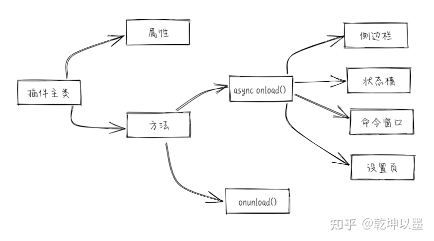

调用已经导入的外部模块和主类的方法的语法格式是一样的

> this.方法名 ：_this_.addCommand （），const { contentEl } = _this_;

但也有完整路径的格式,因为workspace并没有做为模块导入，这里只是作为app的属性

> _this_.app.workspace.getActiveViewOfType(MarkdownView)

## 产生需求

因为之前我用quicker做一个却作，就是修改Note Refacotr的data.json文件，然后重载插件，对文件进行拆分。当时我对hot-fix的插件进行修改，只要data.json文件一改动，就自动重载插件。但我觉得这个插件用于开发比较合适但在平常使用会驻留内在占用资源。所以最好用命令行或侧边栏来启动，这样我可以用快捷键来重载插件。也可以让我的脚本每个过程都是可控的。所以我需要使用命令行方式来重载插件，只是实现这个功能就太简单了，所以我给自己又定更高的目标，**就是用modal中suggestion模块实现在安装的所有插件清单里，随便选择一个插件重载**。

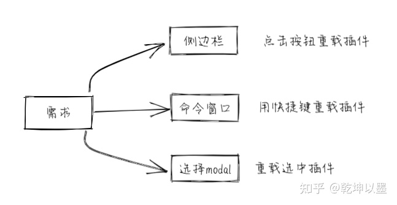

## 开发工具

### devtool

devtool一些小技巧可以让开发效率大幅度提升，在开发插件过程中我又发现一个小技巧：它就是编译代码块的功能，因为插件开发api文档过于简陋，所有示例也没有描述。所以我只能通过在devtool的命令面板来敲命令来看看某个方法有什么参数，某个类有什么属性，返回值是什么？但有一个难题如果是循环语句这种代码块我直接敲出来会报错，所以我在网上找到可以通过在source面板新建snippet来实现对代码块的运行。这又解决了我一个大问题。如下图，你只要在左侧的snippet文件名点击右键会有"run"就可以运行你编写的代码块。

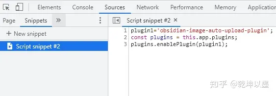

### npm

我编译ts文件一直用npx tsc，所以在开发之初我也用这个命令来编译main.ts文件，但出现很奇怪的现象，我的插件无法打开，一打开就报错。就这一问题我在国外obsidian论坛进行咨询，但很长时间也没有人理会我，老外还是很热情的，估计问题比较特殊，我当时卡在那里，这个问题在开发之初差点让我放弃了，后来我重新学习官网的插件开发说明，发现他推荐用npm run dev编译，我就死马就活马医，下载了npm，然后运行npm run dev之后就正常了。

开发插件过程中也就是这个坑比较深一点。但你只要按要求安装node.js和npm。在命令窗口进入开发插件目录，再运行npm run dev，再开始用vscode进行代码开发即可。

### git

因为在研究obsidian同步的时候对git有深入的了解，开发之初git主要是用来下载源程序和办公室与家里同步。不过用git clone来下载程序经常因为网络的原因，经常报错，还不如直接下载其压缩包。

## 开发过程

  

### 侧边栏

```ts
const ribbonIconEl = this.addRibbonIcon('dice', 'reload', (evt: MouseEvent) => {
			// Called when the user clicks the icon.
			this.reload('obsidian-sample-plugin');
		});
```

dice是图标代表是骰子，reload：是提示语，鼠标放在图标上显示的提示字符，evt:事件 点击鼠标会执行reload这个方法。

如果想换图标可以下面的链接里查询：

[List of available icons for component setIcon](https://link.zhihu.com/?target=https%3A//forum.obsidian.md/t/list-of-available-icons-for-component-seticon/16332/4)

侧边栏最简单，点击侧边栏上图标启动指定插件重载，这个功能主要为了熟悉侧边栏的开发。

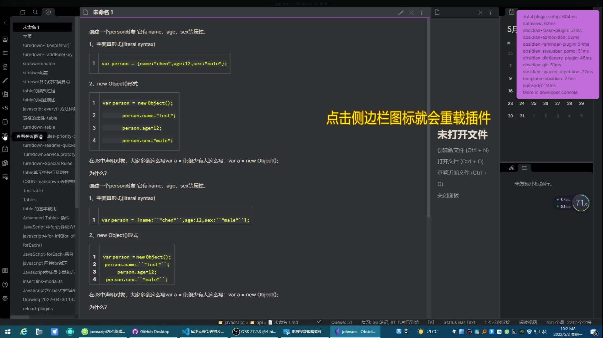

00:05 / 00:07

倍速

高清

### 命令

```text
this.addCommand({
        id: "Excalidraw plugin",
        name: "Excalidraw plugin",
        callback: () => {
          this.reload("obsidian-excalidraw-plugin");        
         
        }
```

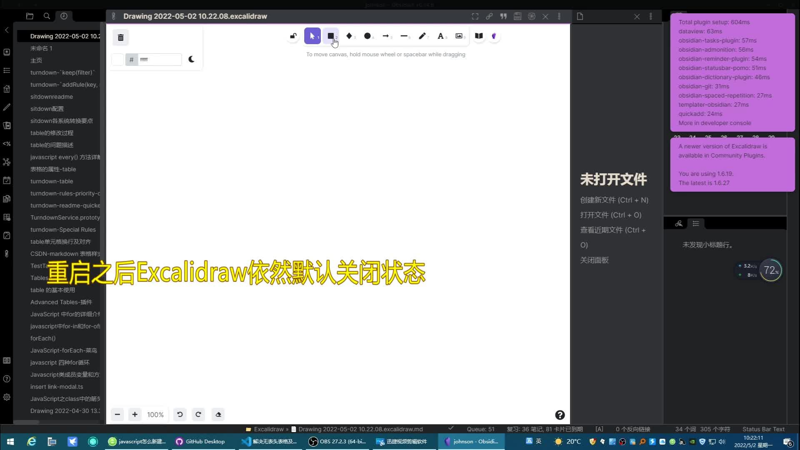

00:21 / 00:20

倍速

高清


重新播放

通过命令行开启插件，本来只是想配合我的脚本来实现脚本的流程化。结果无意中发现，如果插件本来是关闭的，重载的插件可以启动这个插件，而且在ob重启后插件依然处于关闭状态，这样我就可以把不常用的插件都关闭，然后在使用的时候才重载。极大提高obsidian启动的速度。


00:00 / 00:20

倍速

高清


00:20

### 选择框

开发这个功能主要是给自己找点别扭，并检验自己modal模块部分知识是否真正掌握了，开始本来想借用Auto Move Notes插件里现成的suggestion模块，读了程序之后才发现这位作者也是原样抄的另外一个插件模块，而那个插件模块做得太复杂了，涉及到我以后才会学到内容，我觉得原样调用对现在我没有意义，所以自己在官网示例的基础上做一个简单的suggestion模块，修改别人代码相对比较容易，不需要考虑很多细节。但自己从头开发真得难多了，发现自己基本功不扎实，一个简单的问题就能把我卡住，所以我干脆把类，接口，数组，对象，变量重新过一遍，做了导图。然后又用卡片复习巩固，自己觉得基本功扎实之后，再重新启动任务，很轻松完成了。

```text
onChooseSuggestion(books, evt: MouseEvent | KeyboardEvent) {
	    this.item=selectedPlugin;//选中插件的ID赋于全局变量item
	   if(this.i==1){ this.reload(selectedPlugin);   } //根据调用参数确定调用方法
	   if(this.i==2){ this.disablepl(selectedPlugin);   }
		
	}
```

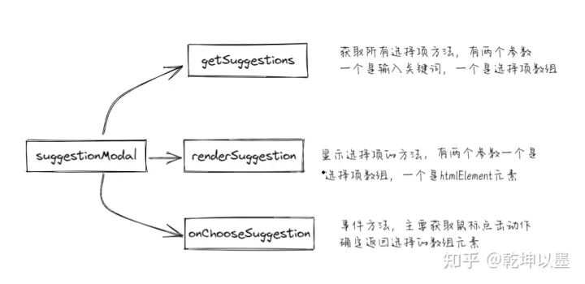

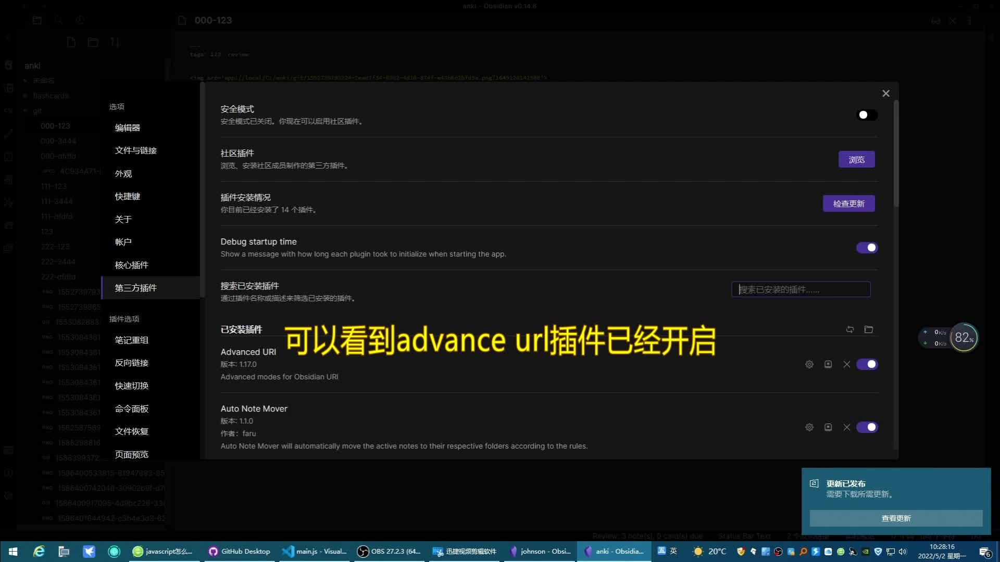

00:21 / 00:20

倍速

高清


重新播放

选择框会根据输入的内容缩小选择范围，这其实是模块方法的内置的功能，但如果想正常使用，涉及到对象与数组类型转换，以及自定义类型和方法返回值的知识，这个浪费我一点时间，把基本功夯实才轻松解决。

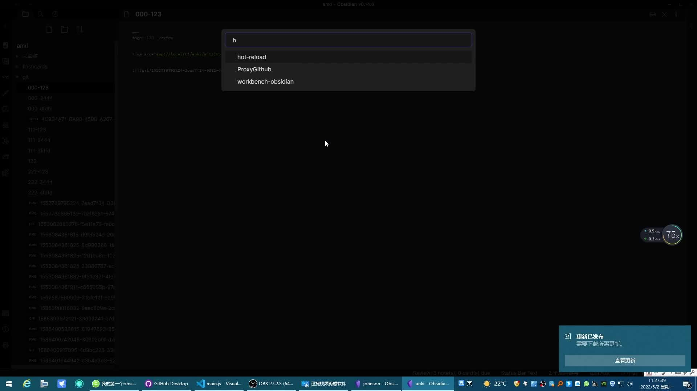

00:00 / 00:12

倍速

高清


00:12

## 设置页

设置页是插件结构中最复杂的部分，所以单独做一个章节。设置页主要包括两个类一个main.js中的主类，一个settings.ts，在示例sample-plugin中，虽然不有把settingtab单独设置一个文件，但也是samplSettingTab也是作为单独一个类来处理。

视频就是是最终的效果

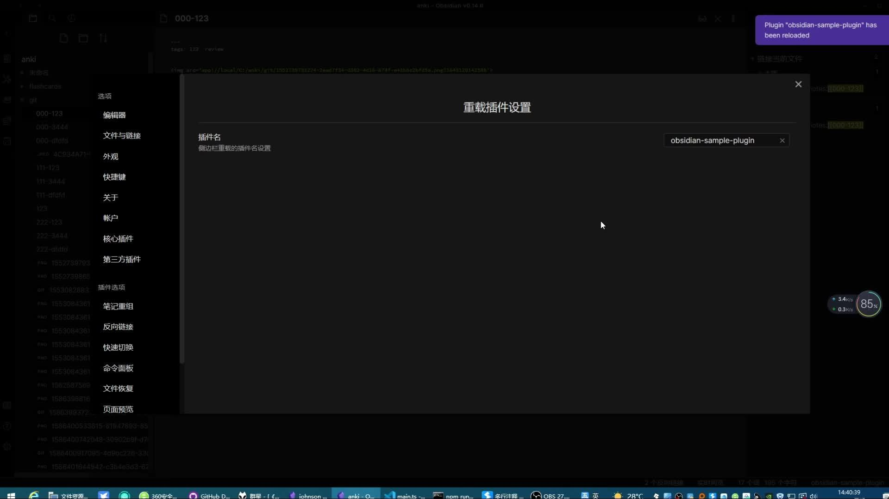

00:00 / 00:14

倍速

高清


00:14

### main.js结构

设置的类要想添加到面板上在main.js有几个要点。在变量方面主要程序要一个全局的缺省值，这样在初次使用可以把初始值赋给设置值来使用。另外在类中设置一个属性setting.用来保存设置值，当把this做为参数传递给设置页类class的时候。可以在设置页类中调用this.setting来对设置值进行操作。

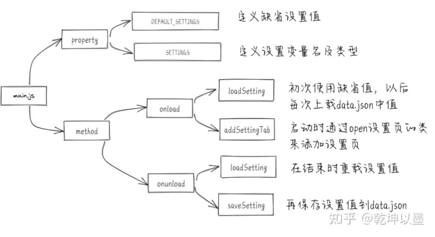

### 设置变量或属性

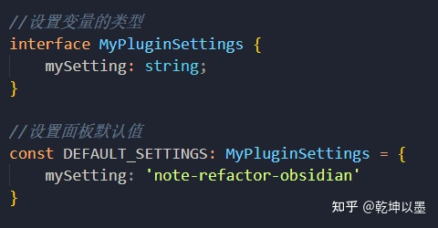

  

一个属性变量在使用前要经过三部曲：自定义类型-接口，声明，赋值（初次使用为默认值）。我开始对设置接口(interface)自定义类型不是特别理解，觉得完全没有必要。后来源程序看多了，就明白设置接口的目的主要还是规范代码管理，因为随着插件功能增强，设置变量种类越来越多，设置接口类型可以把变量进行分组管理。这样在以后调用过程中，思路比较清晰，也方便其他人阅读。比如下图就是Auto Note Mover插件的设置变量的接口设置。三个接口分别代表关于标签，排除路径，移动路径三个功能变量组。

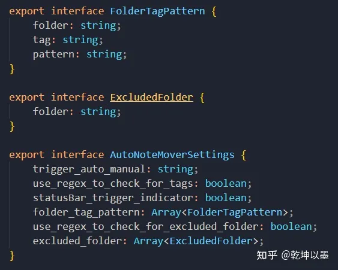

因为我第一个插件功能比较简单settingTab类只有一个属性，所以设置一个变量mySetting就够了.一个属性变量在使用前要经过三部曲：自定义类型-接口，声明，赋值（初次使用为默认值）。通过上面接口自定义类型，设默认值，下面我就要去声明这个变量，并使之为主类的属性。

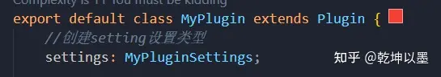

声明之后还要对这个变量进行赋值。这里使用了Object.assign,其含义是合并默认值及data.json的值。如果默认值与文件中值重复以文件的值为准。

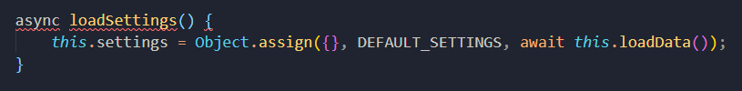

下面我就看看我们如何调用这个属性变量。我对上面侧边栏做一些小的改动。根据设置页变量的改变其鼠标放到图标上后提示内容也做相应的改变，具体代码如下，在main.js的主类调用属性的格式：this.setting。

```ts
const ribbonIconEl = this.addRibbonIcon('dice', this.settings.mySetting, (evt: MouseEvent) => {
			// Called when the user clicks the icon.			
			this.reload(this.settings.mySetting)//重载setting属性中的mysetting值指定插件
		});
```

### 设置方法method

设置页类的属性变量主要存放设置内容，而设置页的方法主要是操作Element元素，来完成设置页的构造。比如设置标题，说明及各种输入框和按钮。一般常用添加有动作元素都是用setting()来实现，设置的元素方法很多，详见下面的链接

[Setting | Obsidian Plugin Developer Docs](https://link.zhihu.com/?target=https%3A//marcus.se.net/obsidian-plugin-docs/api/classes/Setting)


  

输入框addText和按钮addButton比较常见，也比较简单，我这里介绍是比较实用且相对有一定难度的选择输入框addSearch，在视频可以看到，他可能根据你输入关键词缩放提示项，它跟我主界面中实现原理和调用类都是类似，唯一的区别是参数el元素不同，这个参数决定了选择项显示位置，cb.inputEl是指在输入框下方显示,具体原理参照我上面suggestion类的原理导图，代码实现如下，

  

```text
new Setting(containerEl)
			.setName('插件名')//设置输入框标题
			.setDesc('侧边栏重载的插件名设置') //输入注释说明
			.addSearch((cb) => {  //添加选项项输入框
				new PluginSuggest(this.app, cb.inputEl); //调用插件显示选择项模块
				cb.setValue(this.plugin.settings.mySetting) //把输入值赋给变量
				.onChange(async (value) => { //一旦内容变动
				   this.plugin.settings.mySetting = value; //输入内容输给变量
				   await this.plugin.saveSettings();//结果保存到data.json文件中
					});
			})
```

> 注意:设置页settingTab类中调用 主类plugin类中的设置变量setting的语法格式：this.plugin.settings.因为主类plugin类是作为参数进入设置页类settingTab，\`this.addSettingTab(new SampleSettingTab(this.app, this));故主类plugin被定义为settingTab的类的属性，\`this.plugin = plugin;\`,故主类的属性setting,在settingTab调用语法格式为：this.plugin.settings.mySetting. 听起来有点绕口令，也只能说成这样了。

## \# Note Refacotr完善

之前用quicker做一个脚本，就是在Note Refacotr拆分笔记之前用来改变文件前缀和标签，当时用quicker的获取文本模块来实现的，为了能够让修改的data.json生效，还增加了插件重载的功能。掌握了插件开发技能之后，发现只要对Note Refacotr插件稍做一些完善就能实现这个功能。以后开发内容都放到这个文章里。

### 准备

编译Note Refacotr源程序依赖是不完整的，需要从sample插件把obsidian的一些依赖给拷贝到node\_modules目录即可，一般用vscode打开源码会提示缺少什么模块及模块名，你按照提示拷贝即可。在运行npm run dev上面提示缺什么就安装什么 npm install xxxx。另外需要设置的地方就是他编译成的main.js的目录为当前目录的dist目录下，你只要把在esbuild.config文件里把目录改成当前目录即可。

### 效果

Note Refacotr很经典，但技术难度不高，主要是对编辑界面下的文本内容进行复制和剪切操作。但整个程序结构逻辑清晰和结构干净简洁，作者基本功很扎实。Note Refacotr是非常好进行入门临模的插件。下图就是效果，如果上面介绍的设置页部分能够理解，这个功能非常简单，就是增加一个settingModal.ts，用setting()的addTextArea增加两个多行文本即可。然后在命令行addcommand调用这个设置面板。2022-05-07 added

  

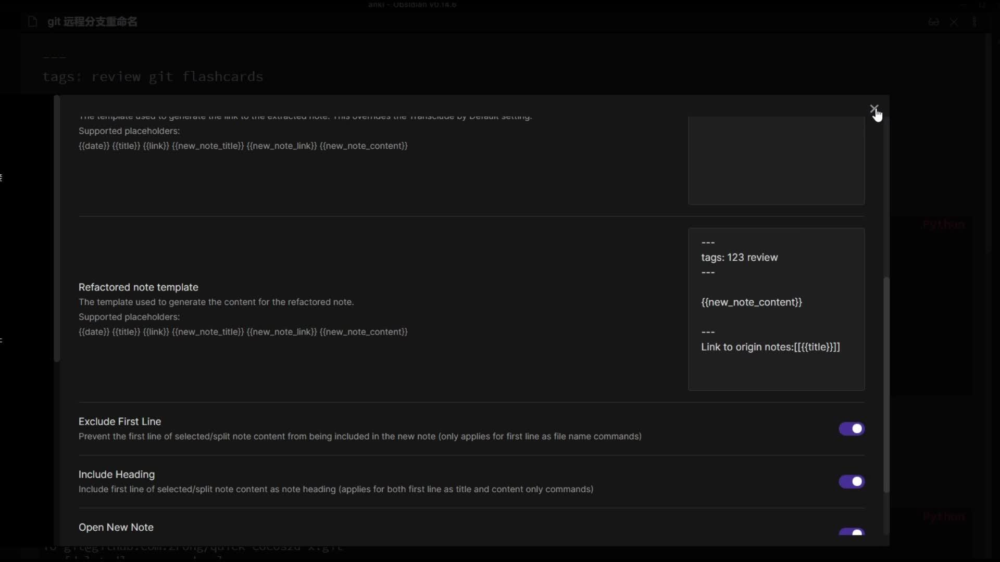

00:00 / 00:49

倍速

高清


00:49


## Image auto upload Plugin

这个插件是作者是我们国人，主要功能有三个一个粘贴图片自动传到图床，一个把当前笔记中所有图片链接上传到图床，另一个把当前笔记图片下载。第一个功能很好用，但第二功能一直无法使用，没有任何反应。我到作者github上咨询发现很多人都有这个问题，我也追问把我现象描述出来，作者反馈是图床软件的版本问题，但我下载前面所有版本都测试不成功，作者反馈他按我的描述进行演示没有发现这个情况。源程序能够说明一切，我们看看他是怎么写的吧。


上面的代码的意思如果http开头不处理，也就是这个插件只上传存储在本地的图片。与时我又测试只有本地图片的笔记，但依然没任何的反应。那就看看他如何处理本地图片的链接的。这是抽取链接的正则表达式


他的意思是抽取\[\]()两种地址。


这个代码的意思把（）中的作为地址，把\[\]作为名称，简单的说：就是这个插件它不支持较为简短的wiki形式的图片链接，就是下图的链接方式。


原来如此，所以我取消wiki的链接形式，但依然没有上传成功。why?


原来这里还有一句话，他又在原来地址前加上父路径。简单的说：他这个插件只支持用相对路径的图片链接。


图片改成相对地址的链接，这次上传终于成功了，所以这个插件只支持相对链接的本地图片上传到图床，既然看懂了源程序，对这个插件完善就相对比较简单了。中午大概用了半个小时就把这个软件稍做修改，基本完成图片链接都可以上传的功能，但觉得程序强壮性还有待考证，先使用一段时间观察观察。added: 2022-05-08。

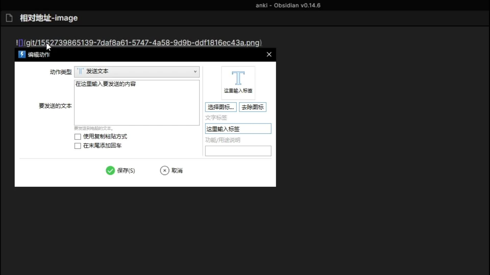

00:00 / 01:35

倍速

高清


01:35

## Spaced Repetition插件

Spaced Repetition是目前我使用最频繁的插件，因为使用的频繁，所以对他的一些bug就越发不能忍受，其实我学习插件开发大部分原因就是想改造这个插件。

复习笔记中时间偶尔会出现标签错乱，这个问题我向作者反馈了，而且之前半年前也有一个用户反应过这个问题，但都没有得到回应。估计作者暂时不会处理。只能自己来解决。


因为从库里下载的源程序缺少两个很重要的文件所以没有办法对ts文件进行编译，虽然最终的main.js里包含这两个文件的内容，但是编译过的，我暂时没有能力从js恢复到ts文件，只能直接修改main.js文件，所以不可能做太大的修改。


找到相关的判断代码，代码的意思如果笔记有复习记录就修改复习记录的value值，如果初次复习就添加复习记录key:value值，这两种情况之外第三种情况就添加复习记录key:value。（第三个逻辑很奇怪，不知适合什么情况）所以我每个条件我增加一个console.log来跟踪错误发生时，它引发哪个逻辑。


当我抓到bug时，他显示运行第三个逻辑，实际人工判断这个笔记应该属于第一个逻辑已经有复习记录的笔记。这是怎么回事呢？我ctrl+z恢复笔记原状再来一次。


可以看到这次恢复正常，判断为逻辑一，我又试了几次好象都正常了，所以这其实可能obsidian的api的bug，获取信息失败，但插件判断机制处理失当造成的。我把第三个逻辑全部注释掉，然后增加一个提醒。这样如果出现异常，会报警并保持原样。

我把整个过程发给作者，他改不改是他的事情，至少对我没有影响，这也是学习开发的主要原因，尽可能把主动权掌握在自己手里。如果对这个比较敏感的朋友，可以跟我一样找到这个代码段全部注释掉就可以了。等我把两个js文件恢复后，我会优化更改，可以自行重新过一遍，这样应该更合理。.

## 小结

通过开发一个小插件熟悉了插件开发涉及到的所有结构，主要难点在设置页上，而设置页的基础是modal，对插件结构熟悉之后，就能很轻松看懂别人源代码。然后对自己常用的几个插件不太满意的功能尝试进行完善，因为obsidian的api文档不太完善，所以学习别人插件是开发插件的必由之路，在修改别人插件过程中，其实能够学习到很多的东西。特别是经典的插件，他们结构简洁清晰，语法规范严谨从中受益颇深。2022-05-08修改。