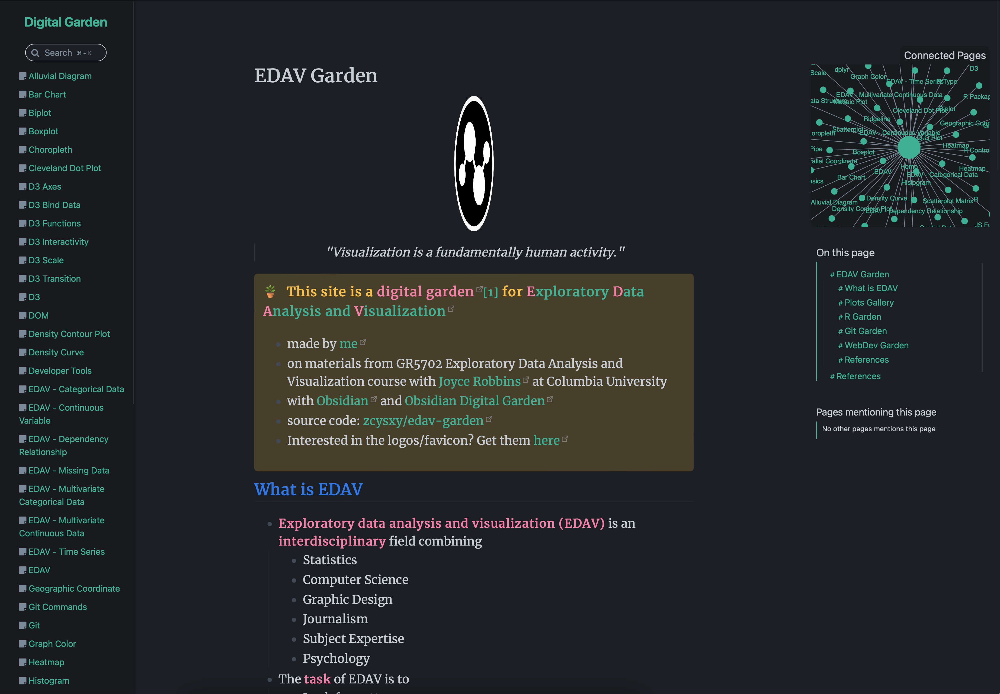
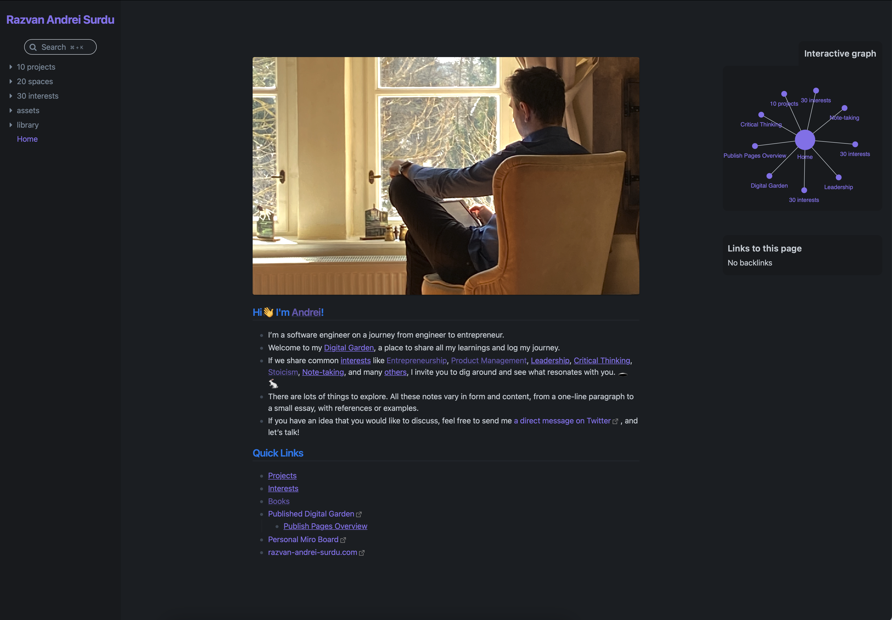
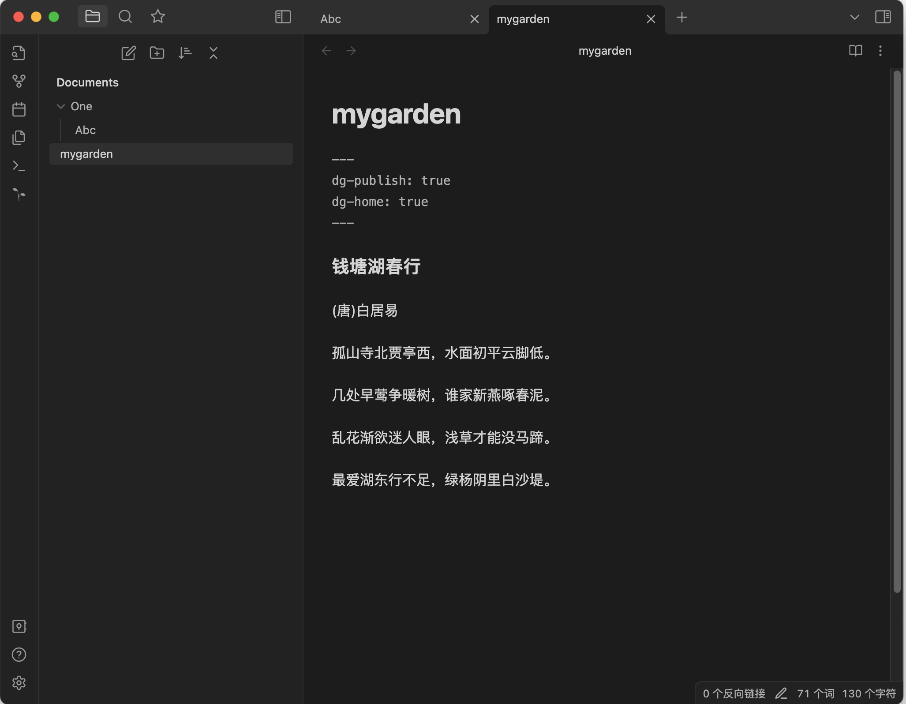
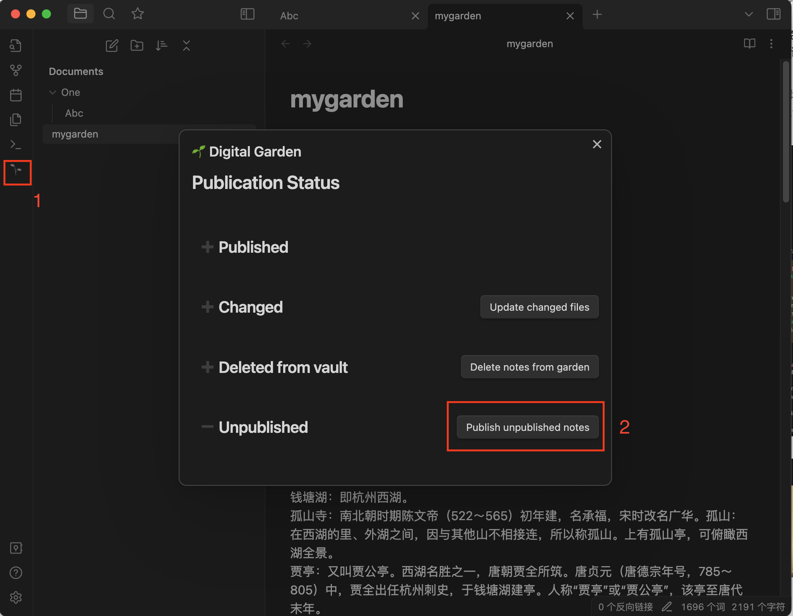
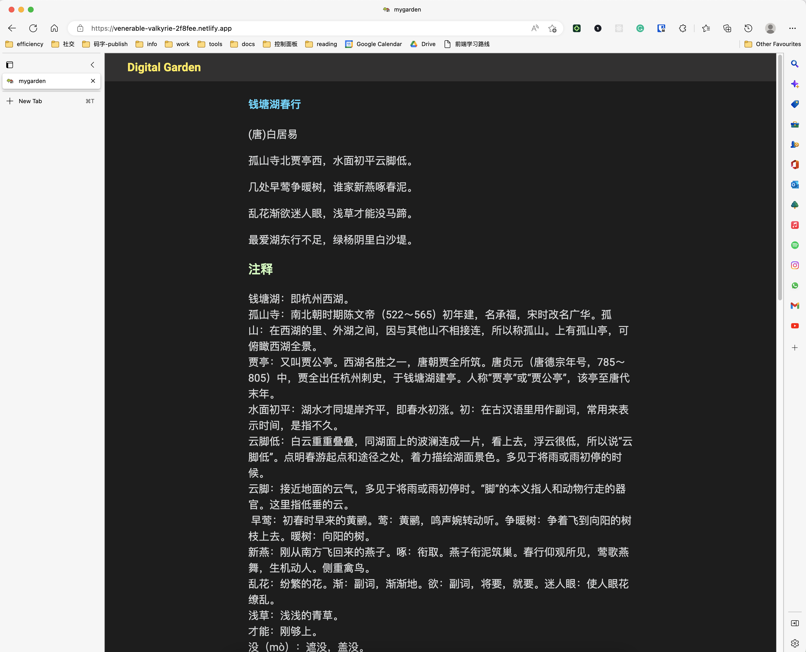
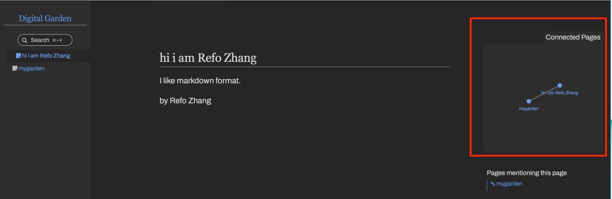
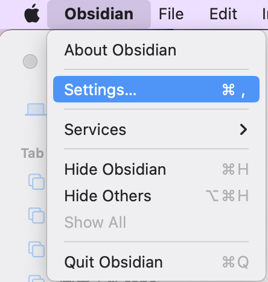
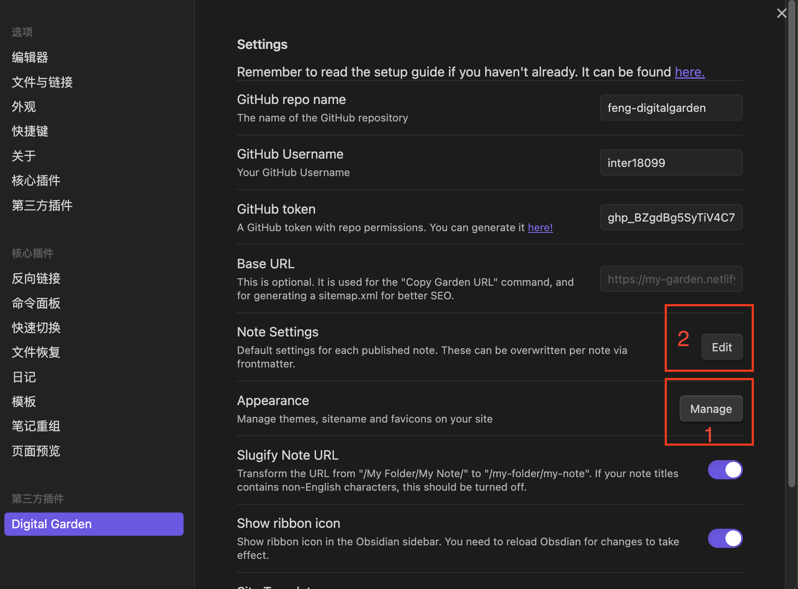
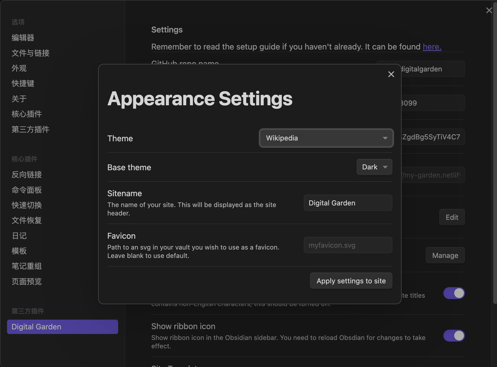
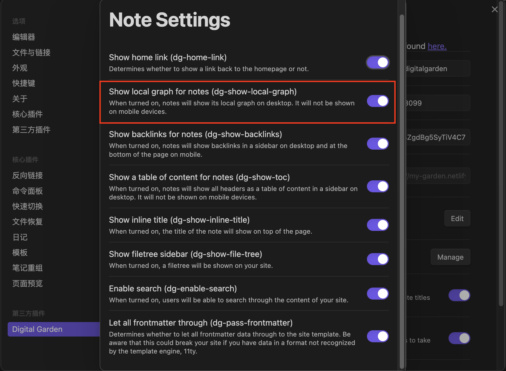

来源网址: https://fengrin.me/posts/2022-12-19-publish-your-website-free-use-your-local-note-obsidian-gitHub-netlify
裁剪时间: 2023-08-29 10:29:15
# 免费直接把笔记发布成网站:Obsidian + GitHub + Netlify

December 19, 2022

本文的视频版：[https://www.bilibili.com/video/BV13V4y1c76b/](https://www.bilibili.com/video/BV13V4y1c76b/)

Hello，大家好，今天向大家介绍，如何免费用 Obsidian + GitHub + Netlify 发布自己的网站。简单的说，Obsidian 是一个 markdown 笔记软件，GitHub 是一个代码托管网站，Netlify 是一个静态网站部署工具。

建好之后，流程大致是，在 Obsidian 编辑文章，然后通过命令一键发布，然后就可以通过网址访问了，这里有其他人建好的，大致是这个样子：

*   1: 
*   2: 

0,

准备：

*   下载 Obsidian 笔记软件
*   注册 GitHub 账号

1,

首先，我们需要用到 Obsidian 的一个插件 Digital Garden，下载安装Digital Garden。

2，

打开这个 [repo](https://github.com/oleeskild/digitalgarden)，点击绿色的 deploy to netlify

这样会打开 Netlify，在你的 GitHub 创建一个这个 repo 的 copy。然后新建一个名字，然后按步骤在 Netlify 发布你的网站到 internet。

3，

下一步，你需要获取你 GitHub 账户的 access token，这个 token 用于你的 Obsidian 笔记软件的设置，相当于一个 password。去[这个网址](https://github.com/settings/tokens/new?scopes=repo)，点击 generate token 按钮，复制 token，下一步需要用到。

4， 打开 Obsidian - Digital Garden 的 settings。填入 GitHub 用户名，repo 的名字（在 step3 设置好的），还有上一步复制好的 token。

5，

现在可以发布你的第一个笔记了。在 Obsidian 创建一个新的笔记，并且把下面字符加到笔记的开头。

```plain
---
dg-publish: true
dg-home: true
---
```

笔记现在它应该是这样的： 

*   dg-home 代表这个笔记应该作为网站首页
*   dg-publish 设置代表这个笔记是否需要被发布到互联网上。

6， 按 CTRL+P 打开命令面板，找到 Digital Garden: Publish Single Note 命令，按回车。

或者，点击侧边栏的小树苗 🌱 的图标，然后点击发布按钮： 

7, 在 Netlify 找到你网站的网址，打开，大功告成： 

### 如何添加 Connnected Pages 图表

0, 例子：



1 点击 Obsidian - settings：



2 点击 settings - Appearance - Manage：



3 选择支持图表的 Theme，如 Wikipedia



4 点击 settings - Note Settings - Edit

5 开启：Show local graph for notes:



6 添加 [Internal link](https://help.obsidian.md/How+to/Internal+link)

创建一个 Note，名为 hi i am Refo Zhang

创建一个 Note，名为 digital garden

在 Obsidian 中，编辑 digital garden note，按键盘上的 `[` 两次，然后输入 hi，选择弹出的 hi i am Refo Zhang。最终效果是：

```plain
[[hi i am Refo Zhang]]
```

这样就会在第二个 note 中，创建一个第一个 note 的 internal link。

7 Publish 所有的改变，即可得到一个含有所有 Notes 关系的图表

### 下面还值得折腾的点：

*   网站 CSS 样式定制
*   购入一个顶级域名，这样网站就不再是用 xxx.netlify.app 这样别人的 2 级域名了。

相关链接：

*   [本文的B站视频版](https://www.bilibili.com/video/BV13V4y1c76b/)
*   [Obsidian 官网](https://obsidian.md/)
*   [Digital Garden 插件官网](https://dg-docs.ole.dev/)
*   [Digital Garden Github repo](https://github.com/oleeskild/digitalgarden)
*   [Nelify](https://netlify.com/)
*   [GitHub](https://github.com/)