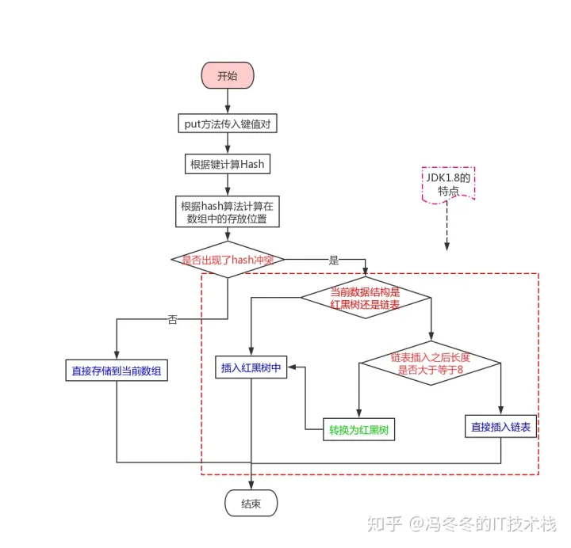

## hashmap


在 Java 的 `HashMap` 中，**负载因子**（`load factor`）的默认值为 `0.75`，它与 **泊松分布**（Poisson distribution）之间确实存在一定的数学关联。这种关联主要体现在设计 `HashMap` 时关于**哈希冲突**的概率分布分析和性能优化上。

---

### **负载因子 0.75 的意义**

1. **定义**：负载因子是 `HashMap` 中 **已存储元素数量与桶数量的比值**，即：
    
    复制
    
    ```
    load factor = number of elements / number of buckets
    ```
    
    当负载因子达到或超过阈值时，`HashMap` 会触发 **动态扩容**（rehashing），将桶的数量加倍，并将现有元素重新分配到新的桶中。
    
2. **默认值 0.75 的原因**：
    
    - **空间与时间的权衡**：负载因子过小（如 0.5）会导致桶的使用率过低，浪费内存；负载因子过大（如 1.0 或更高）会增加哈希冲突的概率，从而降低查询和插入的性能。0.75 是一个合理的中间值。
    - **概率分析**：负载因子为 0.75 时，哈希冲突的概率相对较低，且桶内链表长度符合理想分布，能保证较好的性能。

---

### **泊松分布与 HashMap 的关系**

泊松分布是离散概率分布，常用于描述单位时间或单位空间内事件发生的次数（如随机事件分布）。在 `HashMap` 中，可以将其应用于分析**哈希冲突的分布**：

1. **桶内元素数量分布**：
    
    - 在 `HashMap` 中，假设哈希函数是均匀分布的，那么每个元素被分配到某个桶的概率是相等的，且彼此独立。
    - 对于一个具有 `n` 个桶的 `HashMap`，如果总共有 `k` 个元素，且每个桶的元素分布是随机的，则可以用泊松分布来近似描述每个桶中元素的数量分布：
        
        复制
        
        ```
        P(X = k) = (λ^k * e^(-λ)) / k!
        ```
        
        其中：
        - `P(X = k)` 是单个桶中恰好有 `k` 个元素的概率。
        - `λ` 是平均负载（即 `λ = load factor = k / n`）。
        - `k!` 是阶乘。
2. **负载因子与泊松分布的关系**：
    
    - 当负载因子为 0.75 时，意味着平均每个桶中的元素数为 `λ = 0.75`。
    - 根据泊松分布的性质，当 `λ` 较小（如 0.75）时，大多数桶中元素数量会接近 `λ`，即 0 或 1 的概率较高，而出现更高数量（如 2 或 3）的概率迅速下降。
    - 这使得 `HashMap` 在负载因子为 0.75 时，桶内链表的长度较短，大多数情况下查询和插入的时间复杂度接近 O(1)。
3. **具体概率计算**（假设负载因子为 `λ = 0.75`）：
    
    - 单个桶中有 0 个元素的概率：
        
        apache
        
        复制
        
        ```
        P(X = 0) = (0.75^0 * e^(-0.75)) / 0! = e^(-0.75) ≈ 0.472
        ```
        
        即，约 47.2% 的桶是空的。
    - 单个桶中有 1 个元素的概率：
        
        apache
        
        复制
        
        ```
        P(X = 1) = (0.75^1 * e^(-0.75)) / 1! = 0.75 * e^(-0.75) ≈ 0.354
        ```
        
        即，约 35.4% 的桶中恰有 1 个元素。
    - 单个桶中有 2 个元素的概率：
        
        apache
        
        复制
        
        ```
        P(X = 2) = (0.75^2 * e^(-0.75)) / 2! = 0.28125 * e^(-0.75) ≈ 0.133
        ```
        
        即，约 13.3% 的桶中有 2 个元素。
    - 单个桶中有 3 个元素的概率：
        
        apache
        
        复制
        
        ```
        P(X = 3) = (0.75^3 * e^(-0.75)) / 3! = 0.2109375 * e^(-0.75) ≈ 0.033
        ```
        
        即，约 3.3% 的桶中有 3 个元素。
    
    **结论**：当负载因子为 0.75 时，大多数桶中元素数量为 0 或 1，少数桶中有 2 个或更多元素。这种分布使得哈希冲突较少，查询和插入性能较高。
    
4. **高负载因子对泊松分布的影响**：
    
    - 如果负载因子增大（如 1.0 或更高），则 `λ` 增大，泊松分布的尾部会变长，意味着出现长链表的概率增大，从而降低性能。
    - 如果负载因子减小（如 0.5），则大部分桶会变为空，内存利用率下降，但性能稍有提升。

---

### **总结**

`HashMap` 的默认负载因子 0.75 是基于工程经验和数学分析得出的平衡值。它与泊松分布的关系在于：

1. 负载因子决定了每个桶的平均负载（`λ`），进而影响桶内元素数量的概率分布。
2. 当负载因子为 0.75 时，泊松分布表明绝大多数桶的元素数为 0 或 1，哈希冲突少，性能接近 O(1)。
3. 这种设计在时间复杂度和空间利用率之间找到了一个较优的平衡点。


https://zhuanlan.zhihu.com/p/79219960

### 多线程操作hashMap死循环原因  
hashMap 链表+数组 扩容时，需要从新计算hash,线程1和2同时进入扩容操作，2挂起，1扩容完毕，2继续，导致环形链表，get操作就会死循环

put流程图


### 使用hashmap要注意哪些问题
避免hash冲突 重写hashCode equals

## concurrentHashMap
https://juejin.cn/post/6844903951385493518#heading-1

concurrentHashMap相关

1.8之前采用分段锁，降低锁的粒度  
取消了Segment分段锁的数据结构，取而代之的是数组+链表（红黑树）的结构。而对于锁的粒度，调整为对每个数组元素加锁（Node）。然后是定位节点的hash算法被简化了，这样带来的弊端是Hash冲突会加剧。因此在链表节点数量大于8时，会将链表转化为红黑树进行存储。这样一来，查询的时间复杂度就会由原先的O(n)变为O(logN)  
1.8之后cas思想  
CAS采用乐观锁思想达到lock free

CAS:CAS有3个操作数，内存值V，旧的预期值A，要修改的新值B。当且仅当预期值A和内存值V相同时，将内存值V修改为B，否则什么都不做