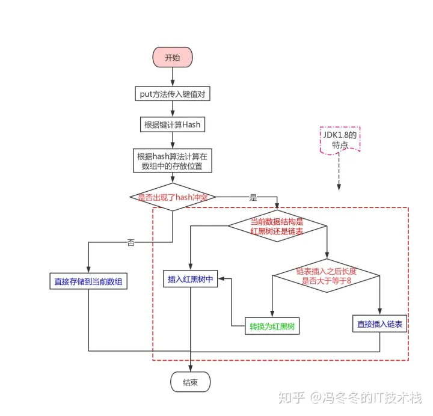

## hashmap

https://zhuanlan.zhihu.com/p/79219960

### 多线程操作hashMap死循环原因  
hashMap 链表+数组 扩容时，需要从新计算hash,线程1和2同时进入扩容操作，2挂起，1扩容完毕，2继续，导致环形链表，get操作就会死循环

put流程图

### 使用hashmap要注意哪些问题
避免hash冲突 重写hashCode equals

## concurrentHashMap
https://juejin.cn/post/6844903951385493518#heading-1

concurrentHashMap相关

1.8之前采用分段锁，降低锁的粒度  
取消了Segment分段锁的数据结构，取而代之的是数组+链表（红黑树）的结构。而对于锁的粒度，调整为对每个数组元素加锁（Node）。然后是定位节点的hash算法被简化了，这样带来的弊端是Hash冲突会加剧。因此在链表节点数量大于8时，会将链表转化为红黑树进行存储。这样一来，查询的时间复杂度就会由原先的O(n)变为O(logN)  
1.8之后cas思想  
CAS采用乐观锁思想达到lock free

CAS:CAS有3个操作数，内存值V，旧的预期值A，要修改的新值B。当且仅当预期值A和内存值V相同时，将内存值V修改为B，否则什么都不做