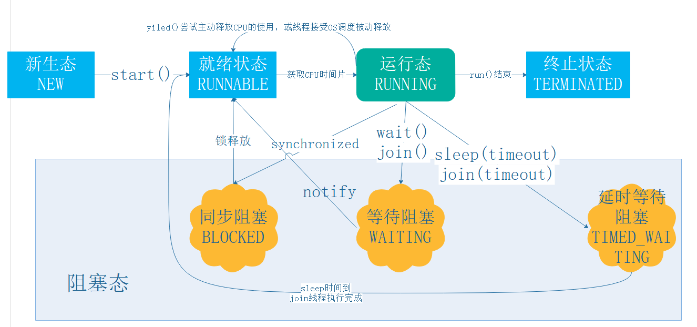
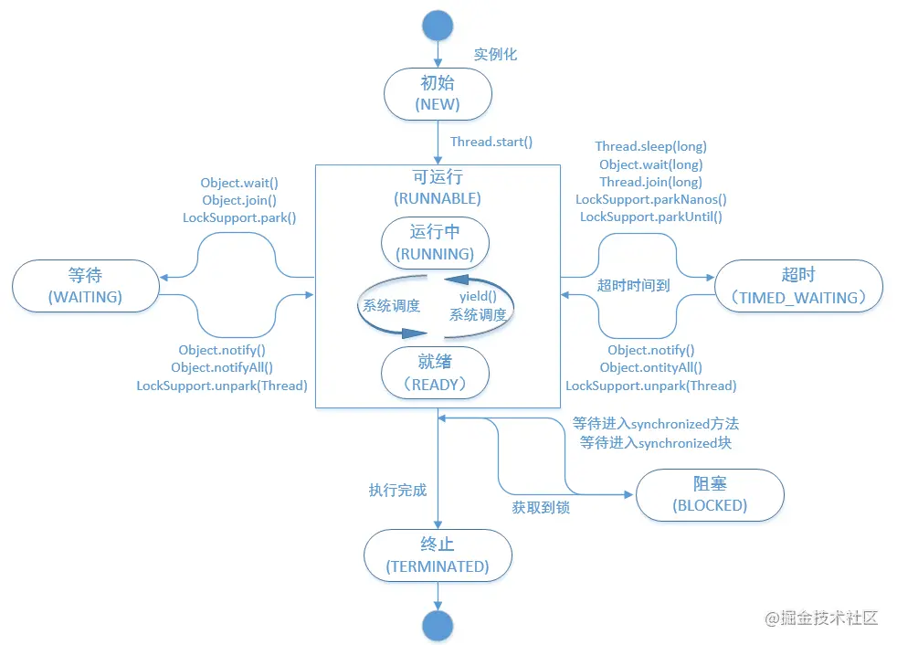
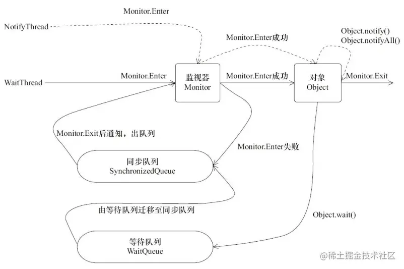

[RedSpider社区成员原创与维护的Java多线程系列文章](https://github.com/RedSpider1/concurrent)

  

## 线程的生命周期及五种基本状态
**线程状态图**


**线程状态图2**


### Java线程具有五中基本状态

**新建状态(New)**

当线程对象对创建后，即进入了新建状态，如：Thread t = new MyThread();

**就绪状态(Runnable)**

当调用线程对象的start()方法(t.start();)，线程即进入就绪状态。处于就绪状态的线程，只是说明此线程已经做好了准备，随时等待CPU调度执行，并不是说执行了t.start()此线程立即就会执行；

**运行状态(Running)**

当CPU开始调度处于就绪状态的线程时，此时线程才得以真正执行，即进入到运行状态。注：就     绪状态是进入到运行状态的唯一入口，也就是说，线程要想进入运行状态执行，首先必须处于就绪状态中；

**阻塞状态(Blocked)**

处于运行状态中的线程由于某种原因，暂时放弃对CPU的使用权，停止执行，此时进入阻塞状态，直到其进入到就绪状态，才 有机会再次被CPU调用以进入到运行状态。根据阻塞产生的原因不同，阻塞状态又可以分为三种：

1.等待阻塞：运行状态中的线程执行wait()方法，使本线程进入到等待阻塞状态；

2.同步阻塞 -- 线程在获取synchronized同步锁失败(因为锁被其它线程所占用)，它会进入同步阻塞状态；

3.其他阻塞 -- 通过调用线程的sleep()或join()或发出了I/O请求时，线程会进入到阻塞状态。当sleep()状态超时、join()等待线程终止或者超时、或者I/O处理完毕时，线程重新转入就绪状态。

**死亡状态(Dead)**

线程执行完了或者因异常退出了run()方法，该线程结束生命周期。

### 线程状态变更的几种方法

**sleep()**  

　　sleep()方法需要指定等待的时间，它可以让当前正在执行的线程在指定的时间内暂停执行，进入阻塞状态，该方法既可以让其他同优先级或者高优先级的线程得到执行的机会，也可以让低优先级的线程得到执行机会。但是sleep()方法不会释放“锁标志”，也就是说如果有synchronized同步块，其他线程仍然不能访问共享数据。  

**wait()**  

　　wait()方法需要和notify()及notifyAll()两个方法一起介绍，这三个方法用于协调多个线程对共享数据的存取，所以必须在synchronized语句块内使用，也就是说，调用wait()，notify()和notifyAll()的任务在调用这些方法前必须拥有对象的锁。注意，它们都是Object类的方法，而不是Thread类的方法。  

　　wait()方法与sleep()方法的不同之处在于，wait()方法会释放对象的“锁标志”。当调用某一对象的wait()方法后，会使当前线程暂停执行，并将当前线程放入对象等待池中，直到调用了notify()方法后，将从对象等待池中移出任意一个线程并放入锁标志等待池中，只有锁标志等待池中的线程可以获取锁标志，它们随时准备争夺锁的拥有权。当调用了某个对象的notifyAll()方法，会将对象等待池中的所有线程都移动到该对象的锁标志等待池。  

　　除了使用notify()和notifyAll()方法，还可以使用带毫秒参数的wait(long timeout)方法，效果是在延迟timeout毫秒后，被暂停的线程将被恢复到锁标志等待池。  

　　此外，wait()，notify()及notifyAll()只能在synchronized语句中使用，但是如果使用的是ReenTrantLock实现同步，该如何达到这三个方法的效果呢？解决方法是使用ReenTrantLock.newCondition()获取一个Condition类对象，然后Condition的await()，signal()以及signalAll()分别对应上面的三个方法。

**yield()**  

　　yield()方法和sleep()方法类似，也不会释放“锁标志”，区别在于，它没有参数，即yield()方法只是使当前线程重新回到可执行状态，所以执行yield()的线程有可能在进入到可执行状态后马上又被执行，另外yield()方法只能使同优先级或者高优先级的线程得到执行机会，这也和sleep()方法不同。

**join()**  

　　join()方法会使当前线程等待调用join()方法的线程结束后才能继续执行
　　join的使用实例
　　```java
　　public class JoinExample implements Runnable {
    public void run() {
        System.out.println(Thread.currentThread().getName() + " is running");
        try {
            Thread.sleep(1000);
        } catch (InterruptedException e) {
            e.printStackTrace();
        }
        System.out.println(Thread.currentThread().getName() + " is done");
    }

    public static void main(String[] args) {
        Thread t1 = new Thread(new JoinExample(), "Thread 1");
        Thread t2 = new Thread(new JoinExample(), "Thread 2");

        t1.start();
        t2.start();

        try {
            t1.join(); // 等待t1线程执行完毕
            t2.join(); // 等待t2线程执行完毕
        } catch (InterruptedException e) {
            e.printStackTrace();
        }

        System.out.println("All threads are done");
    }
}
/**
输出结果：
Thread 1 is running
Thread 2 is running
Thread 2 is done
Thread 1 is done
All threads are done
**  可见 join只是让其他现场加入当前线程并且在加入的线程执行完后当前线程才继续执行，假如加入多个线程，并不保证这多个线程的执行顺序/
```

```java

public static void main(String[] args) throws InterruptedException {

              final ExecutorService exec = Executors.newFixedThreadPool(4);//线程池容量4

              final ReentrantLock lock = new ReentrantLock();

              final Condition con = lock.newCondition();

              final int time = 2;

              final Runnable add = new Runnable() {

                public void run() {

                  lock.lock();

                  System.out.println("Pre " + lock);

                  try {

                    con.await(time, TimeUnit.SECONDS);//await方法会释放锁

//                    Thread.sleep(2000);

                  } catch (InterruptedException e) {

                    e.printStackTrace();

                  } finally {

                    System.out.println("Post " + lock.toString());

                    lock.unlock();

                  }

                }

              };

              for(int index = 0; index < 4; index++)

                exec.submit(add);

              exec.shutdown();

            }

```

输出：四个pre,延迟2s,四个post

```

Pre java.util.concurrent.locks.ReentrantLock@4cd1355d[Locked by thread pool-1-thread-1]

Pre java.util.concurrent.locks.ReentrantLock@4cd1355d[Locked by thread pool-1-thread-2]

Pre java.util.concurrent.locks.ReentrantLock@4cd1355d[Locked by thread pool-1-thread-3]

Pre java.util.concurrent.locks.ReentrantLock@4cd1355d[Locked by thread pool-1-thread-4]

Post java.util.concurrent.locks.ReentrantLock@4cd1355d[Locked by thread pool-1-thread-3]

Post java.util.concurrent.locks.ReentrantLock@4cd1355d[Locked by thread pool-1-thread-1]

Post java.util.concurrent.locks.ReentrantLock@4cd1355d[Locked by thread pool-1-thread-4]

Post java.util.concurrent.locks.ReentrantLock@4cd1355d[Locked by thread pool-1-thread-2]

```

如果改成Thread.sleep(),输出:每个pre延迟2s,然后post

```

Pre java.util.concurrent.locks.ReentrantLock@fb77e4c[Locked by thread pool-1-thread-1]

Post java.util.concurrent.locks.ReentrantLock@fb77e4c[Locked by thread pool-1-thread-1]

Pre java.util.concurrent.locks.ReentrantLock@fb77e4c[Locked by thread pool-1-thread-2]

Post java.util.concurrent.locks.ReentrantLock@fb77e4c[Locked by thread pool-1-thread-2]

Pre java.util.concurrent.locks.ReentrantLock@fb77e4c[Locked by thread pool-1-thread-3]

Post java.util.concurrent.locks.ReentrantLock@fb77e4c[Locked by thread pool-1-thread-3]

Pre java.util.concurrent.locks.ReentrantLock@fb77e4c[Locked by thread pool-1-thread-4]

Post java.util.concurrent.locks.ReentrantLock@fb77e4c[Locked by thread pool-1-thread-4]

```

wait(),notify(),notifyAll()同理：

```java

  public static void main(String[] args) throws InterruptedException {

        final ExecutorService exec = Executors.newFixedThreadPool(4);

        final Runnable add = new Runnable() {

          public synchronized  void run() {

            System.out.println("Pre " + Thread.currentThread().getName());

            try {

//              Thread.sleep(5000);

              this.wait(2000);

            } catch (InterruptedException e) {

              e.printStackTrace();

            } finally {

              System.out.println("Post " + Thread.currentThread().getName());

            }

          }

        };

        for(int index = 0; index < 4; index++)

          exec.submit(add);

        exec.shutdown();

      }

```

### wait() notify() 使用
Java中的wait()和notify()方法是用于线程同步的基本方法，它们通常是在生产者和消费者模式中使用的。具体来说，当多个线程需要共享同一个资源时，就需要使用这些方法来协调线程之间的通信。

wait()方法是一个对象级别的方法，用于将当前线程置于对象的等待池中，并释放该对象的锁。当线程调用wait()方法时，它就会释放所持有的对象锁，进入等待状态，直到其他线程调用该对象的notify()方法唤醒它。wait()方法可以指定一个超时时间，如果在超时时间内没有被唤醒，那么线程就会自动唤醒。

notify()方法也是一个对象级别的方法，用于唤醒在对象等待池中等待的一个线程。当线程调用notify()方法时，它会通知在该对象等待池中等待的某个线程，使其从等待池中出队，并重新尝试获取该对象的锁。

下面是一个使用wait()和notify()方法的示例代码：
https://www.liaoxuefeng.com/wiki/1252599548343744/1306580911915042

```java
import java.util.*;  
  
public class WaitNotifyExample {  
    public static void main(String[] args) throws InterruptedException {  
        var q = new TaskQueue();  
        var ts = new ArrayList<Thread>();  
        for (int i=0; i<5; i++) {  
            var t = new Thread() {  
                public void run() {  
                    // 执行task:  
                    while (true) {  
                        try {  
                            String s = q.getTask();  
                            System.out.println(Thread.currentThread().getName() + "execute task: " + s);  
                        } catch (InterruptedException e) {  
                            return;  
                        }  
                    }  
                }  
            };  
            t.start();  
            ts.add(t);  
        }  
        var add = new Thread(() -> {  
            for (int i=0; i<20; i++) {  
                // 放入task:  
                String s = "t-" + Math.random();  
                System.out.println("add task: " + s);  
                q.addTask(s);  
                try { Thread.sleep(100); } catch(InterruptedException e) {}  
            }  
        });  
        add.start();  
        add.join();  
        Thread.sleep(100);  
        for (var t : ts) {  
	        // 队列中的task都执行完了  中断等待的线程
            t.interrupt();  
        }  
    }  
}  
  
class TaskQueue {  
    Queue<String> queue = new LinkedList<>();  
  
    public synchronized void addTask(String s) {  
        this.queue.add(s);  
        this.notify();  
        // this.notifyAll();  //一样的
    }  
  
    public synchronized String getTask() throws InterruptedException {  
        while (queue.isEmpty()) {  
            this.wait();  
        }  
        return queue.remove();  
    }  
}

```

在这个示例中，我们定义了一个WaitNotifyExample类，其中包含一个布尔型的flag变量。waitForFlag()方法通过while循环来检查flag变量的值，如果它为false，则调用wait()方法将线程置于等待状态。setFlag()方法用于将flag变量设置为true，并调用notifyAll()方法来唤醒在等待池中等待的所有线程。

在使用wait()和notify()方法时，需要注意以下几点：

1.  wait()和notify()方法只能用于同步方法或同步块中，否则会抛出IllegalMonitorStateException异常。
2.  **wait()方法和notify()方法必须在同一个对象上调用，否则也会抛出IllegalMonitorStateException异常**。
3.  wait()方法和notify()方法应该始终使用while循环进行调用，以避免虚假唤醒问题。
4.  wait()方法可以指定超时时间，**如果在超时时间内没有被唤醒，那么线程就会自动唤醒**。
5.  notify()方法只会唤醒在等待池中等待的一个线程，如果需要唤醒所有等待的线程，可以使用notifyAll()方法。
#### wait() notify()原理

知道了如何使用，就得知道他的原理到底是什么？

首先我们看，使用这两个方法的顺序一般是什么？

1.  使用 wait ，notify 和 notifyAll 时需要先对调用对象加锁。
2.  调用 wait 方法后，线程状态有 Running 变为 Waiting，并将当前线程放置到对象的 **等待队列**。
3.  notify 或者 notifyAll 方法调用后， 等待线程依旧不会从 wait 返回，需要调用 noitfy 的线程释放锁之后，等待线程才有机会从 wait 返回。
4.  notify 方法将等待队列的一个等待线程从等待队列种移到**同步队列**中，而 notifyAll 方法则是将**等待队列**种所有的线程全部移到**同步队列**，被移动的线程状态由 Waiting 变为 Blocked。
5.  从 wait 方法返回的前提是获得了调用对象的锁。

从上述细节可以看到，等待/通知机制依托于同步机制，其目的就是确保等待线程从 wait 方法返回后能够感知到通知线程对变量做出的修改。

该图描述了上面的步骤：



WaitThread 获得了对象的锁，调用对象的 wait 方法，放弃了锁，进入的等待队列，然后 NotifyThread 拿到了对象的锁，然后调用对象的 notify 方法，将 WatiThread 移动到同步队列中，最后，NotifyThread 执行完毕，释放锁， WaitThread 再次获得锁并从 wait 方法返回继续执行。

## 线程的创建及启动

java中要开启一个线程，只能是新建一个Thread的实例或者继承了Thread的子类的实例，调用start方法，便开启了 线程  进入Runnable状态

```java

@Test

    public void demo1() {

          new Thread().start();

    }

```

上面代码就创建了并启用了一个线程   只是因为没有传入实现Runnable接口的实例对象或者集成Thread并重写了run()方法的对象，所以什么也没执行，线程就执行完毕，消亡掉了。

### 几种多线程的实现

1.  继承Thread类，重写该类的run()方法
2. 实现 Runnable 接口
3. 实现 Callable 接口
4. 使用线程池
```java
import java.util.concurrent.Callable;
import java.util.concurrent.ExecutorService;
import java.util.concurrent.Executors;
import java.util.concurrent.Future;

public class CallableExample {
    public static void main(String[] args) throws Exception {
        ExecutorService executor = Executors.newSingleThreadExecutor();

        Callable<Integer> task = new Callable<Integer>() {
            public Integer call() {
                int sum = 0;
                for (int i = 1; i <= 10; i++) {
                    sum += i;
                }
                return sum;
            }
        };

        Future<Integer> future = executor.submit(task);

        System.out.println("Result: " + future.get());

        executor.shutdown();
    }
}

```
### runnable callable区别
**Runnable** 接口run 方法无返回值；**Callable** 接口call 方法有返回值，是个泛型，和Future、FutureTask配合可以用来获取异步执行的结果 **Runnable** 接口run 方法只能抛出运行时异常，且无法捕获处理；**Callable** 接口call 方法允许抛出异常，可以获取异常信息

## 可重入锁ReetrantLock基本使用

https://blog.csdn.net/Somhu/article/details/78874634

在JDK5.0版本之前，重入锁的性能远远好于synchronized关键字，JDK6.0版本之后synchronized 得到了大量的优化，二者性能也不分伯仲，但是重入锁是可以完全替代synchronized关键字的.

重入锁和synchronized最大的区别是锁是可重入的 所以释放锁也要多次释放（和获取锁的次数相同），这样才能释放锁 ，重入锁的获取锁和释放锁都是显示的

```java

public class ReentrantLockTest implements Runnable{

    public static ReentrantLock lock = new ReentrantLock();

    public static int i = 0;

    @Override

    public void run() {

        for (int j = 0; j < 10000; j++) {

            lock.lock();  // 看这里就可以

            //lock.lock(); ①

            try {

                i++;

            } finally {

                lock.unlock(); // 看这里就可以

                //lock.unlock();②

            }

        }

    }

    public static void main(String[] args) throws InterruptedException {

        ReentrantLockTest test = new ReentrantLockTest();

        Thread t1 = new Thread(test);

        Thread t2 = new Thread(test);

        t1.start();t2.start();

        t1.join(); t2.join(); // main线程会等待t1和t2都运行完再执行以后的流程

        System.err.println(i);

    }

}

```

t1.join(),t2,join()方法 这样 主线程打印的是20000，注释掉 可能是0-20000之间的任何数    join()的用法体现

①②处的注释放开就体现了重入锁锁的可重入性  只放开②会报 java.lang.IllegalMonitorStateException 异常 只放开①会造成死锁

为什么要引入可重入锁呢？开始我以为synchronized是不可重入的

```java

public class SynchronizedDemo implements Runnable{

    public static int i = 0;

    @Override

    public synchronized void  run() {

      while(i<10000) {

        i++;

        run();

      }

    }

    public static void main(String[] args) throws InterruptedException {

      SynchronizedDemo test = new SynchronizedDemo();

        Thread t1 = new Thread(test);

        t1.start();

        t1.join();  // main线程会等待t1和t2都运行完再执行以后的流程

        System.err.println(i);

    }

}

```

可重入和不可重入的概念：当一个线程获得了当前实例的锁，并进入方法A，则这个线程在没有释放这把锁的时候，能否再次进入方法A呢？

本来以为这样会导致死锁，发现没有，说明synchronized是可重入的（jdk1.8可能之前不能，只有对synchronized有过优化？）

那么为什么引入synchronized呢？仅仅是因为它能显示的加锁释放锁么？

ReenTrantLock独有的能力：

1.      ReenTrantLock可以指定是公平锁还是非公平锁。而synchronized只能是非公平锁。所谓的公平锁就是先等待的线程先获得锁。

```java

public ReentrantLock(boolean fair) {

    sync = fair ? new FairSync() : new NonfairSync();

}

```

2.      ReenTrantLock提供了一个Condition（条件）类，用来实现分组唤醒需要唤醒的线程们，而不是像synchronized要么随机唤醒一个线程要么唤醒全部线程。

lock.newCondition()

condition.await()      obj.wait()

condition.signal()    obj.notify()    调用signal()方法前需要获取到创建该对象的锁否则会产生

                            // java.lang.IllegalMonitorStateException异常

condition.signalAll()  obj.notifyAll()

3.      ReenTrantLock提供了一种能够中断等待锁的线程的机制，通过lock.lockInterruptibly()来实现这个机制。

对于synchronized块来说，要么获取到锁执行，要么持续等待。而重入锁的中断响应功能就合理地避免了这样的情况。比如，一个正在等待获取锁的线程被“告知”无须继续等待下去，就可以停止工作了。直接上代码，来演示使用重入锁如何解决死锁：

```java

public class KillDeadlock implements Runnable{

    public static ReentrantLock lock1 = new ReentrantLock();

    public static ReentrantLock lock2 = new ReentrantLock();

    int lock;

    public KillDeadlock(int lock) {

        this.lock = lock;

    }

    @Override

    public void run() {

        try {

            if (lock == 1) {

                lock1.lockInterruptibly();  // 以可以响应中断的方式加锁

                try {

                    Thread.sleep(500);

                } catch (InterruptedException e) {}

                lock2.lockInterruptibly();

            } else {

                lock2.lockInterruptibly();  // 以可以响应中断的方式加锁

                try {

                    Thread.sleep(500);

                } catch (InterruptedException e) {}

                lock1.lockInterruptibly();

            }

        } catch (InterruptedException e) {

            e.printStackTrace();

        } finally {

            if (lock1.isHeldByCurrentThread()) lock1.unlock();  // 注意判断方式

            if (lock2.isHeldByCurrentThread()) lock2.unlock();

            System.err.println(Thread.currentThread().getId() + "退出！");

        }

    }

    public static void main(String[] args) throws InterruptedException {

        KillDeadlock deadLock1 = new KillDeadlock(1);

        KillDeadlock deadLock2 = new KillDeadlock(2);

        Thread t1 = new Thread(deadLock1);

        Thread t2 = new Thread(deadLock2);

        t1.start();t2.start();

        Thread.sleep(1000);

        //t2.interrupt(); // ③

    }

}

```

三处的注释没加上的时候，是死锁，打开注释，可以运行

运行结果：

java.lang.InterruptedException

  at java.util.concurrent.locks.AbstractQueuedSynchronizer.doAcquireInterruptibly(Unknown Source)

  at java.util.concurrent.locks.AbstractQueuedSynchronizer.acquireInterruptibly(Unknown Source)

  at java.util.concurrent.locks.ReentrantLock.lockInterruptibly(Unknown Source)

  at com.KillDeadlock.run(KillDeadlock.java:28)

  at java.lang.Thread.run(Unknown Source)

10退出！

11退出！

可以看到

t2只是释放了锁，保证t1执行，自己的任务却没有执行。。。。

锁申请等待限时：

如同synchronized一样。lock.lock()方法是没有获取到锁的话，会持续等待，ReentrantLock提供tryLock()或者tryLock(long timeout, TimeUtil unit) 方法进行一次限时的锁等待。

前者不带参数，这时线程尝试获取锁，如果获取到锁则继续执行，如果锁被其他线程持有，则立即返回 false ，也就是不会使当前线程等待，所以不会产生死锁。

后者带有参数，表示在指定时长内获取到锁则继续执行，如果等待指定时长后还没有获取到锁则返回false。

  

synchronized实现死锁   线程一持有锁1，要去获取锁额二，线程二持有锁二，要去获取锁一，因为线程都没有结束，所以都不会释放自己的锁，却都想获取对方的锁，就一直等待，造成死锁

  
  

## CountDownLatch使用以及原理

https://blog.csdn.net/sunp823/article/details/51887215      引入最佳案例

https://blog.csdn.net/LightOfMiracle/article/details/73456832    原理

https://blog.csdn.net/zhutulang/article/details/48504487   与join的区别（join只能是所有相关线程任务都执行完毕，阻塞的线程才继续执行，latch则是相关线程执行到某一阶段，就调用countDown()方法，就不再阻塞）

```java

public class CountDownLatchDemo {

  public static void main(String[] args) throws InterruptedException{

    CountDownLatch countDownLatch = new CountDownLatch(2){

      @Override

      public void await() throws InterruptedException {

        super.await();

        System.out.println(Thread.currentThread().getName() +  " count down is ok");

      }

    };

    Thread thread1 = new Thread(new Runnable() {

      @Override

      public void run() {

        //do something

        try {

          Thread.sleep(1000);

        } catch (InterruptedException e) {

          e.printStackTrace();

        }

        System.out.println(Thread.currentThread().getName() + " is done");

        countDownLatch.countDown();

      }

    }, "thread1");

    Thread thread2 = new Thread(new Runnable() {

      @Override

      public void run() {

        //do something

        try {

          Thread.sleep(2000);

        } catch (InterruptedException e) {

          e.printStackTrace();

        }

        System.out.println(Thread.currentThread().getName() + " is done");

        countDownLatch.countDown();

      }

    }, "thread2");

    thread1.start();

    thread2.start();

    countDownLatch.await();    //主线程调用CountDownLatch实例的await()方法，除非状态值为0，不然主线程会一直阻塞

                               //例如:将thread2.start()注释掉，因为初始状态值为2，值调用一次countDown()，主线程一直阻塞

  }

}

```

运行结果：

==thread1 is done    //1000ms后thread1结束

thread2 is done    //2000ms后thread2结束

main count down is ok #673ab7==

## AQS同步器

https://juejin.im/post/5afb9ab3f265da0b736dd1e1

juc包下的ReentrantLock,CyclicBarrier等都依赖同步器，方法都是内部定义了一个类继承AbstractQueuedSynchronizer()，通过重写同步器的方法来实现自己的同步逻辑。AQS基于一个FIFO双向队列实现，被设计给那些依赖一个代表状态的原子int值的同步器使用。我们都知道，既然叫同步器，那个肯定有个代表同步状态（临界资源）的东西，在AQS中即为一个叫state的int值，该值通过CAS进行原子修改

  

## ReadWriteLock读写锁的使用

https://blog.csdn.net/liuchuanhong1/article/details/53539341

## CyclicBarrier的工作原理及其实例以及和CountDownLatch的区别

https://blog.csdn.net/carson0408/article/details/79471490

## 深入理解Semaphore

https://blog.csdn.net/qq_19431333/article/details/70212663

## Exchanger的工作原理及实例

https://blog.csdn.net/carson0408/article/details/79477280

线程池

https://blog.csdn.net/hsuxu/article/details/8985931

ThreadLocal原理分析与使用场景

https://www.cnblogs.com/luxiaoxun/p/8744826.html