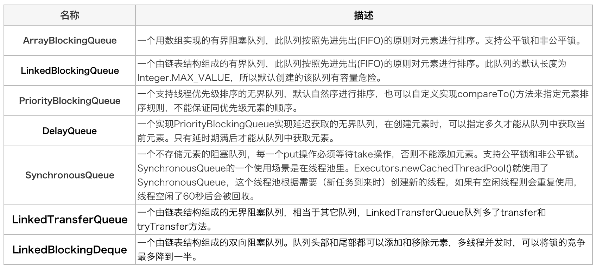
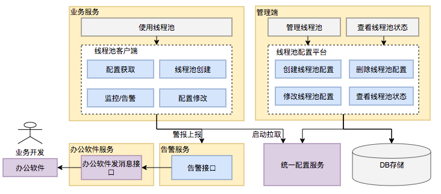
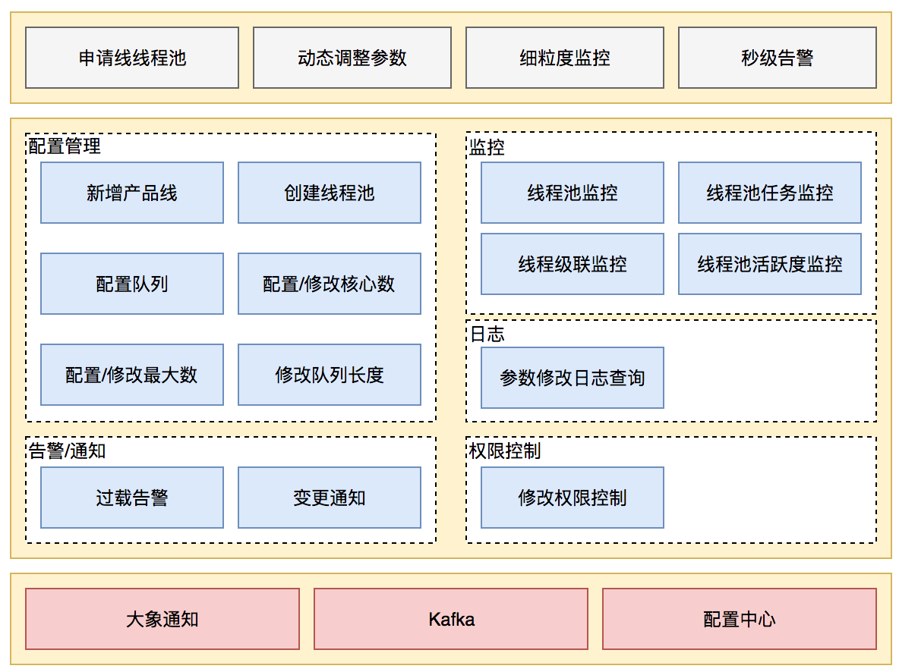
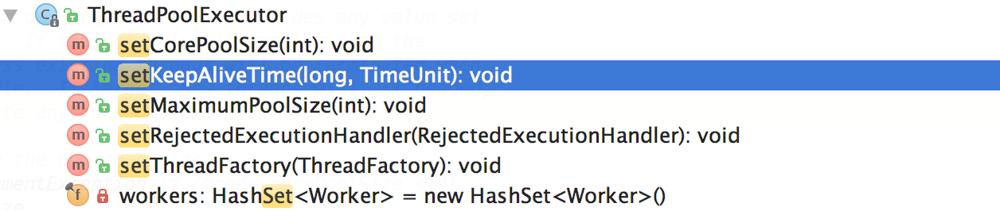

**优质博文：**
[Java线程池实现原理及其在美团业务中的实践](https://tech.meituan.com/2020/04/02/java-pooling-pratice-in-meituan.html)

## 线程池的等待队列
常见的等待队列：


**ArrayBlockingQueue源码分析:**
https://www.cnblogs.com/tuyang1129/p/12683373.html

什么叫阻塞呢？
阻塞就是说在**等待条件满足**的过程中，你**不可以去干其他**的事情

为什么说 `ArrayBlockingQueue`是阻塞队列呢，就是因为它的put操作 是阻塞的
所以如果用 add()  或者 offer()  就起不到阻塞队列的作用
```java
  
public void put(E e) throws InterruptedException {
    // 判断元素是否为null，若为null将抛出异常
    checkNotNull(e);
    // 获取锁对象lock
    final ReentrantLock lock = this.lock;
    // 调用lock的lockInterruptibly方法加锁，lockInterruptibly可以响应中断
    // 加锁是为了防止多个线程同时操作队列，造成线程安全问题
    lock.lockInterruptibly();
    try {
        // 如果当前队列中的元素的个数为数组长度，表示队列满了，
        // 这时调用notFull.await()让当前线程阻塞，也就是让生产者阻塞
        // 而此处使用while循环而不是if，是考虑到线程被唤醒后，队列可能还是满的
        // 所以线程被唤醒后，需要再次判断，若依旧是满的，则再次阻塞
        while (count == items.length)
            notFull.await();
        
        // 调用enqueue方法将元素加入数组中
        enqueue(e);
    } finally {
        // 释放锁
        lock.unlock();
    }
}

/** 此方法将新元素加入到数组中 */
private void enqueue(E x) {
    // 获得存储元素的数组
    final Object[] items = this.items;
    // 将新元素x放入到数组中，且放入的位置就是putIndex指向的位置
    items[putIndex] = x;
    // putIndex加1，如果超过了数组的最大长度，则将其置为0，也就是数组的第一个位置
    if (++putIndex == items.length)
        putIndex = 0;
    // 元素数量+1
    count++;
    // 因为我们已经向队列中添加了元素，所以可以唤醒那些需要获取元素的线程，也就是消费者
    // 之前说过，notEmpty就是用来阻塞和唤醒消费者的
    notEmpty.signal();
}

// 判断元素是否为null
private static void checkNotNull(Object v) {
    if (v == null)
        throw new NullPointerException();
}
```

## 线程池参数设置的合理性？？

## 动态化设置线程池参数
动态化线程池的核心设计包括以下三个方面：
 
1.  简化线程池配置：线程池构造参数有8个，但是最核心的是3个：corePoolSize、maximumPoolSize，workQueue，它们最大程度地决定了线程池的任务分配和线程分配策略。考虑到在实际应用中我们获取并发性的场景主要是两种：（1）并行执行子任务，提高响应速度。这种情况下，应该使用同步队列，没有什么任务应该被缓存下来，而是应该立即执行。（2）并行执行大批次任务，提升吞吐量。这种情况下，应该使用有界队列，使用队列去缓冲大批量的任务，队列容量必须声明，防止任务无限制堆积。所以线程池只需要提供这三个关键参数的配置，并且提供两种队列的选择，就可以满足绝大多数的业务需求，Less is More。

2.  参数可动态修改：为了解决参数不好配，修改参数成本高等问题。在Java线程池留有高扩展性的基础上，封装线程池，允许线程池监听同步外部的消息，根据消息进行修改配置。将线程池的配置放置在平台侧，允许开发同学简单的查看、修改线程池配置。

3.  增加线程池监控：对某事物缺乏状态的观测，就对其改进无从下手。在线程池执行任务的生命周期添加监控能力，帮助开发同学了解线程池状态。

 动态化线程池整体设计：
 
动态化线程池提供如下功能：

**动态调参**：支持线程池参数动态调整、界面化操作；包括修改线程池核心大小、最大核心大小、队列长度等；参数修改后及时生效。 **任务监控**：支持应用粒度、线程池粒度、任务粒度的Transaction监控；可以看到线程池的任务执行情况、最大任务执行时间、平均任务执行时间、95/99线等。 **负载告警**：线程池队列任务积压到一定值的时候会通过大象（美团内部通讯工具）告知应用开发负责人；当线程池负载数达到一定阈值的时候会通过大象告知应用开发负责人。 **操作监控**：创建/修改和删除线程池都会通知到应用的开发负责人。 **操作日志**：可以查看线程池参数的修改记录，谁在什么时候修改了线程池参数、修改前的参数值是什么。 **权限校验**：只有应用开发负责人才能够修改应用的线程池参数。



线程池参数动态化：


## 线程池的使用场景
**场景1：快速响应用户请求**

**描述**：用户发起的实时请求，服务追求响应时间。比如说用户要查看一个商品的信息，那么我们需要将商品维度的一系列信息如商品的价格、优惠、库存、图片等等聚合起来，展示给用户。

**分析**：从用户体验角度看，这个结果响应的越快越好，如果一个页面半天都刷不出，用户可能就放弃查看这个商品了。而面向用户的功能聚合通常非常复杂，伴随着调用与调用之间的级联、多级级联等情况，业务开发同学往往会选择使用线程池这种简单的方式，将调用封装成任务并行的执行，缩短总体响应时间。另外，使用线程池也是有考量的，这种场景最重要的就是获取最大的响应速度去满足用户，所以应该不**设置队列去缓冲并发任务**，**调高corePoolSize和maxPoolSize去尽可能创造多的线程快速执行任务**。


**场景2：快速处理批量任务**

**描述**：离线的大量计算任务，需要快速执行。比如说，统计某个报表，需要计算出全国各个门店中有哪些商品有某种属性，用于后续营销策略的分析，那么我们需要查询全国所有门店中的所有商品，并且记录具有某属性的商品，然后快速生成报表。

**分析**：这种场景需要执行大量的任务，我们也会希望任务执行的越快越好。这种情况下，也应该使用多线程策略，并行计算。但与响应速度优先的场景区别在于，这类场景任务量巨大，并不需要瞬时的完成，而是关注如何使用有限的资源，尽可能在单位时间内处理更多的任务，也就是吞吐量优先的问题。所以**应该设置队列去缓冲并发任务，调整合适的corePoolSize去设置处理任务的线程数**。在这里，设置的线程数过多可能还会引发线程上下文切换频繁的问题，也会降低处理任务的速度，降低吞吐量。


## submit和execute区别
In Java, a thread pool is a collection of pre-initialized threads that are used to execute tasks. The `ThreadPoolExecutor` class in Java provides a way to create and manage thread pools.

Both the `execute` and `submit` methods are used to submit a task to a thread pool for execution. However, there are some differences between them:

1.  Return Value: The `execute` method has a void return type, while the `submit` method returns a `Future` object. This `Future` object can be used to check the status of the task, get the result of the task if it returns a value, and cancel the task.
    
2.  Exception Handling: The `execute` method does not throw any checked exceptions, while the `submit` method throws a `RejectedExecutionException` if the task cannot be accepted for execution.
    
3.  Task Parameters: The `execute` method takes a `Runnable` object as a parameter, while the `submit` method takes a `Callable` or a `Runnable` object as a parameter. The `Callable` interface is similar to the `Runnable` interface, but it allows the task to return a value.
    
4.  Execution: The `execute` method adds the task to the thread pool's queue and returns immediately, while the `submit` method submits the task to the thread pool and returns a `Future` object immediately. The task may not be executed immediately if all the threads in the thread pool are busy.
    

In summary, the `execute` method is used to submit a task for execution without any expectation of a result, while the `submit` method is used to submit a task for execution and obtain a `Future` object that can be used to check the status and get the result of the task.

**带返回值的 是阻塞的**

```java
import java.util.concurrent.*;  
  
public class TestCompletionService {  
    private static final String commandstr01 = "hahah";  
    private static final String commandstr02 = "hahah";  
  
  
    public static void main(String[] args) throws InterruptedException, ExecutionException {  
        //1、创建一个线程池  
        ExecutorService executorService = Executors.newCachedThreadPool();  
  
        CompletionService<String> completionService = new ExecutorCompletionService<String>(executorService);  
  
        Future<String> submit = completionService.submit(new MyThreadt33(commandstr01));  
        Future<String> submit1 = completionService.submit(new MyThreadt44(commandstr01));  
  
        executorService.shutdown();  
  
        System.out.println(completionService.take().get());  
        System.out.println(completionService.take().get());  
  
        System.out.println("submit: " + submit.get());  
        System.out.println("submit1: "+ submit1.get());  
    }  
}  
  
class MyThreadt33 implements Callable<String>{  
    private String commandstr;          // 要运行的mingling  
    public MyThreadt33(String commandstr) {  
        this.commandstr = commandstr;  
    }  
    @Override  
    public String call() throws Exception {  
        int sum = 0;  
        for (int i = 0; i < 10; i++) {  
            Thread.sleep(200);  
            sum += i;  
            System.out.println("Mythread3: "+i);  
        }  
        return String.valueOf(sum+300000);  
    }  
}  
  
class MyThreadt44 implements Callable<String>{  
    private String commandstr;          // 要运行的mingling  
    public MyThreadt44(String commandstr) {  
        this.commandstr = commandstr;  
    }  
    @Override  
    public String call() throws Exception {  
        int sum = 0;  
        for (int i = 0; i < 5; i++) {  
            Thread.sleep(200);  
            sum += i;  
            System.out.println("Mythread4: "+i);  
        }  
        return String.valueOf(sum+400000);  
    }  
}
```

```bash
Mythread4: 0
Mythread3: 0
Mythread4: 1
Mythread3: 1
Mythread3: 2
Mythread4: 2
Mythread3: 3
Mythread4: 3
Mythread3: 4
Mythread4: 4
400010
Mythread3: 5
Mythread3: 6
Mythread3: 7
Mythread3: 8
Mythread3: 9
300045
submit: 300045
submit1: 400010
```


