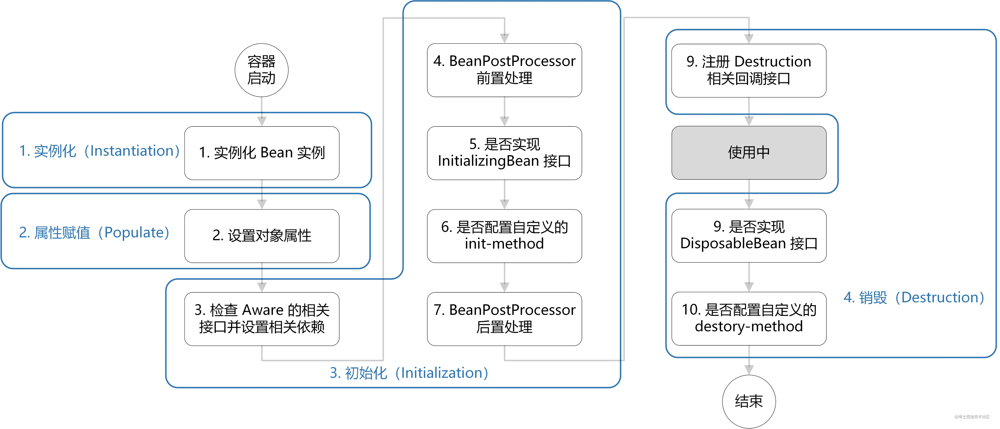

## 生命周期
Bean 的生命周期概括起来就是 **4 个阶段**：

1.  实例化（Instantiation）
2.  属性赋值（Populate）
3.  初始化（Initialization）
4.  销毁（Destruction）
### 生命周期一览图


-   实例化：第 1 步，利用反射实例化一个 bean 对象，分配内存空间；
    
-   属性赋值：第 2 步，为 bean 设置相关属性和依赖；
    
-   初始化：第 3~7 步，步骤较多，其中第 5、6 步为初始化操作，第 3、4 步为在初始化前执行，第 7 步在初始化后执行，该阶段结束，才能被用户使用；
    
-   销毁：第 8~10步，第8步不是真正意义上的销毁（还没使用呢），而是先在使用前注册了销毁的相关调用接口，为了后面第9、10步真正销毁 bean 时再执行相应的方法。
    

1.实例化：为 Bean 分配内存空间；
2.设置属性：将当前类依赖的 Bean 属性，进行注入和装配；
3.初始化：

1.  执行各种通知。
2.  执行初始化的前置方法。
3.  执行初始化方法。
4.  执行初始化的后置方法。

4.使用 Bean：在程序中使用 Bean 对象；5.销毁 Bean：将 Bean 对象进行销毁操作。

## 四个阶段对应的拓展点

### 3.1 Aware 接口

若 Spring 检测到 bean 实现了 Aware 接口，则会为其注入相应的依赖。所以**通过让bean 实现 Aware 接口，则能在 bean 中获得相应的 Spring 容器资源**。

Spring 中提供的 Aware 接口有：

1.  BeanNameAware：注入当前 bean 对应 beanName；
2.  BeanClassLoaderAware：注入加载当前 bean 的 ClassLoader；
3.  BeanFactoryAware：注入 当前BeanFactory容器 的引用。

其代码实现如下：

```java
// AbstractAutowireCapableBeanFactory.java
private void invokeAwareMethods(final String beanName, final Object bean) {
    if (bean instanceof Aware) {
        if (bean instanceof BeanNameAware) {
            ((BeanNameAware) bean).setBeanName(beanName);
        }
        if (bean instanceof BeanClassLoaderAware) {
            ((BeanClassLoaderAware) bean).setBeanClassLoader(bcl);
            
        }
        if (bean instanceof BeanFactoryAware) {
            ((BeanFactoryAware) bean).setBeanFactory(AbstractAutowireCapableBeanFactory.this);
        }
    }
}
复制代码
```

以上是针对 BeanFactory 类型的容器，而对于 ApplicationContext 类型的容器，也提供了 Aware 接口，只不过这些 Aware 接口的注入实现，是通过 BeanPostProcessor 的方式注入的，但其作用仍是注入依赖。

1.  EnvironmentAware：注入 Enviroment，一般用于获取配置属性；
2.  EmbeddedValueResolverAware：注入 EmbeddedValueResolver（Spring EL解析器），一般用于参数解析；
3.  ApplicationContextAware（ResourceLoader、ApplicationEventPublisherAware、MessageSourceAware）：注入 ApplicationContext 容器本身。

其代码实现如下：

```scss
// ApplicationContextAwareProcessor.java
private void invokeAwareInterfaces(Object bean) {
    if (bean instanceof EnvironmentAware) {
        ((EnvironmentAware)bean).setEnvironment(this.applicationContext.getEnvironment());
    }

    if (bean instanceof EmbeddedValueResolverAware) {
        ((EmbeddedValueResolverAware)bean).setEmbeddedValueResolver(this.embeddedValueResolver);
    }

    if (bean instanceof ResourceLoaderAware) {
        ((ResourceLoaderAware)bean).setResourceLoader(this.applicationContext);
    }

    if (bean instanceof ApplicationEventPublisherAware) {
        ((ApplicationEventPublisherAware)bean).setApplicationEventPublisher(this.applicationContext);
    }

    if (bean instanceof MessageSourceAware) {
        ((MessageSourceAware)bean).setMessageSource(this.applicationContext);
    }

    if (bean instanceof ApplicationContextAware) {
        ((ApplicationContextAware)bean).setApplicationContext(this.applicationContext);
    }

}
```

  ### 3.2 BeanPostProcessor

BeanPostProcessor 是 Spring 为**修改 bean**提供的强大扩展点，其可作用于容器中所有 bean，其定义如下：

```typescript
public interface BeanPostProcessor {

	// 初始化前置处理
	default Object postProcessBeforeInitialization(Object bean, String beanName) throws BeansException {
		return bean;
	}

	// 初始化后置处理
	default Object postProcessAfterInitialization(Object bean, String beanName) throws BeansException {
		return bean;
	}

}
复制代码
```

常用场景有：

1.  对于标记接口的实现类，进行自定义处理。例如3.1节中所说的ApplicationContextAwareProcessor，为其注入相应依赖；再举个例子，**自定义对实现解密接口的类**，将对其属性进行解密处理；
2.  为当前对象提供代理实现。例如 Spring AOP 功能，生成对象的代理类，然后返回。

```scss
// AbstractAutoProxyCreator.java
public Object postProcessBeforeInstantiation(Class<?> beanClass, String beanName) {
    TargetSource targetSource = getCustomTargetSource(beanClass, beanName);
    if (targetSource != null) {
        if (StringUtils.hasLength(beanName)) {
            this.targetSourcedBeans.add(beanName);
        }
        Object[] specificInterceptors = getAdvicesAndAdvisorsForBean(beanClass, beanName, targetSource);
        Object proxy = createProxy(beanClass, beanName, specificInterceptors, targetSource);
        this.proxyTypes.put(cacheKey, proxy.getClass());
        // 返回代理类
        return proxy;
    }

    return null;
}
复制代码
```

### 3.3 InitializingBean 和 init-method

InitializingBean 和 init-method 是 Spring 为 **bean 初始化**提供的扩展点。

InitializingBean接口 的定义如下：

```csharp
public interface InitializingBean {
	void afterPropertiesSet() throws Exception;
}
复制代码
```

在 afterPropertiesSet() 方法写初始化逻辑。

指定 init-method 方法，指定初始化方法：

```xml
<?xml version="1.0" encoding="UTF-8"?>
<beans xmlns="http://www.springframework.org/schema/beans"
       xmlns:xsi="http://www.w3.org/2001/XMLSchema-instance"
       xsi:schemaLocation="http://www.springframework.org/schema/beans http://www.springframework.org/schema/beans/spring-beans.xsd">

    <bean id="demo" class="com.chaycao.Demo" init-method="init()"/>
    
</beans>
复制代码
```

DisposableBean 和 destory-method 与上述类似，就不描述了。


https://juejin.cn/post/6844904065457979405#heading-1
https://www.51cto.com/article/717956.html
https://www.jianshu.com/p/1dec08d290c1
https://segmentfault.com/a/1190000040365130