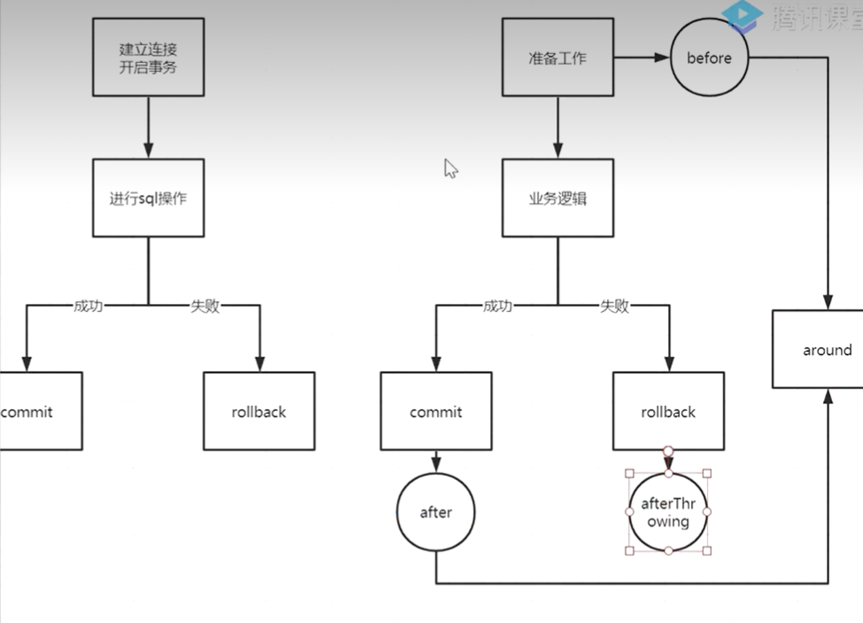
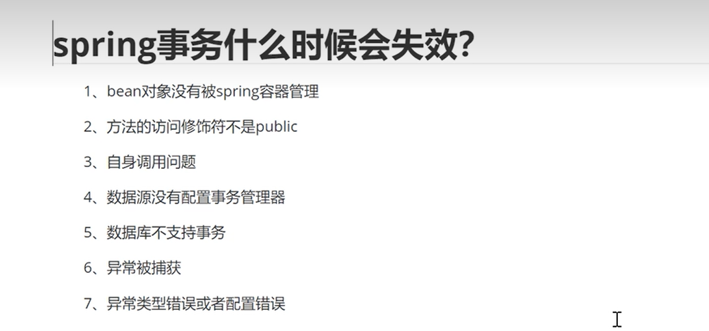

## chatGPT：
Q:spring 事务的实现原理

A: Spring 事务的实现原理是基于 AOP 的。

在 Spring 中，事务管理是通过切面实现的，即将事务管理的功能作为切面添加到目标对象上。

Spring 通过使用事务拦截器实现事务管理，该拦截器的作用是在调用目标方法前后管理事务的开启、提交、回滚等操作。

事务的具体实现依赖于底层使用的事务管理器，Spring 支持多种事务管理器，例如 JPA、JDBC、Hibernate 等，它们对应的事务管理器分别实现了对应的事务管理。

通过结合事务拦截器和事务管理器，Spring 可以实现声明式事务管理，即通过在配置文件或注解中声明事务属性，而不用在代码中显式编写事务管理逻辑。

## b站
https://www.bilibili.com/video/BV1N8411J7zK?p=50&spm_id_from=pageDriver&vd_source=4ea256e9431ae8b0e6d59aeaa6c35daf
spring的事务管理是如何实现的？

总：
S pr i n g的事务是由aop来实现的

首先要生成具体的代理对象，然后按照aop的整套流程来执行具体的操作逻辑，正常情况下要 通过通知来完成核心功能，但是事务不是通过通知来实现的，而是通过一个TransactionInter ceptor来实现的，然后调用invoke来实现具 体的逻辑 

分：
1. 准备工作，解析各个方法上事务相关的属性，根据具体的属性来判断是否开始新事务 
2. 当需要开启的时候，获取数据库连接，关闭自动提交功能，开起事务 
3. 执行具体的sql逻辑操作工
4. 在操作过程中，如果执行失败了，那么会通过completeTransactionAfterThrowing来完成事务的回滚操作，回滚的具体逻 辑是通过doRollBack方法来实现的，实现的时候也是要先获取连接对象，通过连接对象来回滚 
5. 如果执行过程中，没有任何意外情况的发生，那么通过commitTransactionAfterReturning来完成事务的提交操作，提交的 具体逻辑是通过doCommit方法来实现的，实现的时候也是要获取连接，通过连接对象来提交 
6. 当事务执行完毕之后需要清除相关的事务信息cleanupTransactionInfo 如果想要聊的更加细致的话，需要知道TransactionInfo，TransactionStatus

# 事务传播
## chatgpt
Q: spring中事务的传播机制有哪些 分别解释一下

A: Spring 中事务的传播机制有以下几种：

1.  REQUIRED: 支持当前事务，如果当前没有事务，就新建一个事务。这是最常见的传播机制，即在被调用的方法中需要加入事务。
2.  SUPPORTS: 支持当前事务，如果当前没有事务，就以非事务方式执行。
3.  MANDATORY: 支持当前事务，如果当前没有事务，就抛出异常。
4.  REQUIRES_NEW: 新建事务，如果当前存在事务，就把当前事务挂起。
5.  NOT_SUPPORTED: 以非事务方式执行操作，如果当前存在事务，就把当前事务挂起。
6.  NEVER: 以非事务方式执行，如果当前存在事务，则抛出异常。
7.  NESTED: 如果当前存在事务，则在嵌套事务内执行。如果当前没有事务，则进行与REQUIRED类似的操作。

事务传播机制用于控制**多个事务方法之间的执行关系和影响**。通过设置不同的传播机制，可以灵活控制事务的执行，从而满足不同的业务需求。

## b站
https://www.bilibili.com/video/BV1N8411J7zK?p=51&spm_id_from=pageDriver&vd_source=4ea256e9431ae8b0e6d59aeaa6c35daf

## 事务失效

https://blog.csdn.net/j1231230/article/details/105534599

