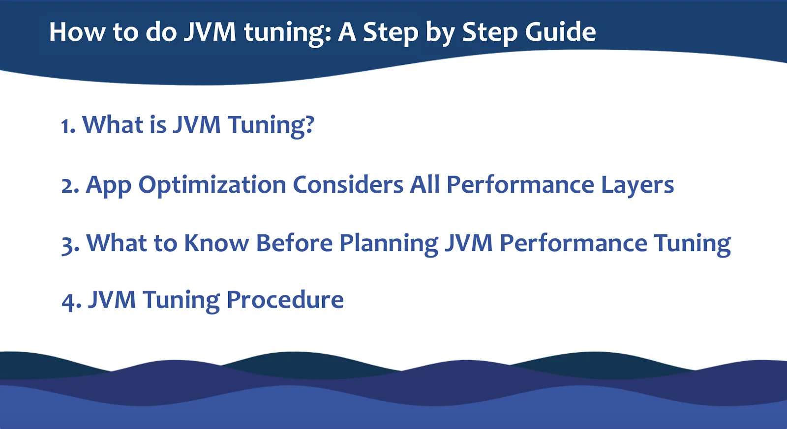

来源网址: https://sematext.com/blog/jvm-performance-tuning/

裁剪时间: 2024-08-06 14:06:46

# Java Virtual Machine (JVM) Performance Tuning Tutorial - Sematext


When it comes to Java applications, to make sure they run at peak performance, it’s critical to close the resource gap between the code and the virtual machine it’s running on – if there is one. The way to do that is by **peaking into and fine-tuning the** **Java Virtual Machine (JVM)**.
当涉及到 Java 应用程序时，为了确保它们以最高性能运行，关键是要缩小代码和运行它的虚拟机之间的资源差距——如果有的话。实现这一点的方法是深入研究并微调 Java 虚拟机(JVM)。
  

However, that’s easier said than done. Many factors can influence [JVM performance](https://sematext.com/guides/java-monitoring/), and during tuning, you must consider all of them. Though, there are ways around that to make it not be such a pain.

  

In this post, we are going to help you plan and understand **how to do JVM tuning** by using the JVM parameters and following some performance tuning principles and procedures. Let’s get to it!

  



  

## **What Is JVM Tuning**

  Before diving into JVM tuning, there are a few things you should consider first:
 
*   **Cost** – considering your environments, you may gain more by adding hardware instead of spending time to tune the JVM.
	* * 成本 * *-考虑到您的环境，您可以通过添加硬件而不是花时间调优 JVM 来获得更多

*   **Desired outcome** – in the long run, it’s more efficient to tune for stability, rather than performance, but they do overlap.
	期望的结果——从长远来看，调优稳定性要比调优性能更有效，但它们确实存在重叠

*   **Ongoing issues** – before starting tuning, you should do a thorough check of your system to see if there isn’t an underlying issue somewhere as tuning can delay or hide it temporarily. You can’t do JVM tuning, nor debugging if you’re not monitoring the JVM. Check out what are the critical JVM metrics  to monitor and which are the best [Java monitoring tools](https://sematext.com/guides/java-monitoring/) available today.
	正在发生的问题——在开始调优之前，您应该彻底检查一下您的系统，看看是否有一个潜在的问题，因为调优可能会延迟或暂时隐藏它。如果不监视 JVM，就不能进行 JVM 调优或调试。看看哪些是需要监视的关键 JVM 指标，哪些是目前可用的最好的

*   **Memory leaks** – they always lead to garbage collection (GC) issues regardless of tuning.
	内存泄漏——无论调优与否，它们总是会导致垃圾收集(GC)问题。

Java virtual machine tuning is the process of adjusting the default parameters to match our application needs. This includes simple adjustments like the size of the [heap](https://sematext.com/glossary/jvm-heap/) , through choosing the right garbage collector to using optimized versions of getters.
Java 虚拟机调优是调整默认参数以满足应用程序需求的过程。这包括一些简单的调整，比如通过选择正确的垃圾收集器来使用优化版本的 getter，来调整堆的大小( https://sematext.com/glossary/jvm-heap/)。

## **App Optimization Considers All Performance Layers**

  Although critical, tuning JVM is not enough to ensure optimal performance. For instance, if an app has a badly designed architecture or poorly written code, you can’t expect performance to skyrocket by merely tuning the JVM.
  

Not to mention, once you have the first two optimized, you’d need to get back to the JVM and start it all over again. A well-done tuning looks at the whole system and all the layers that can impact performance, including database and OS.
更不用说，一旦对前两个进行了优化，就需要返回到 JVM 并从头开始。良好的调优将着眼于整个系统和所有可能影响性能的层，包括数据库和操作系统。
  
That said, when you're at the stage of performing JVM tuning, assume that the architecture and code of your project are either optimal or have been tuned. However, before diving into it, you must set performance optimization goals and identify the current performance issues. The goals will serve as a benchmark to compare the app with once it’s optimized and to determine if it needs further intervention.
也就是说，当您处于执行 JVM 调优的阶段时，假设项目的体系结构和代码要么是最优的，要么已经进行了调优。但是，在深入研究之前，必须设置性能优化目标并确定当前的性能问题。这些目标将作为一个基准，以比较应用程序一旦优化，并确定是否需要进一步的干预。

Looking to learn more about JVM monitoring with Sematext Cloud? Check out this short video below:
[前往平台观看](https://www.youtube.com/watch?v=ijkRkMLh_qQ&embeds_referring_euri=https%3A%2F%2Fsematext.com%2F&embeds_referring_origin=https%3A%2F%2Fsematext.com)

## **What You Need to Know Before Planning JVM Performance Tuning**

Before diving into the step-by-step process, you need to get familiar with some basic concepts that we’ll use further on:

###  JVM Main Parameters

JVM parameters or JVM arguments are Java-specific values that change the behavior of the Java Virtual Machine.

When it comes to JVM tuning, there are few important parameters you should know as you’ll encounter them when configuring, tuning, and improving overall performance of the JVM. 

### Heap Memory

Whatever you do, when it comes to JVM performance, you will, more than likely, reach a point where you have to initialize the heap memory. **The parameters to specify minimum and maximum heap size are:**
```bash
java -Xms4096m -Xmx4096m app.jar
```

When setting the minimum and maximum heap size of the JVM memory you may want to consider setting them to the same values. That way your heap will not have to be resized saving precious CPU cycles. You may also want to pre-touch all the pages if you are using larger heap by setting the -XX:+AlwaysPreTouch flag to the startup options.
在设置 JVM 内存的最小和最大堆大小时，可能需要考虑将它们设置为相同的值。这样，您的堆就不必调整大小，从而节省宝贵的 CPU 周期。如果要使用更大的堆，可以通过将-XX: + AlwaysPreTouch 标志设置为启动选项来预先触摸所有页面。
  
**Starting from Java 8 the Metaspace has replaced the old PermGen memory space.** No more java.lang.OutOfMemoryError: PermGen errors, right now we can start [monitoring our application](https://sematext.com/guides/application-performance-monitoring/) logs for java.lang.OutOfMemoryError: Metadata space. By default the class metadata allocation is limited by the amount of available native memory and we have a new option to limit the maximum size of the new memory space introduced with Java 8. But just because the space can grow up to the limits of the native memory it doesn’t mean it is always occupying as much as it can. This region of the JVM memory can be dynamically resized depending on the needs.
 从 Java 8开始，Metaspace 取代了原来的 PermGen 内存空间。没有java.lang.OutOfMemoryError: PermGen errors，现在我们可以开始[监视我们的应用程序]( https://sematext.com/guides/application-performance-monitoring/) java.lang 的日志。元数据空间。默认情况下，类元数据分配受到可用本机内存数量的限制，我们有一个新选项来限制 Java8引入的新内存空间的最大大小。但是，仅仅因为空间可以发展到本机内存的限制，并不意味着它总是占用尽可能多的空间。JVM 内存的这个区域可以根据需要动态调整大小。

**The following properties exposed by the JVM allow us to control the Metaspace**:
 
*   \-XX:MaxMetaspaceSize – unlimited by default, sets the maximum amount of native memory that can be allocated for the class metadata.

*   \-XX:MetaspaceSize – sets the size of the allocated class metadata above which the first garbage collection will be triggered. Default value is platform dependent.

*   \-XX:MinMetaspaceFreeRatio – minimum percentage of the Metaspace memory region that needs to be available after garbage collection. If the amount of memory left is below the threshold the Metaspace region will be resized.

*   \-XX:MaxMetaspaceFreeRatio – maximum percentage of the Metaspace memory region that needs to be available after the garbage collection. If the amount of memory left is above the threshold the Metaspace region will be resized.
 

**Keep in mind that monitoring Metaspace region of the memory may be a very good idea as high garbage collection work in this memory region may indicate memory leaks in classes or classloaders.**
请记住，监视内存的 Metaspace 区域可能是一个非常好的主意，因为该内存区域中的高垃圾收集工作可能表明类或类加载器中存在内存泄漏

Delving deeper, it’s important to **take note of memory allocation parameters as well as you’ll need them during tuning**. They are as follows: 

*   \-XX:NewSize sets the initial size of young generation space

*   \-XXMaxNewSize states the maximum size of young generation space

*   \-Xmn specifies the size of the entire young generation space, meaning eden and the two survivor spaces

You will **use these parameters to calculate aspects regarding the old generation space size**:

*   The size of the old generation is automatically set based on the size of the young generation space

*   The initial old generation space equals the -Xmx value minus the -XX:NewSize value

*   The minimum size of the old generation space equals  the -Xmx value minus the -XX:MaxNewSize value

### Out of Memory Error

**[Java OutOfMemoryError](https://sematext.com/blog/java-lang-outofmemoryerror/) is probably every [DevOps](https://sematext.com/glossary/devops/)’ worst nightmare**. You find yourself facing an app crash that is difficult to replicate and diagnose. Unfortunately, it’s quite frequent with large applications. Fortunately, **JVM has parameters that write heap memory on a file that you can later use to troubleshoot**.

```plain
-XX:+HeapDumpOnOutOfMemoryError
-XX:HeapDumpPath=./java_pid<pid>.hprof
-XX:OnOutOfMemoryError="<cmd args>;<cmd args>"
-XX:+UseGCOverheadLimit
```

*   _HeapDumpOnOutOfMemoryError_ commands the JVM to dump heap to a physical file when java.lang.OutOfMemoryError is thrown

*   _HeapDumpPath_ specifies the path to directory or filename

*   _OnOutOfMemoryError_ is used to run emergency user-defined commands when an OutOfMemoryError first occurs

*   _UseGCOverheadLimit_ is a policy that limits the proportion of the VM’s time that is spent in GC before an OutOfMemoryError is thrown

### Garbage Collection

JVM has four **garbage collector implementations**: 

*   Serial Garbage Collector -XX:+UseSerialGC

*   Parallel Garbage Collector -XX:+UseParallelGC

*   CMS Garbage Collector -XX:+UseConcMarkSweepGC

*   G1 Garbage Collector -XX:+UseG1GC

The first two garbage collectors are dedicated to work in the area of young generation heap space, while the CMS and G1 garbage collectors are dedicated for the old generation space. 

Read more about this in our article about how [Java garbage collection](https://sematext.com/blog/java-garbage-collection/) works.  

### GC Logging

Garbage Collection performance is closely related to JVM and app performance. When the garbage collector is not able to clear the memory it works more and more eventually leading to stop the world events or even out of memory situations. We want to avoid such situations as much as possible. To be able to do that we need to be able to observe what JVM garbage collector is doing. **One of the best ways to monitor GC performance is to look at [GC logs](https://sematext.com/blog/java-garbage-collection-logs/).** You can log GC activity with the following commands:

```plain
-XX:+UseGCLogFileRotation
-XX:NumberOfGCLogFiles=<number of log files>
-XX:GCLogFileSize=<file size>[unit]
-Xloggc:/path/to/gc.log
```  

*   \-XX:+UseGCLogFileRotation specifies the log file rotation policy
*   \-XX:NumberOfGCLogFiles states the maximum number of log files to use when rotating logs
*   \-XX:GCLogFileSize refers to the maximum size of the [log file](https://sematext.com/glossary/log-file/)
*   \-Xloggc specifies where the file is located

There are also additional  JVM parameters important for [GC logging](https://sematext.com/blog/java-garbage-collection-logs/). For example:  

*   \-XX:+PrintGCDetails – includes additional details in the garbage collector log
*   \-XX:+PrintGCDateStamps – prints date stamps to the log
*   \-XX:+PrintGCTimeStamps – prints the timestamps to the log
*   \-XX:+PrintTenuringDistribution – adds information about tenuring age information to the log
*   \-XX:+PrintGCApplicationStoppedTime – includes information about how much time the application was stopped at safepoint which are commonly caused by stop the world garbage collection

### Other
  
*   \-XX:+UseStringDeduplication eliminates duplicate string value to a single instance to reduce unnecessary memory usage.
*   \-XX:+UseLWPSynchronization enables LWP (Light Weight Process) – based instead of thread-based synchronization.
*   \-XX:LargePageSizeInBytes sets the large page size used for the Java heap. Have in mind, though, that while larger page sizes allow for more efficient use of memory hardware, this may lead to larger space sizes for Metaspace, which can force you to reduce the size of the Java heap space.
*   \-XX:MaxHeapFreeRatio enables the maximum percentage of heap free after GC to avoid shrinking.
*   \-XX:MinHeapFreeRatio enables the minimum percentage of heap free after GC to avoid expansion.
*   \-XX:SurvivorRatio sets the ratio of eden/survivor space size.
*   \-XX:+UseLargePages use large page memory.
*   \-XX:+UseStringCache enables caching of commonly allocated strings.
*   \-XX:+UseCompressedStrings use a byte\[\] type for String objects, which can be represented in pure ASCII format.
*   \-XX:+OptimizeStringConcat optimizes String concatenation operations where possible.

### Set your JVM Performance Goals

Before you start tuning the JVM for performance, you first have to set performance goals. You will set values for these goals later on:

*   **Latency** is the amount of time required to run a garbage collection event.
*   **Throughput** is the percentage of time the VM spends executing the application versus time spent performing garbage collection.
*   **Footprint** is the amount of memory required by the garbage collector to run smoothly.
  

However, **you can’t focus on all three goals at once, as any performance gain from any of them results in a performance loss of the other one or two**. For example:

*   High throughput and low latency results in higher memory usage.
*   High throughput and low memory usage results in higher latency.
*   Low latency and low memory usage results in lower throughput.

**You have to decide which two are the most relevant to your app while you consider your business needs.** Either way, the goal of JVM tuning is to optimize the garbage collector so that you have high throughput with less memory consumption and low latency. However, less memory/low latency does not automatically mean that the less or lower the memory or latency is, the better the performance. That depends on which metrics you choose to keep an eye on.

### JVM Tuning Principles 

When performing performance tuning, have in mind the following principles as they make garbage collection easier.

*   **Minor GC collection** – implies that Minor GC should collect as many dead objects as possible to reduce the frequency of Full GC.
*   **GC memory maximization** – it says that the more memory the GC can access during a cycle, the more efficient the cleanup and the lower the collection frequency.
*   **Two out of three** – as stated above, you need to pick two out of the three performance goals.
### JVM Tuning Procedure

1.Observation
2.Determine Memory Footprint
3.Tuning for Latency
4.Tuning for Throughput

First, **what you need to have in mind is that Java VM tuning can’t solve all performance issues.** Therefore, it should be done only necessary. That said, tuning is a lengthy process where you’ll more than likely perform ongoing configuration optimizations and multiple iterations based on the stress and benchmark tests results. Before meeting the desired metric, you may also need to tune parameters many times, thus running the tests all over again.  

**As a general rule, tuning should first meet the memory usage requirements, latency, and finally, throughput, as you’ll see in the following sections.**

We are going to use the default parallel garbage collector (or throughput collector) in JDK, which you can enable with -XX:+UseParallelGC. This flag enables a parallel version of both the young- and old-generation collectors. You can check the defaults for your Java version by running java -XX:+PrintCommandLineFlags -version. You can also check the serial garbage collector by using the -XX:+UseSerialGC. The serial collector is a single-thread collector, while the parallel collector is a multiple-thread collector.

## **How to Do JVM Performance Tuning**  

Once you know all of the above, here are the steps you need to take to perform JVM tuning:

### Measure Memory Footprint
  
To determine the memory usage, you first need to know the size of the active data. The size of the active data is the amount of Java heap that is occupied by data that was active since the application entered the steady stage.
 
### Application Phase: Stable vs. Start-up

Active data has to be measured in a stable state instead of the start-up phase. In the start-up phase, the JVM loads and launches the app’s main modules and data; thus, the JVM parameters are not yet stable.

On the other hand, the stable phase implies that an app has already been running for some time and underwent a stress test. More specifically, an app is in a stable phase when it reaches a workload that meets the requirements at the business peak in the production environment and stays steady after the peak is reached. Only then every JVM performance parameter is in a stable state.

### How to Determine Memory Footprint

Make sure to perform the tests with the default JVM parameters as it allows you to see how much memory the app requires while in the stable phase. The Full GC

Once the app is running in a stable state, you have to estimate the memory footprint based on the average old and permanent occupancy, you can see with Full GC logs during stable state periods. You can also use the longest Full GC for estimation.

GC logs are one of the best ways to gather meaningful and rich data to help with tuning. Enabling GC logs doesn’t affect performance. Therefore you can use them even in production environments to detect issues.

Use the following command-line to turn on Full GC logs:

```css

-XX:+PrintGC -XX:+PrintGCDetails -XX:+PrintGCTimeStamps -Xloggc:<filename>

```

However, if there are no Full GC logs available, you can use monitoring tools to call for them or the following command to enable them:

```css
jmap -histo:live pid
```

Either way, you get information similar to:

```css

0.134: [GC (Allocation Failure) [PSYoungGen: 65536K->10720K(76288K)] 65536K->40488K(251392K), 0.0190287 secs] [Times: user=0.13 sys=0.04, real=0.02 secs]

0.193: [GC (Allocation Failure) [PSYoungGen: 71912K->10752K(141824K)] 101680K->101012K(316928K), 0.0357512 secs] [Times: user=0.27 sys=0.06, real=0.04 secs]

0.374: [GC (Allocation Failure) [PSYoungGen: 141824K->10752K(141824K)] 232084K->224396K(359424K), 0.0809666 secs] [Times: user=0.58 sys=0.12, real=0.08 secs]

0.455: [Full GC (Ergonomics) [PSYoungGen: 10752K->0K(141824K)] [ParOldGen: 213644K->215361K(459264K)] 224396K->215361K(601088K), [Metaspace: 2649K->2649K(1056768K)], 0.4409247 secs] [Times: user=3.46 sys=0.02, real=0.44 secs]

0.984: [GC (Allocation Failure) [PSYoungGen: 131072K->10752K(190464K)] 346433K->321225K(649728K), 0.1407158 secs] [Times: user=1.28 sys=0.08, real=0.14 secs]

1.168: [GC (System.gc()) [PSYoungGen: 60423K->10752K(190464K)] 370896K->368961K(649728K), 0.0676498 secs] [Times: user=0.53 sys=0.05, real=0.06 secs]

1.235: [Full GC (System.gc()) [PSYoungGen: 10752K->0K(190464K)] [ParOldGen: 358209K->368152K(459264K)] 368961K->368152K(649728K), [Metaspace: 2652K->2652K(1056768K)], 1.1751101 secs] [Times: user=10.64 sys=0.05, real=1.18 secs]

2.612: [Full GC (Ergonomics) [PSYoungGen: 179712K->0K(190464K)] [ParOldGen: 368152K->166769K(477184K)] 547864K->166769K(667648K), [Metaspace: 2659K->2659K(1056768K)], 0.2662589 secs] [Times: user=2.14 sys=0.00, real=0.27 secs]

```

**We can see several operations performed by our JVM version 8.** Let’s look at one of the lines here that described the Full GC event performed on purpose from our test code by using the System.gc() method:

```css

1.235: [Full GC (System.gc()) [PSYoungGen: 10752K->0K(190464K)] [ParOldGen: 358209K->368152K(459264K)] 368961K->368152K(649728K), [Metaspace: 2652K->2652K(1056768K)], 1.1751101 secs] [Times: user=10.64 sys=0.05, real=1.18 secs]

```

**As you can see there is a lot of information in a single line describing the Full GC event.** Apart from the event type we see what was happening in the young generation space \[PSYoungGen: 10752K->0K(190464K)\], what was happening in the old generation space, \[ParOldGen: 358209K->368152K(459264K)\], what was happening in the Metaspace region of memory \[Metaspace: 2652K->2652K(1056768K)\], the total memory difference 368961K->368152K(649728K) and finally the time the whole operation took: \[Times: user=10.64 sys=0.05, real=1.18 secs\].
 

The information about young generation garbage collector work tells us that after the young generation garbage collection event the space went down from 10752K to 0K and the total allocated young generation space is 190464K.


The old generation garbage collector started with the memory usage at 358209K and after its work finished with 368152K. The total memory allocated to old generation space is 459264K. This means that this GC cycle didn’t end up freeing too much old generation space.

After the whole garbage collection was done we ended up with 368152K memory starting from the initial 368961K and the whole memory space occupied was 649728K.
  
The Metaspace region of the memory started and ended with the same memory usage 2652K and the whole region occupies 1056768K.

Finally, it took JVM 1.18 seconds to perform the whole garbage collection operation. The user=10.64 section tells us the amount of CPU time spent in user-mode code outside of the operating system kernel. The sys=0.05 section is the CPU time spent inside the kernel within the process itself, which means how long the CPU spent executing system-related calls.
  

As you can see **a single garbage collector log line can give us a lot of insight into what happened, how much memory was released, and how long the whole operation took**.

### Tuning for Latency


Once the memory footprint established, the next step is latency tuning. At this stage, **heap memory size and latency don’t meet application requirements.** Therefore, a new debugging is needed with the actual requirements that the app has. You might have to tune the heap size again, determine GC duration and frequency, and decide if you need to switch to another garbage collector.

### Determine System Latency Requirements

Previously, we’ve mentioned performance goals, but we didn’t set values for them. These goals serve as system latency requirements you need to meet after tuning. The metrics that help get there are:

*   Acceptable average Minor GC frequency, which you’ll compare with the number of Minor GCs.

*   Acceptable maximum Full GC pause, which you’ll compare with the longest Full GC cycle.

*   Acceptable frequency of maximum Full GC pause, which you’ll compare with the highest frequency of the Full GC.

*   Acceptable average Minor GC pause, which you’ll compare with the Minor GC duration.

You can get this data by optimizing the young generation and old generation size, respectively. You can read more about it in our guide to garbage collection tuning.

### Tuning for Throughput

In the final step of JVM performance tuning, **we run throughput tests on the results we got so far and then make slight adjustments if needed**.

Based on tests and overall application requirements, an app should have a set throughput metric. When this goal is met or exceeded even, you can stop the tuning.
  

However, if after optimization, you still can’t reach the throughput goal, you need to get back to it and assess the gap between the throughput requirement and the current throughout. If the gap is around 20%, you can change the parameters, increase memory, and debug the application again. However, if the gap is larger than 20%, you need to review the throughput goal as the throughput goal, and the design may not meet the requirements of the whole Java application.

  

**For a garbage collection, throughput tuning has two purposes: to minimize the number of objects passed to the old area and decrease Full GC execution time or Stop-the-World events.** These can lead to low throughput.

## **Time to Tune!**
  

JVM performance tuning is a complex process that requires a methodical approach and a clear idea of the desired performance outcomes, as you’ve noticed in this JVM tuning guide. The default JVM tunings do a great job of improving application performance and making sure it’s stable in most situations. On the other hand, depending on how your app handles the required workload, the basic initial JVM parameters may not be enough. In that case, you’ll have to benchmark your app and tune the JVM to reach an appropriate set of parameters.

[Start Free Trial](https://apps.sematext.com/ui/registration)
