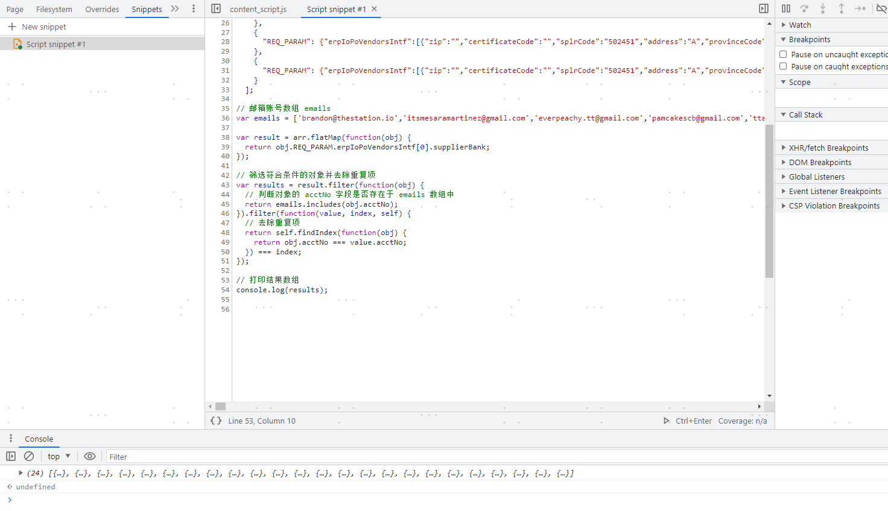

# 小技巧
devtool一些小技巧可以让开发效率大幅度提升，在开发插件过程中我又发现一个小技巧：它就是编译代码块的功能，因为插件开发api文档过于简陋，所有示例也没有描述。所以我只能通过在devtool的命令面板来敲命令来看看某个方法有什么参数，某个类有什么属性，返回值是什么？但有一个难题如果是循环语句这种代码块我直接敲出来会报错，所以我在网上找到可以通过在source面板新建snippet来实现对代码块的运行

