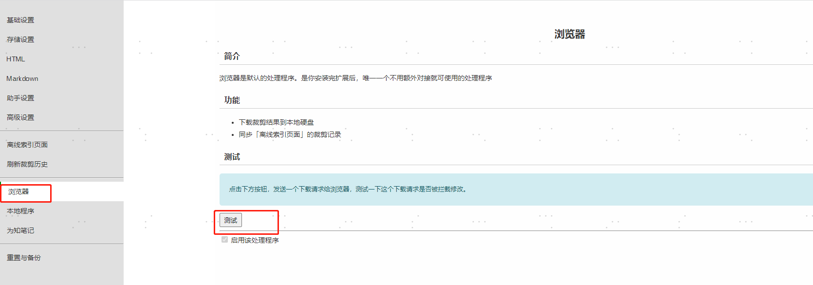

# markdown保存
## 毛线
https://mika-cn.github.io/maoxian-web-clipper/index-zh-CN.html

MaoXian 是一个可以将网页的内容裁剪并保存到**本地电脑**的浏览器扩展。使用它，你可以避免网站挂了，网址失效，图片失效等问题。 它可以将网页保存为 HTML 格式或 Markdown 格式，图片样式等也会一同保存下来。

安装方式 下载crx自行安装

2023-8-28 10:32:14
安装后发现该插件已经被禁用，只需要将crx文件解压成文件夹 然后导入即可

**使用插件前请先测试一下是否可以下载**


如果不能下载 可能是有其他插件影响了该插件的使用，先禁用其他插件
### markdown模板配置
```
来源网址: {{url}}
裁剪时间: {{createdAt}}
{{content}}
```


