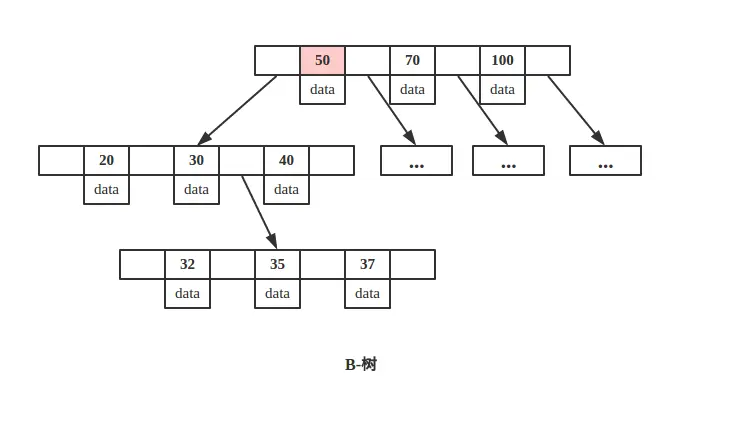
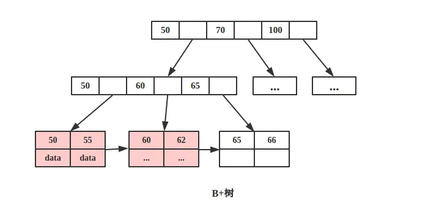

b树和b+树

https://maimai.cn/article/detail?fid=1408720815&efid=lFI6aphOIq_PIY3ptWhuaA&from=single_feed

最大的区别
b树：
1.  关键字集合分布在整颗树中；
2.  任何一个关键字出现且只出现在一个结点中；
3.  搜索有可能在非叶子结点结束；
4.  其搜索性能等价于在关键字全集内做一次二分查找；
b+树
非叶子节点不保存数据  只用来索引
非终端结点可以看成是索引部分，结点中仅含其子树（根结点）中的最大（或最小）关键字

 **B+树叶节点两两相连可大大增加区间访问性，可使用在范围查询等，而B-树每个节点 key 和 data 在一起，则无法区间查找**
 b树：

 
b+树：
