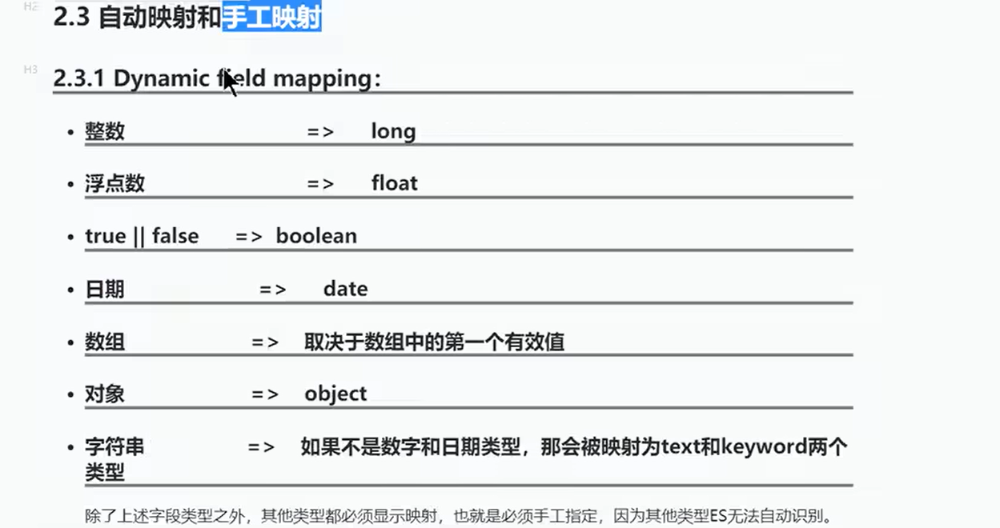
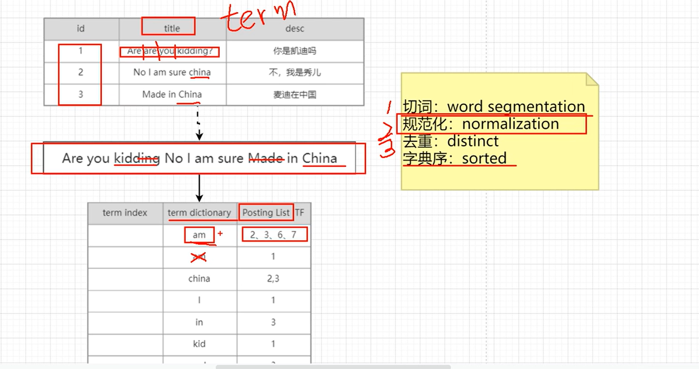
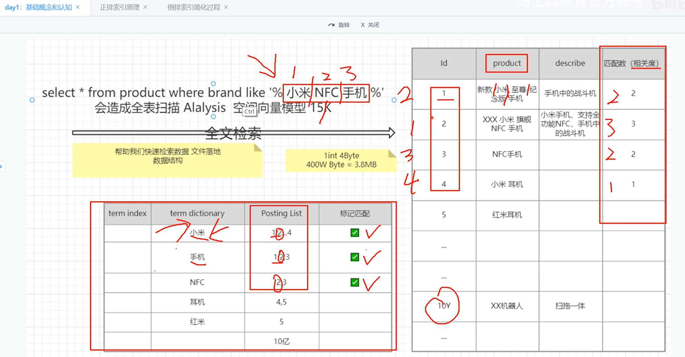

Elasticsearch（通常缩写为 ES）是一种流行的开源全文搜索和分析引擎。下面是一些与Elasticsearch相关的基本概念：

1. 索引：索引是具有相似结构并与特定主题相关的文档的集合。索引可以被认为是关系数据库中的表。
2. 文档：文档是 Elasticsearch 中的基本信息单元。它可以被认为是表格中的一行。文档包含描述文档中包含的信息的字段。
3. 节点：节点是参与集群的单个 Elasticsearch 实例。集群是一组协同工作以索引和搜索数据的节点。
4. 分片：索引被分成更小的单元，称为分片。每个分片都是一个独立的索引，可以存储在单独的节点上。这允许索引的水平缩放。
5. 副本：副本是存储在集群中不同节点上的分片副本。副本提供冗余，可用于提高搜索性能。
6. 映射：映射定义了索引的结构，包括字段的数据类型和分析字段以进行搜索的方式。
7. 分析：分析是将文本转换为可用于搜索的标记的过程。标记通常是单个单词，但它们也可以是短语或其他文本单元。
8. 查询：查询是在索引中搜索符合特定条件的文档的请求。Elasticsearch 支持范围广泛的查询类型，包括匹配、术语、范围等。
9. 聚合：聚合用于对索引中的数据执行计算，例如计算值的平均值、总和或计数。

以上是Elasticsearch相关的一些基本概念。了解这些概念对于有效使用和使用 Elasticsearch 至关重要。

## mapping

ES中的mapping有点类似与RDB中`表结构`的概念，在MySQL中．表结构里包含了字段名称，字段的类型还有索引信息等。 `mapping`中也包含了一些属性，比如**字段名称、类型、字段使用的分词器、见否评分**、**是否创建索引**等属性 es中一个字段可以有多个类型。比如自动映射的时候一个普通的字符串就会被映射乘text和keyword两个类型



## 常见数据类型

### 简单类型
1. *＊数字类型：**Iong integer short byte double float half_ float scaled_ float unsigned long
2. Keywords:
   1. Keyword 只能精确化查找，id用keyword,keyword字段常用于排序，汇总和term查询
   2. constant_keyword：始终包含相同们的关键字字段
   3. wildcard:可针对类似grep的通配符查询优化日志行和类似的关键字值
3. dates（时间类型）：包括date和date_nanos.
4. alias:为现有字段定义别名。
5. text:当一个字段是要被全文搜索的，比如Email内容、产品描述，这些字段应该使用text类型。设置text类型以后，字段内容会被分析，在生成倒排索引以前，字符串会被分析器分成一个一个词项。text类型的字段不用于排序，很少用于聚合。  （解释一下为啥不会为text创建正排索引：大量堆空间，尤其是 在加载高基数text字段时。字段数据一旦加载到堆中，就在该段的生命周期内保项间 持在那里。同样，加载字段数据是一个昂贵的过程，可能导致用户遇到延迟问 情况下禁用字段数据的原因）
### 对象关系类型
1. object: 单个json对象
2. nested: 对象数组
3. join: 为同一索引中的文档定义父子关系

### term

在 Elasticsearch 中，“term”是一个基本的搜索查询，**用于匹配字段中的精确值**。术语查询用于搜索在一个或多个字段中包含特定术语的文档。与全文搜索查询不同，术语查询在搜索前不分析字段中的文本。相反，它对字段的内容执行精确匹配，因此确保搜索的术语与索引中存储的术语完全匹配非常重要。
  
例如，如果您有图书索引，您可以使用term query来搜索特定的作者、书名或 ISBN 编号。例如：

```bash
GET /books/_search
{
    "query": {
        "term": {
            "author": "J.K. Rowling"
        }
    }
}
```
books此查询将返回索引中具有名为authorvalue 的字段的所有文档"J.K. Rowling"。

当您需要对特定值（例如确切的名称、数字或日期）执行精确匹配时，术语查询很有用。当您要执行区分大小写的搜索时，它也很有用，因为术语查询在搜索之前不执行任何分析或文本规范化。



