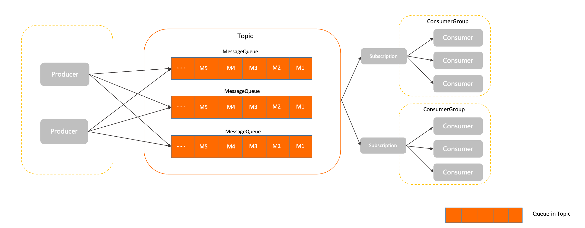
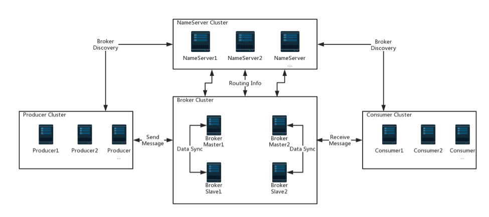

rocketMQ 是一种开源的分布式消息传递系统，其主要功能是在不同的应用程序之间进行异步消息传递。以下是一些学习 RocketMQ 的资源：

1.  官方文档：RocketMQ 官方提供了详细的文档，包括快速入门、基本概念、架构设计、高级特性等。您可以在这里开始学习 RocketMQ：[http://rocketmq.apache.org/docs/quick-start/](http://rocketmq.apache.org/docs/quick-start/)
2.  视频教程：网上有一些 RocketMQ 的视频教程，如 B 站、优酷、YouTube 等，这些视频教程可以让您更直观地了解 RocketMQ 的使用方式。
3.  示例代码：RocketMQ 官方提供了一些示例代码，可以让您快速了解 RocketMQ 的使用方式，其中包括生产者和消费者的示例代码。您可以在这里找到示例代码：[http://rocketmq.apache.org/docs/quick-start/](http://rocketmq.apache.org/docs/quick-start/)
4.  社区支持：RocketMQ 社区非常活跃，您可以在社区论坛上提出问题并获得回答。在这里，您可以找到更多的学习资源，也可以结交更多的 RocketMQ 爱好者：[http://rocketmq.apache.org/community/](http://rocketmq.apache.org/community/)

## rocketmq怎么确保消息不丢失
https://blog.51cto.com/u_12132623/3065789
https://blog.csdn.net/qq_45076180/article/details/113828472

**我们将消息流程分为如下三大部分，每一部分都有可能会丢失数据。**

**生产阶段**：Producer通过网络将消息发送给Broker，这个发送可能会发生丢失，比如网络延迟不可达等。
**存储阶段**：Broker肯定是先把消息放到内存的，然后根据刷盘策略持久化到硬盘中，刚收到Producer的消息，再内存中了，但是异常宕机了，导致消息丢失。
**消费阶段**：消费失败了其实也是消息丢失的一种变体吧。
### 1. 生产阶段
1. **不要使用单向发送**有三种send方法，同步发送、异步发送、单向发送。我们可以采取同步发送的方式进行发送消息，发消息的时候会同步阻塞等待broker返回的结果，如果没成功，则不会收到SendResult，这种是最可靠的。其次是异步发送，再回调方法里可以得知是否发送成功.如果业务要求严格，为保证消息的成功投递和保存，我们可以只取**SEND_OK**标识消息发送成功，把**失败的消息记录到数据库，并启动一个定时任务，扫描发送失败的消息，重新发送**5次，直到成功或者发送5次后发送邮件或短信通知人工介入处理
2. **适当调大重试次数**发送消息如果失败或者超时了，则会自动重试。默认是重试三次，可以根据api进行更改，比如改为10次
3. **多主多从的高可用架构防止单一broker宕机引起数据丢失**  假设Broker宕机了，但是生产环境一般都是多M多S的，所以还会有其他master节点继续提供服务，这也不会影响到我们发送消息，我们消息依然可达。因为比如恰巧发送到broker的时候，broker宕机了，producer收到broker的响应发送失败了，**这时候producer会自动重试，这时候宕机的broker就被踢下线了**， 所以producer会换一台broker发送消息。
4. **采用事务消息**
### 2. broker存储阶段
1. **同步刷盘？？** MQ持久化消息分为两种：同步刷盘和异步刷盘。默认情况是**异步刷盘，Broker收到消息后会先存到cache里然后立马通知Producer说消息我收到且存储成功**了，你可以继续你的业务逻辑了，然后Broker起个线程**异步的去持久化到磁盘中**，但是Broker还没持久化到磁盘就宕机的话，消息就丢失了。同步刷盘的话是收到消息存到cache后并不会通知Producer说消息已经ok了，而是会等到持久化到磁盘中后才会通知Producer说消息完事了。这也保障了消息不会丢失，但是性能不如异步高。看业务场景取舍。
2. **集群部署  多主多从** 即使Broker设置了同步刷盘策略，但是Broker刷完盘后磁盘坏了，这会导致盘上的消息全TM丢了。但是如果即使是1主1从了，但是Master刷完盘后还没来得及同步给Slave就磁盘坏了，不也是GG吗？没错！所以我们还可以配置不仅是等Master刷完盘就通知Producer，而是**等Master和Slave都刷完盘后才去通知Producer**说消息ok了。
```bash
# master 节点配置
flushDiskType = SYNC_FLUSH
brokerRole=SYNC_MASTER

# slave 节点配置
brokerRole=slave
flushDiskType = SYNC_FLUSH

## Producer发消息到Broker后，Broker的Master节点先持久化到磁盘中，然后同步数据给Slave节点，Slave节点同步完且落盘完成后才会返回给Producer说消息ok了。
```
### 3. 消费阶段
1. **同步消费，手动进行ack确认** 
2. **消息消费失败自动重试**


## rocketmq和kafka的区别
| 关键词                                                                 | ACTIVEMQ                                        | RABBITMQ             | KAFKA                                                                                      | ROCKETMQ                                                                        | Pulsar                 |
|---------------------------------------------------------------------|-------------------------------------------------|----------------------|--------------------------------------------------------------------------------------------|---------------------------------------------------------------------------------|------------------------|
| 开发语言                                                                | Java                                            | ErLan 语言非常难学         | Java                                                                                       | Java                                                                            | -                      |
| 单机吞吐量                                                               | 万级                                              | 万级                   | 十万级                                                                                        | 十万级                                                                             | -                      |
| 产生时间                                                                | 2007                                            | -                    | 2012                                                                                       | 2017                                                                            | 2018                   |
| 贡献公司                                                                | Apache                                          | -                    | LinkedIn                                                                                   | 阿里巴巴                                                                            | 雅虎                     |
| 特性                                                                  | （1）支持协议众多:AMQP, STOMP, MQTT, JMS (2)消息是持久化的JDBC | -                    | （1）超高写入速率（2）end-to-end耗时毫秒级                                                                | （1）万亿级消息支持，（2）万亿Topic数量支持（3)end-to-end 耗时毫秒级                                    | （1）存储和计算分离（2）支持SQL数据查询 |
| 商业公司实践                                                              | 国内部分企业                                          | -                    | LinkedIn                                                                                   | 阿里巴巴                                                                            | 雅虎、腾讯、智联招聘             |
| 容错                                                                  | 无重试机制                                           | -                    | 无重试机制                                                                                      | 支持重试，死信消息                                                                       | 支持重试，死信消息              |
| 顺序消息                                                                | 支持                                              | 支持                   | 支持                                                                                         | 支持                                                                              | 支持                     |
| 定时消息                                                                | 不支持                                             | 支持                   | 不支持                                                                                        | 支持                                                                              | 支持                     |
| 消息查询                                                                | 数据库中查询                                          | -                    | 不支持                                                                                        | 支持                                                                              | 支持SQL                  |
| Topic                                                               | -                                               | -                    | 百级Topic时会影响系统吞吐量                                                                           | 千级Topic时会影响系统吞吐量                                                                |                        |
| 社区活跃度                                                               | 低                                               | 高                    | 高                                                                                          | 高                                                                               | 低                      |
| 使用建议                                                                | 无论是功能还是性能方面，与后面消息队列差异巨大，不推荐                     | RabbitMQ 对消息堆积的支持并不好 | Kafka 与周边生态系统的兼容性是最好的没有之一，尤其在大数据和流计算领域，几乎所有的相关开源软件系统都会优先支持 Kafka，由于异步批量的设计，Kafka不太适合在线业务场景 | 如果你的应用场景很在意响应时延，那应该选择使用 RocketMQ                                                | Pulsar 采用存储和计算分离的设计    |
| 适用场景                                                                | -                                               | RabbitMQ 支持优先级队列     | kafka 更加擅长于日志、大数据计算、流式计算等场景                                                                | RocketMQ 提供了消息重试、消息过滤、消息轨迹、消息检索等功能特性，特别是 RocketMQ 的消息检索功能，因此 RocketMQ 很适合核心业务场景 | -                      |

**rocketmq模型关系图**

## rocketMQ架构
**rocketmq架构图**

-   **NameServer**: 提供轻量级的服务发现和路由。 每个 NameServer 记录完整的路由信息，提供等效的读写服务，并支持快速存储扩展。
-   **Broker**: 通过提供轻量级的 Topic 和 Queue 机制来处理消息存储,同时支持推（push）和拉（pull）模式以及主从结构的容错机制。
-   **Producer**：生产者，产生消息的实例，拥有相同 Producer Group 的 Producer 组成一个集群。
-   **Consumer**：消费者，接收消息进行消费的实例，拥有相同 Consumer Group 的  
    Consumer 组成一个集群。
简单说明一下图中箭头含义，从 Broker 开始，Broker Master1 和 Broker Slave1 是主从结构，它们之间会进行数据同步，即 **Date Sync**。同时**每个 Broker 与  
NameServer 集群中的所有节点建立长连接**，定时注册 Topic 信息到所有 NameServer 中。

**Producer 与 NameServer 集群中的其中一个节点（随机选择）建立长连接**，定期从 NameServer 获取 Topic 路由信息，并向提供 Topic 服务的 Broker Master 建立长连接，且定时向 Broker 发送心跳。Producer 只能将消息发送到 Broker master，但是 **Consumer** 则不一样，它同时和提供 Topic 服务的 **Master 和 Slave  建立长连接**，既可以从 Broker Master 订阅消息，也可以从 Broker Slave 订阅消息。

## 重复消费问题
保证消费的幂等性   业务逻辑幂等/redis存一个键

## 如何处理大量积压的消息
面对大量积压的消息：

如果Topic下的**MessageQueue配置得是足够多**的（默认只有4个），那每个Consumer实际上会分配多个MessageQueue来进行消费。这个时候，就可以简单的通过增加Consumer的服务节点数量来加快消息的消费，等积压消息消费完了，再恢复成正常情况。最极限的情况是把Consumer的节点个数设置成跟MessageQueue的个数相同。但是如果此时再继续增加Consumer的服务节点就没有用了。
而如果Topic下**的MessageQueue配置得不够多**的话，那就不能用上面这种增加Consumer节点个数的方法了。这时怎么办呢？
这时如果要快速处理积压的消息，可以创建一个新的Topic，并配置足够多的MessageQueue。并紧急上线一组新的消费者，只负责搬运积压的消息，转储到新的Topic中，这个速度是可以很快的。然后在新的Topic上，就可以通过增加消费者个数来提高消费速度了。之后再根据情况恢复成正常情况。
