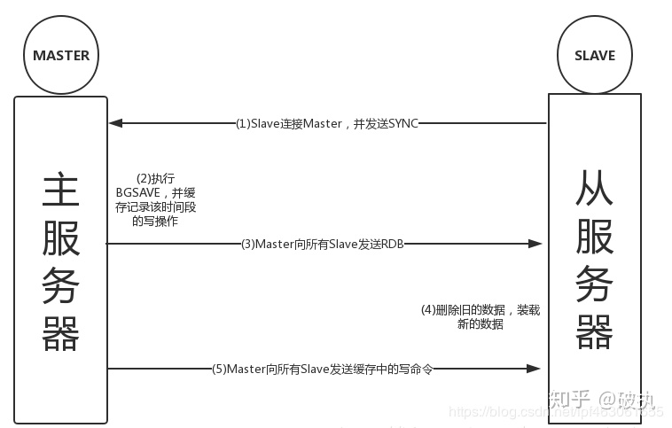

https://zhuanlan.zhihu.com/p/77646963

## RDB

### 1.1 触发机制

RDB持久化触发机制分为：**手动触发**和**自动触发** 
**手动触发**
`bgsave命令`：就是background save，执行bgsave命令时Redis主进程会fork一个子进程来完成RDB的过程
自动触发
场景一：配置redis.conf，触发规则，自动执行

```text
# 当在规定的时间内，Redis发生了写操作的个数满足条件，会触发发生BGSAVE命令。
# save <seconds> <changes>
# 当用户设置了多个save的选项配置，只要其中任一条满足，Redis都会触发一次BGSAVE操作
save 900 1 
save 300 10 
save 60 10000
# 以上配置的含义：900秒之内至少一次写操作、300秒之内至少发生10次写操作、
# 60秒之内发生至少10000次写操作，只要满足任一条件，均会触发bgsave
```

场景二：执行shutdown命令关闭服务器时，如果没有开启AOF持久化功能，那么会自动执行一次bgsave

场景三：主从同步（slave和master建立同步机制）


### 1.2 RDB执行流程

Redis 使用操作系统的多进程 cow(Copy On Write) 机制来实现RDB快照持久化

1.  执行bgsave命令的时候，Redis主进程会检查是否有子进程在执行RDB/AOF持久化任务，如果有的话，直接返回
2.  Redis主进程会fork一个子进程来执行执行RDB操作，fork操作会对主进程造成阻塞（影响Redis的读写），fork操作完成后会发消息给主进程，从而不再阻塞主进程。（阻塞仅指主进程fork子进程的过程，后续子进程执行操作时不会阻塞）
3.  RDB子进程会根据Redis主进程的内存生成临时的快照文件，持久化完成后会使用临时快照文件替换掉原来的RDB文件。（该过程中主进程的读写不受影响，但Redis的写操作不会同步到主进程的主内存中，而是会写到一个临时的内存区域作为一个副本）
4.  子进程完成RDB持久化后会发消息给主进程，通知RDB持久化完成（将上阶段内存副本中的增量写数据同步到主内存）
### 1.3 RDB的优缺点

**优点**

-   RDB文件小，非常适合定时备份，用于灾难恢复
-   Redis加载RDB文件的速度比AOF快很多，因为RDB文件中直接存储的时内存数据，而AOF文件中存储的是一条条命令，需要重演命令。

**缺点**

-   RDB无法做到实时持久化，若在两次bgsave间宕机，则会丢失区间（分钟级）的增量数据，不适用于实时性要求较高的场景
-   RDB的cow机制中，fork子进程属于重量级操作，并且会阻塞redis主进程
-   存在老版本的Redis不兼容新版本RDB格式文件的问题
## 2、AOF（append only file）日志

AOF日志是持续增量的备份，是基于写命令存储的可读的文本文件。AOF日志会在持续运行中持续增大，由于Redis重启过程需要优先加载AOF日志进行指令重放以恢复数据，恢复时间会无比漫长。所以需要定期进行AOF重写，对AOF日志进行瘦身。目前AOF是Redis持久化的主流方式。

### 2.1 开启方式

AOF默认是关闭的，通过redis.conf配置文件进行开启
```text
## 此选项为aof功能的开关，默认为“no”，可以通过“yes”来开启aof功能  
## 只有在“yes”下，aof重写/文件同步等特性才会生效  
appendonly yes  

## 指定aof文件名称  
appendfilename appendonly.aof  

## 指定aof操作中文件同步策略，有三个合法值：always everysec no,默认为everysec  
appendfsync everysec  
## 在aof-rewrite期间，appendfsync是否暂缓文件同步，"no"表示“不暂缓”，“yes”表示“暂缓”，默认为“no”  
no-appendfsync-on-rewrite no  

## aof文件rewrite触发的最小文件尺寸(mb,gb),只有大于此aof文件大于此尺寸是才会触发rewrite，默认“64mb”，建议“512mb”  
auto-aof-rewrite-min-size 64mb  

## 相对于“上一次”rewrite，本次rewrite触发时aof文件应该增长的百分比  
## 每一次rewrite之后，redis都会记录下此时“新aof”文件的大小(例如A)
## aof文件增长到A*(1 + p)之后，触发下一次rewrite，每一次aof记录的添加，都会检测当前aof文件的尺寸。  
auto-aof-rewrite-percentage 100
```
AOF是文件操作，对于变更操作比较密集的server，那么将造成磁盘IO的负荷加重。此外linux对文件操作采取了“延迟写入”手段，即并非每次write操作都会触发实际磁盘操作，而是进入了buffer中，当buffer数据达到阀值时触发实际写入(也有其他时机)，这是linux对文件系统的优化。

Linux 的`glibc`提供了`fsync(int fd)`函数可以将指定文件的内容强制从内核缓存刷到磁盘。只要 Redis 进程实时调用 fsync 函数就可以保证 aof 日志不丢失。但是 fsync 是一个磁盘 IO 操作，它很慢！如果 Redis 执行一条指令就要 fsync 一次，那么 Redis 高性能的地位就不保了。

因此在上述配置文件中，可观察到Redis中提供了3中AOF记录同步选项：

-   always：每一条AOF记录都立即同步到文件，性能很低，但较为安全。
-   everysec：每秒同步一次，性能和安全都比较中庸的方式，也是redis推荐的方式。如果遇到物理服务器故障，可能导致最多1秒的AOF记录丢失。
-   no：Redis永不直接调用文件同步，而是让操作系统来决定何时同步磁盘。性能较好，但很不安全。

### 2.2 重写（rewrite）机制

AOF日志会在持续运行中持续增大，需要定期进行AOF重写，对AOF日志进行瘦身。

**AOF Rewrite** 虽然是“压缩”AOF文件的过程，但并非采用“基于原AOF文件”来重写或压缩，而是采取了类似RDB快照的方式：基于Copy On Write，全量遍历内存中数据，然后逐个序列到AOF文件中。因此AOF rewrite能够正确反应当前内存数据的状态。

AOF重写（bgrewriteaof）和RDB快照写入（bgsave）过程类似，二者都消耗磁盘IO。Redis采取了“schedule”策略：无论是“人工干预”还是系统触发，快照和重写需要逐个被执行。

重写过程中，对于新的变更操作将仍然被写入到原AOF文件中，同时这些新的变更操作也会被Redis收集起来。当内存中的数据被全部写入到新的AOF文件之后，收集的新的变更操作也将被一并追加到新的AOF文件中。然后将新AOF文件重命名为appendonly.aof，使用新AOF文件替换老文件，此后所有的操作都将被写入新的AOF文件。

### 2.3 触发机制

和RDB类似，AOF触发机制也分为：**手动触发**和**自动触发**

**手动触发** 直接调用bgrewriteaof命令

```text
redis-cli -h ip -p port bgrewriteaof
```

**自动触发**

根据auto-aof-rewrite-min-size和auto-aof-rewrite-percentage参数确定自动触发时机

```text
auto-aof-rewrite-min-size:表示运行AOF重写时文件最小体积，默认为64MB（我们线上是512MB）。

auto-aof-rewrite-percentage:代表当前AOF文件空间（aof_current_size）和上一次重写后AOF文件空间（aof_base_size）的值
```

自动触发时机：

`(aof_current_size > auto-aof-rewrite-min-size ) && (aof_current_size - aof_base_size) / aof_base_size >= auto-aof-rewrite-percentage`

其中aof_current_size和aof_base_size可以在info Persistence统计信息中查看。

### 2.4 AOF的优缺点

**优点** AOF只是追加写日志文件，对服务器性能影响较小，速度比RDB要快，消耗的内存较少

**缺点**

-   AOF方式生成的日志文件太大，需要不断AOF重写，进行瘦身。
-   即使经过AOF重写瘦身，由于文件是文本文件，文件体积较大（相比于RDB的二进制文件）。
-   AOF重演命令式的恢复数据，速度显然比RDB要慢。

## 3、Redis 4.0 混合持久化

-   仅使用RDB快照方式恢复数据，由于快照时间粒度较大，时回丢失大量数据。
-   仅使用AOF重放方式恢复数据，日志性能相对 rdb 来说要慢。在 Redis 实例很大的情况下，启动需要花费很长的时间。

Redis 4.0 为了解决这个问题，带来了一个新的持久化选项——**混合持久化**。将 rdb 文件的内容和增量的 AOF 日志文件存在一起。这里的 AOF 日志不再是全量的日志，而是自持久化开始到持久化结束的这段时间发生的增量 AOF 日志，通常这部分 AOF 日志很小。相当于：

-   大量数据使用粗粒度（时间上）的rdb快照方式，性能高，恢复时间快。
-   增量数据使用细粒度（时间上）的AOF日志方式，尽量保证数据的不丢失。

在 Redis 重启的时候，可以先加载 rdb 的内容，然后再重放增量 AOF 日志就可以完全替代之前的 AOF 全量文件重放，重启效率因此大幅得到提升。

**混合持久化是最佳方式吗？**

不一定。

首先，混合持久化是Redis 4.0才引入的特性，现在很多 公司可能都还在使用3.x版本。使用不了这一特性。

另外，可以使用下面这种方式。Master使用AOF，Slave使用RDB快照，master需要首先确保数据完整性，它作为数据备份的第一选择；slave提供只读服务或仅作为备机，它的主要目的就是快速响应客户端read请求或灾切换。

至于具体使用哪种持久化方式，就看大家根据场景选择。没有最好，只有最合适。