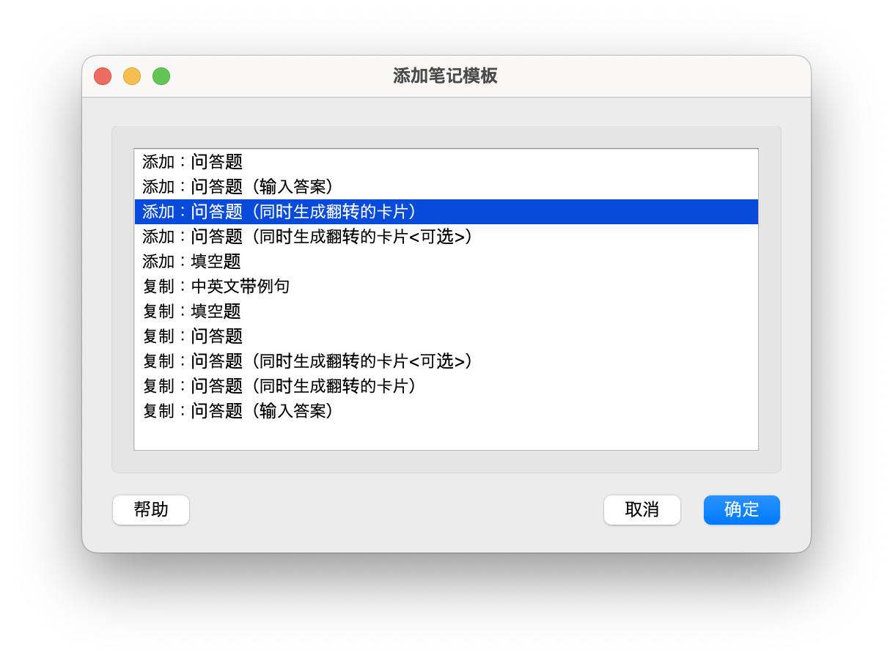

来源网址: https://utgd.net/article/9595

裁剪时间: 2024-06-03 14:54:48

# 越过驾驭 Anki 前的那几道坎儿

  

和所有**圈内公认出圈难**的“效率神器”一样，Anki 是一款初学者不易上手的工具。几道坎儿亘在初学者面前，导致了真正应该体会到这种学习方式的人反而错过了它。

  

这篇文章的目的，就是以初学者的视角，去跨越这几道坎儿，完成思维方式的转变。让大家通过“记单词”这么一个最通俗的实例，来理解“应该怎么去拿捏 Anki 这个工具”。

  

文章结构简介：

  

*   **理解一、二**：面向纯 Anki 新人的入门知识，非纯新不用看

*   **理解三及以后**：面向一直想用起来 Anki 但无法上手的读者

  

## 理解一：牌组就是单词表

  

了解牌组

  

打开 Anki，你是懵的。你在找你最熟悉的那个词“单词表”或者“列表（List）”，但是放眼望去，没有这个东西。你关了 Anki，告诉自己“是我不配”。打开网剧、游戏，把刚才的一切抛在脑后。

  


  

Anki 的主界面，找不到“单词表”

  

Anki 没有用“单词表”这个词，是有原因的。

  

Anki 是多种记忆方法的结合体，这些方法中的一种是“抽认卡/闪卡（Flash card）”。这种记忆方法我们国家的每个人都用过。逢年过节你走亲戚，亲戚家有小孩，你大概率会发现 亲戚家有一叠卡片，正面画着“?”，背面写着“苹（píng）果（guǒ）”。这种“抽认卡”记忆法，就是 Anki 使用的方法之一。

  

因为它是一幅幅（Deck）的抽认卡，所以 Anki 才在主界面里使用“牌组（Deck）”这个单词。创建新的单词表，就是创建牌组。

  


  

Anki 主界面里的“牌组”

  

## 理解二：添加单词卡

  

初识卡片

  

把“牌组”看作“单词表”后，你对 Anki 产生了一些亲切感。接下来的问题是：怎么加单词。

  


  

菜单里的“添加”按钮

  

这时候，你看到了菜单里的“添加”。你感觉应该使它，点了一下，出现了这样的界面：

  


  

点按“添加”后出现的界面

  

“正面”、“背面”，你大概猜出了它们是什么：“正面我就写英文，背面我就写中文呗。或者反过来也行？”

  

根据这样的理解，你把正反面的中英文输了进去，然后点了界面左下角的“添加”：

  


  

在正面输入英文，在背面输入中文

  

添加完这个新单词，你还要手动关上界面。这时候你发现，这个“系统默认”的牌组（也就是单词表）后面多了一个 `1`。点一下看看，出现了一个按钮“开始学习”：

  


  

添加单词后的主界面和“开始学习”

  

你点了这个按钮，刚才添加的新单词蹦了出来，而且是你写的卡的“正面”：

  


  

单词抽认卡的“正面”

  

你当然知道这个刚加的单词是什么意思。这时候，你可以单击一下界面空白处，或者按空格键 `⎵Space` 来查看卡片的“反面”。这时候你会看到之前写好的中文含义：

  


  

按下空格，查看“背面”的答案

  

答案出来了。同时你还发现，屏幕下面有 4 个新的按钮：“重来”、“困难”、“良好”、“简单”。它们代表着你对这个单词**当下**的感觉。对 Anki 来说，这 4 个按钮则代表着不同的复习间隔。选择“简单”，代表你掌握了这个单词，也代表了对这个单词的一个学习流程结束。

  

以上两则就是对 Anki 最基础的理解。掌握了它们，你就足以做最简单的抽认卡，来开始使用 Anki 背单词。

  

但是，毫无疑问，你现在脑子里出现了一个声音——“就这？”

  

## 理解三：正反卡（笔记模板）

  

初步了解“笔记模板（Note Type）”

  

到了这里，你将会遇到第一个坎儿——“笔记模板”，本文也正式进入正题。

  

目前为止你会觉得 Anki 很弱，原因有很多。第一个可能是它看起来只有一种卡片——显示英文，回答中文。好像如果我们想做到相反的事“显示中文，回答英文”，我们就要再加一张卡。这实在是不方便。

  

Anki 能不能加一张卡，互为正反面呢？

  

它可以，它当然可以，它都可以，所以它才是圈内公认。但初学者就是很难直觉地明白怎么做。我们需要的“正反来回测”的功能，需要借助 Anki 里“笔记模板”来完成。而它就是驾驭 Anki 前会遇到的第一道坎儿。从位置到设定方式，这个功能都不符合初学者对此类软件的理解。所以我们接下来就来看看，怎么样通过笔记模板来实现“正反来回测”的功能。

  

我们还是用老方法，在主界面点按“添加”按钮。但是这次，我们不直接写入内容。而是在卡片的左上角的模板处，点一下“问答题”按钮：

  


  

添加卡片时左上角的“问答题”按钮

  

在弹出来的“选择笔记模板”界面中，选择“问答题（同时生成翻转的卡片）”这一选项：

  


  

选项：问答题（同时生成翻转的卡片）

  

这时候你会回到添加卡片的界面。在这里添加卡片，你就会同时得到两张卡：一张正面英文、背面中文；一张则是相反，正面中文、背面英文。

  

## 理解四：加上词性、例句的正反卡

  

进一步了解“笔记模板”，初步了解“卡片模板（Card Templates）”

  

正反来回测解决了。但是背单词不止是一个外语单词对应一个中文意思。英文单词有不同的**词性**，为了更好地理解这些词性，我们还要加上例句帮助理解。我们应该怎么样把这些东西放进 Anki 的卡片里？我们应该怎么样让新加入的“例句”总是在公布答案后再显示？

  

这两个问题牵涉到两个功能：

  

1.  **把例句添加到卡片**：需要我们进一步了解“笔记模板（Note Type）”，了解其中的一个关键功能——字段（Field）

2.  **把例句在翻卡后显示**：需要我们了解“卡片模板（Card Templates）”

  

每一个后面带括号和英文的，都是 Anki 交互上的坎儿。

  

刚才我们是在添加新单词的环节，选择了“问答题（同时生成翻转的卡片）”这一项。但你想改这个笔记模板的话，你要用到另一个界面“管理笔记模板（Manage Note Type）”，打开它的方式之一是通过菜单栏的“工具（Tools）”选项：

  


  

管理笔记模板

  

在这个界面，我们点按“添加”按钮。会弹出一个名为“添加笔记模板”的新菜单，这时候，我们选择“添加：问答题（同时生成翻转的卡片）”。这是因为接下来的改动，我们是基于这个模板的。当我们基于这个模板修改，那修改结果就是双面的：

  



  

添加：问答题（同时生成翻转的卡片）

  

我们想要的结果是：正反面中英文互换，但在公布答案之后，要显示例句和词性。

  

我把新建的模板重命名为“中英文带例句”。之后，我们要了解 Anki 里的一个关键概念——字段（Field）。我们选中“中英文带例句”这个模板，然后选择菜单里的“字段”：

  


  

在菜单中选择“字段”

  

这时候你会看到字段的设置界面：

  


  

字段的设置界面

  

它告诉你：

  

*   现在有 2 个字段：正面和背面

*   你可以添加、删除、重命名字段，也可以重排字段位置

*   字体、字号等杂项设置

  

在这里我们要加入一个新的字段：“例句”。操作很简单，点击右上角的添加，输入“例句”即可。与此同时，我们可以把“正面”改成“英文”、“背面”改为“中文”：

  


  

修改字段后的界面

  

添加后保存，再回到主界面，点击“添加”按钮，这时候，你会发现多了“例句”一栏：

  


  

在新的模板中添加单词和例句

  

我们已经在卡片里加上了属于例句和词性的字段。接下来，你兴高采烈地开始学习，想看看卡片的展示效果。结果发现，傻了，不对啊？怎么还是只有中文和英文，词性和例句呢？

  


  

重新开始学习，发现卡片里并没有“词性、例句”的相关内容

  

## 理解五：卡片模板

  

进一步了解卡片模板

  

做完上一步，你不禁感慨：Anki 的坎儿太多了，折腾这么久还没成，是不是我不配？

  

但是！现在你离终点只有一步之遥！你到达了初学者进入理解 Anki 状态的最后一道坎儿——“卡片模板（Card Templates）”。它决定了你的卡片显示什么，怎么显示，例句不能显示的问题靠它就能解决。

  

在哪打开它呢？其中一个方法是，在你添加新单词的时候：

  


  

添加新单词时左上角的“卡片”

  

在编辑界面的左上角有一个“卡片（Card）”这就是编辑卡片模板的入口之一，点开它，初学者的你会再次打退堂鼓：

  


  

卡片模板界面

  

这个界面有 3 个主要区域：

  

1.  卡片模板

2.  内容模板

3.  预览

  

虽然视觉上是这么个顺序，但是我们讲解的时候，要先从“内容模板”开始。我们来看截图的左面，“内容模板”里，只有一个 `{{英文}}`。

  

这里的“英文”是我们刚才在“笔记模板”里修改的那个字段名称，为了方便我们记忆用的。如果你是对着电脑操作，你现在就可以点“内容模板”里“背面内容模板”，你会发现里面也有一个 `{{中文}}`，对应的也是我们曾经重命名的字段。

  

而这里的花括号 `{{}}`，是一种表示变量的方法。在这里，`{{英文}}`对应的，是这张卡里被你放进“英文”这个字段的内容（请回想起刚才对字段的介绍）。它可以是英文，也可以不是英文，但不管你放进来了什么，它都会如实反映在右边的“预览”之中。

  

我们这张卡片，我们在“英文”这个字段里填写的，就是“Essential”这个单词，所以预览之中，它显示的就是“Essential”。如果我们在编辑卡片时，在“英文”里写了另一个单词“UNTAG”，那么这里就会显示为“UNTAG”。

  

接下来，我们看卡片背面的情况，我们就会知道，为什么我们加的词性和例句刚刚没有出现：

  


  

卡片1：背面内容模板和预览

  

我们看到，在背面内容的模板和预览里，并没有“例句”这个字段。而我们先前正是在这个字段添加的词性和例句。所以解决方法很简单——直接在“背面内容模板”里，添加一个 `{{例句}}`，就能解决问题。

  


  

卡片1：加入“例句”字段后的模板及预览

  

到此为止，你已经完全可以应对用 Anki 学英语背单词的主要情况了。你可以添加你想加入的字段，你知道怎么把它放在合适的位置，在适当的时机出现。

  

但是，天呐，它是居中的！你又又又想关了 Anki 刷剧打游戏了。请再坚持最后一下下，接下来你会知道，不管是“北欧极简”还是“死亡芭比粉”，Anki 不挑用户。你可以把它打扮成任何样子。

  

## 理解六：卡片基础排版需要的 CSS（入门）

  

基础 CSS——左对齐

  

前面说 Anki 可以把卡片变成“死亡芭比粉”主题是真的，但（好在）因为篇幅原因，我们这里不会这么做。我们这里仅仅对 Anki 的卡片排版进行小小的微调，目的是能够同时在电脑和手机上看得舒服。

  

“主题”这个概念在 Anki 里叫“样式（Style）”。在调整 Anki 卡片的样式之前，我们一定要意识到以下层级关系（样式∈卡片模板∈笔记模板）：

  

1.  样式∈卡片模板：样式的修改，在卡片模板这一功能之中；

2.  卡片模板∈笔记模板：而卡片模板的修改，则永远是针对某一笔记模板的修改

  

所以我们修改的样式，仅对应于某一笔记模板。**如果你修改了某个笔记模板的 CSS，它不会通用于其它的笔记模板，仅仅会对这一个笔记模板生效。**

  

接下来，我们就来看看如何调节笔记的样式。样式调节还是卡片模板的界面进行，我们选择其中的样式：

  


  

“样式”中的 CSS 和效果预览

  

我把图里的 CSS 用 DeepL 翻译+手动修改后贴上来，大家很容易理解各自都是干什么的：

  

```plain

.卡 {

    字体: arial;

    字体大小：20px;

    文字对齐：居中;

    颜色：黑色;

    背景色：白色;

}

```

  

我们看到问题出现在 `文字对齐` 这一项，它的对齐方式是“居中”。而我们习惯的排版方式是“居左”。那么“居左”应该怎么实现呢？把代码里的 `center` 改为 `left` 就可以了：

  


  

把居中改为居左后的的排版预览

  

但是，你发现，字段“例句”里的内容，和字段“中文”里的内容没有换行。名词的意思后面直接加的是 “**A.** adjective”，看着还是别扭。

  

这时候，我们需要在两个字段之间，加一条分隔线。而这需要一个简单的 HTML 分割线标签 `<hr>`：

  


  

在“背面内容模板”里，加上分割线的 HTML 标签

  

这样一来，看起来就舒服了。

  

在这一步，你需要意识到一件事——调整 Anki 卡片的“主题”有 2 种方式：

  

1.  整体样式：这是整张笔记的主题，包括背景颜色、字体、字的大小等等。

2.  局部样式：你可以在卡片的正面或者背面局部地调整卡片样式，比如含义的字要比例句的大，含义居中、例句居左等。

  

\*\*注：局部样式里的样式优先度高于整体样式。\*\*也就是说，如果我们在整体样式里字号设为“12”，而在局部样式里刻意把“中文”字段的字号设为“14”时，卡片最终显示的“中文”字段字号将会是“14”。

  

Anki 用到的 CSS，你大可以使用这样的搜索方法在搜索引擎来搜索：`CSS 左对齐`、`CSS 背景色`、`CSS 边距`、`HTML 换行`、`HTML 分割线`……然后在 Anki 的卡片样式编辑器里玩一玩就知道效果啦。

  

## 小结

  

Anki 的交互就像是被打碎时间线和叙事逻辑的文学/影视作品，能用明白的人，就像爱看烧脑电影的人，乐在其中。但用不明白的人，就像是在看天书。

  

Anki 难以上手，主要是因为“笔记模板”和“卡片模板”这两个功能。理解了这两个功能，大概知道怎么用它们，就足够使用 Anki 帮你学习。这篇文章的目的是把理解这两个功能的难度降到最低，同时能比较整体地服务“背单词”这个场景，没有刻意追求全面和细致。

  

这篇文章简单小结下来，大概如下：

  

*   理解牌组和卡片

*   整理、添加和修改笔记模板

*   了解卡片模板，会用变量控制卡片里显示什么

*   会在卡片模板里使用简单的 CSS

  

Anki 能有今天这个地位，文章里介绍的功能甚至算不上管中窥豹。至于 Anki 其它有魅力的功能，UNTAG 会在以后逐渐介绍给大家。