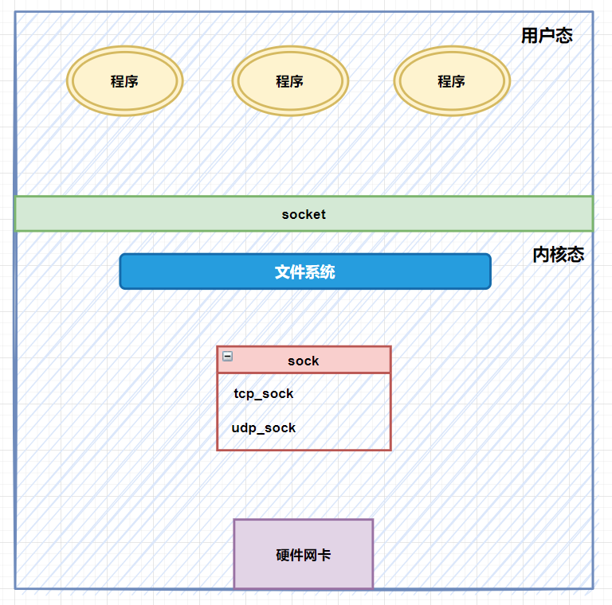
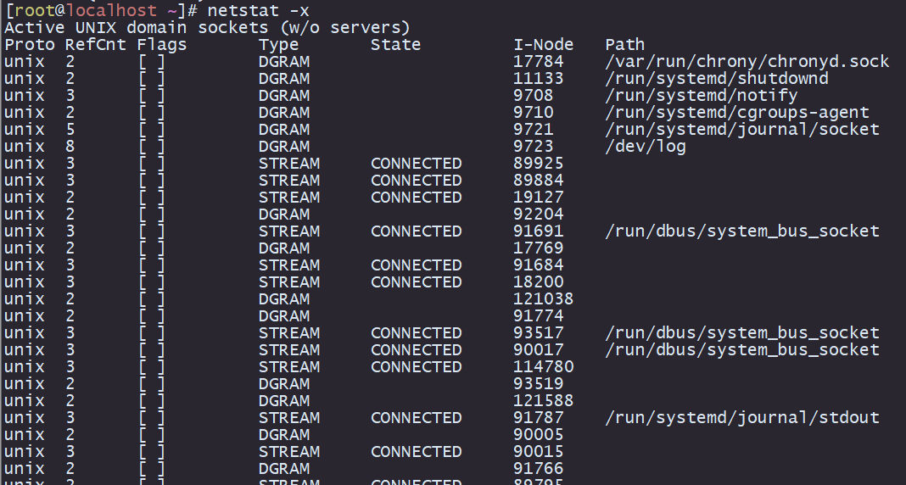

来源网址: https://mp.weixin.qq.com/s/Ebvjy132eRDOmcIL5cmxJw
裁剪时间: 2023-08-30 10:12:34

# socket 到底是个啥

**咸鱼运维杂谈**

00后程序员，深耕 Linux 系统运维、开源软件运维、自动化运维等领域

143篇原创内容

公众号

(本篇文章文字较多，耐心看完，你会有不小的收获)

哈喽大家好，我是咸鱼

  

我相信大家在面试过程中或多或少都会被问到这样一个问题：**你能解释一下什么是 socket 吗？**

  

我记得我当初的回答很是浅显：socket 也叫套接字，用来负责不同主机程序之间的网络通信连接，socket 的表现方式由四元组（ip地址：端口）组成

  

那么今天，咸鱼将跟大家打开 socket 的神秘大门，不但要搞清楚 socket 的概念，最好还能够了解它的底层实现

  

  

  

  

我们首先查看一下 socket 的翻译

  

我们看到，socket 可以翻译成插座、插头

  

那现在请想象这么一个场景：**给手机充电时，你将充电插头插入电源插座里面，是不是意味着插座与充电插头连接起来了**

  

在计算机世界中，socket 翻译成套接字，通过 socket 我们可以与某台服务器进行连接，而建立连接的过程，你可以脑补成将充电插头插进插座的过程

  

  

  

  

**socket 使用场景**

  

假设我们想要将数据从 A 电脑的某个进程传送到 B 电脑的某个进程（比如咸鱼用微信发信息给冰冰）

  

那么在与对方聊天的过程中，其实就是这两台电脑中的微信进程相互传输数据的过程

  

在这个过程中，两台电脑各自调用 socket 方法，然后会得到一个 fd 句柄（socket\_fd），这个 fd 句柄就相当于 socket 的身份证号

  

  

得到 fd 句柄之后：

1.  服务端执行 bind()、listen()、accept() 方法等待客户端建立连接的请求
    
2.  客户端执行 connect() 方法向服务端发起连接
    
3.  连接建立起来之后，两端都可以执行 send()、recv() 方法来互相传递数据
    

  

**PS：**对于不同的传输层协议，上面这个过程是不一样的，详情可以查看我之前的文章《[Python 网络编程](http://mp.weixin.qq.com/s?__biz=MzkzNzI1MzE2Mw==&mid=2247484949&idx=1&sn=311cb4d57ccd8fc9396b0b53d64cd8bf&chksm=c2930651f5e48f4785129241943d0938431d9792d3ab6d566c67b4b1a80953e7c43cf3fef446&scene=21#wechat_redirect)》

  

**TCP 协议**

  

**UDP 协议**

  

  

**socket 底层设计**

  

我们知道了 socket 是用来实现网络传输功能的，它负责不同主机进程之间的网络通信连接

  

我将上面的问题改一下，把 **”socket 是什么“** 改成 **”如果让你来实现一个网络传输功能，你会怎么设计“**

  

网络传输功能，简单点来讲就是两端服务器之间进行网络通信并互相收发数据，收发数据也就是读写数据

  

首先我们会遇到第一个问题：**茫茫互联网中你怎么能找到那台梦中情机**

  

聪明的你肯定会想到——ip地址！我们用 ip 地址来定位电脑

  

找到了你的梦中情机之后，你会发现，**一台电脑上面这么多进程，我怎么才能找到与我通信的那个进程（比如说微信）**

  

聪明的你很快就想到了用端口号（port）

  

可以这么理解，ip 地址是用来定位街区的，而端口号 port 对应这个街区中的门牌号，通过 ip +port 的组合，你可以在茫茫互联网中找到属于你的梦中情机并且与之通信

  

所以**你在设计网络传输功能初期，定义了一个数据结构 sock，sock 里面包含了 ip 和 port 字段**（假设用 C 语言实现）****

  

  
在 Linux 中（以 CentOS 7举例），在头文件`/usr/include/netinet/in.h`可以看到负责套接字地址的 sock 结构体

  

> sin\_family 字段为 AF\_INET，sin\_port 表示端口号，sin\_addr 表示 IPv4 地址，是一个 `struct in_addr`类型的结构体
> 
>   
> 
> sin6\_family 字段为 AF\_INET6，sin6\_port 表示端口号，sin6\_addr 表示 IPv6 地址，是一个 struct in6\_addr 类型的结构体

  

解决了定位问题之后，我们知道在计算机网络中有很多协议，这些协议规定了计算机之间的通信方式

  

比如你是选用可靠的 TCP 协议去进行网络通信，还是相对不可靠的 UDP 协议

  

不同的网络协议还对应着不同的网络通信场景，如果你选择了 TCP协议，你还得考虑例如滑动窗口、超时重传这些场景

  

所以有了 ip 和 port 还不行，你还**需要定义新的数据结构用来维护网络协议以及对应的网络场景**

  

又因为不同的网络协议中有一些功能相似的方法（例如收发数据），于是你决定将不同协议中公共的部分提取出来，通过”继承“的方式来实现功能复用

  

所以可以先定义一个名为 sock 的数据结构，然后定义”继承“ sock 的各类 sock

  

**PS：Linux 内核是用 C 语言实现的，在 C 语言中没有继承这个概念，你可以简单将这个继承理解成 xx\_sock 基于 sock 进行了扩展，xx\_sock 是 sock 的进阶版**

  

*   `sock`：最基础的结构，用来维护任何网络协议都会用到的**收发数据缓冲区**（公用部分）
    
*   `inet_sock`：负责网络传输功能的 sock，在 sock 基础上加了 TTL（网络生存时间）、ip 和 port 这些跟网络传输相关的字段信息
    
*   `inet_connection_sock`：面向连接的 sock，在 `inet_sock` 基础上添加了面向连接的协议里相关字段，比如 accept 队列，数据包分片大小，握手失败，重试次数等；虽然我们现在提到面向连接的协议就是指 TCP，但从设计上 Linux 需要支持扩展其他面向连接的新协议，比如 SCTP 协议，所以说 `tcp_sock` 则是在这个基础上实现的真正的 TCP 协议专用 sock 结构
    

  

上面例子中的这些 sock 都可以在系统上直接找到，以 CentOS 7 为例

  

现在你用代码实现了这一堆数据结构——sock，不同的 sock 分别实现自己职责内的功能（负责面向连接的数据结构 `inet_connection_sock`、负责 UDP 协议的数据结构 `udp_sock` 等等）

  

但是你需要这些 sock 去跟硬件网卡交互才能实现网络传输的功能，既然需要跟硬件交互，那就说明**需要比较高的操作系统权限**

  

同时考虑到性能和安全，这套数据结构不能放在用户态，**需要给它放到****系统内核里面**

  

既然这套数据结构在内核里，处在用户态的程序想要用这套数据结构来实现网络传输功能该怎么办呢？

  

除此之外，处在用户态的程序并不关心也不知道你这套数据结构在底层内核是怎么操作的，功能是怎么实现的，它只关心结果

  

于是你想到了用接口调用的方式——你**将一个个功能抽象一个个接口，以后别人只需要调用这些接口，就可以让内核中这一大堆复杂的数据结构去实现指定功能**

  

又因为在 **Linux 中一切皆文件**，你索性将这些 sock 封装成文件，当用户态的程序去调用你提供的接口时，需要先创建一个 sock 文件

  

这个新生成的 sock 文件有一个文件句柄 fd，用户态的程序只需要拿着这个 fd 就可以对内核中的 sock 进行操作

  

上面有说到，你将不同的数据结构（`inet_sock`、`tcp_sock` 等等）抽象成一个个 API 接口，以后别人只需要调用这些 API 接口就可以驱动我们写好的这一大堆复杂的数据结构去进行网络传输

  

下面列出了一些常见的接口：

*   send
    
*   recv
    
*   bind
    
*   listen
    
*   connect
    

  

到这里，整个网络传输功能就已经基本实现了。上面列举出来的这些方法，其实就是 socket 提供出来的接口

  

到这里，我们对 socket 有了一个更深地了解——socket 其实相当于一个接口层，它处在内核态和用户态之间：

*   向上用户态
    

*   为处在用户态的程序提供 API 接口，方便用户态程序实现网络传输功能
    

*   向下内核态
    

*   对网卡进行操作，负责网络传输工作
    

  

或者你也可以这么理解，**处在用户态的程序通过 socket 提供的接口，将网络传输的这部分工作外包给了 Linux 内核**

  

我们以 tcp 协议为例子来看下 python 中是如何操作 socket 的

  

在客户端中，程序首先调用 socket 提供的 socket 方法创建一个 socket 文件来获得 socket 句柄，然后调用 connect 方法，这时候内核会根据 socket\_fd 找到对应的 sock 文件

  

再根据文件里的信息找到处在内核的 sock 结构，通过 sock 结构与服务端进行三次握手建立连接

  

连接建立好之后，客户端调用 send 方法来进行数据传输，sock 中定义了一个发送缓冲区和接收缓冲区，其实就是一个链表，链表上面放着一个个等待发送或接收的数据

  

  

**总结**

  

我们再次回到那个问题——socket 是什么？

  

**sock（或 socket）是操作系统内核提供的一种数据结构，用于实现网络传输功能**

  

**基于不同的网络协议以及应用场景，衍生了各种类型的 sock**

**每个网络层协议都有相应的 sock 结构体来管理该层协议的连接状态和数据传输。各类 sock 操作硬件网卡，就实现了网络传输的功能**

  

**为了将这些功能让处在用户态的应用程序使用，不但引入了 socket 层，还将各类功能的实现方式抽象成了 API 接口，供应用程序调用**

  

**同时将 sock 封装成文件，应用程序就可以在用户层通过文件句柄（socket fd）来操作内核中 sock 的网络传输功能**

  

**这个 socket fd 是一个 int 类型的数字，而 socket 中文翻译叫做套接字，结合这个 socket fd，你是不是可以将其理解成：一套用于连接的数字**

  

**而 socket 分 Internet socket 和 UNIX Domain socket，两者都可以用于不同主机进程间的通信和本机进程间的通信**

**只是前者采用的是基于 IP 协议的网络通信方式，而后者采用的是基于本地文件系统的通信方式**

  

关于 UNIX Domain socket，可以通过 `netstat -x` 查看

  

  

* * *

**感谢阅读，****喜欢作者就动动小手****\[****一键三连\]**，这是我写作最大的动力