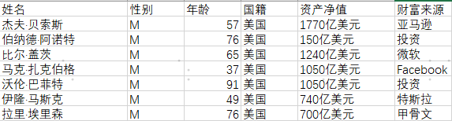
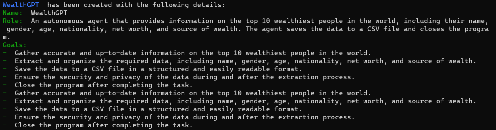
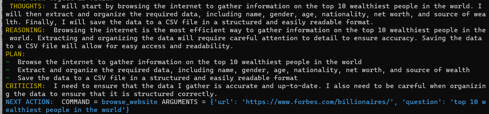
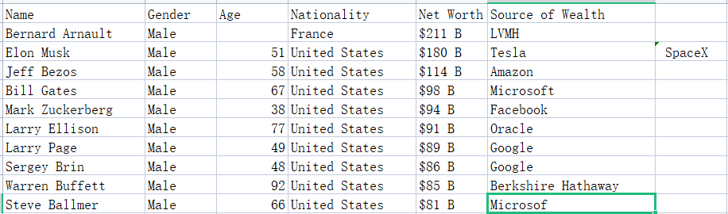
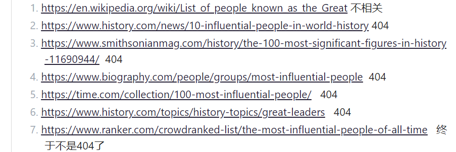
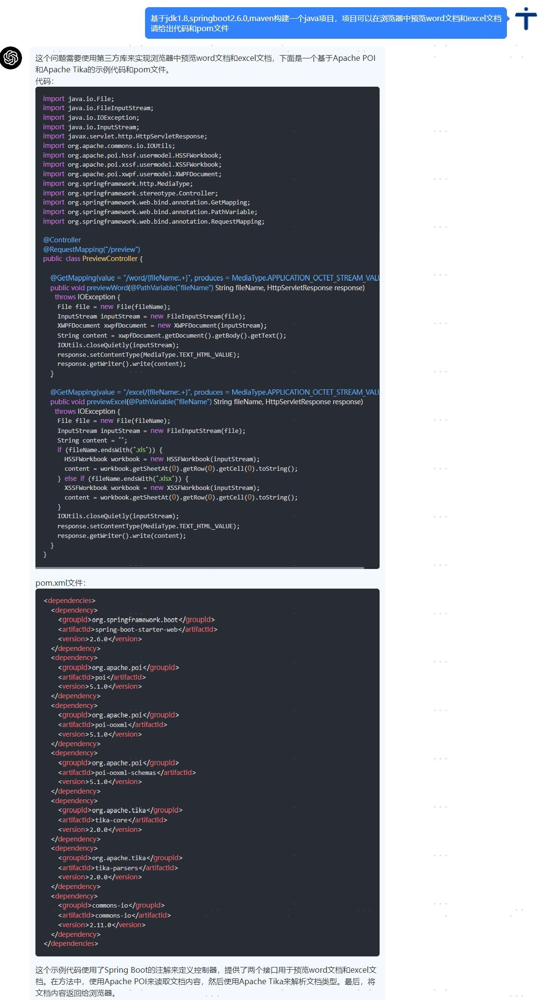
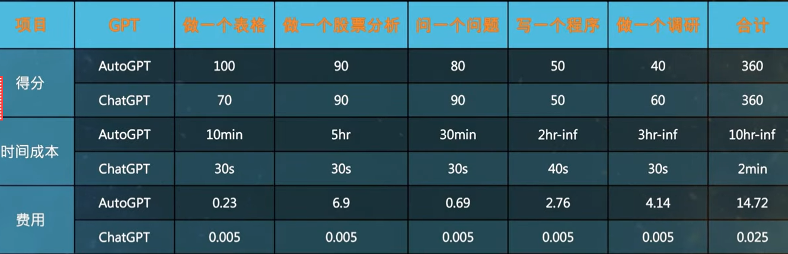
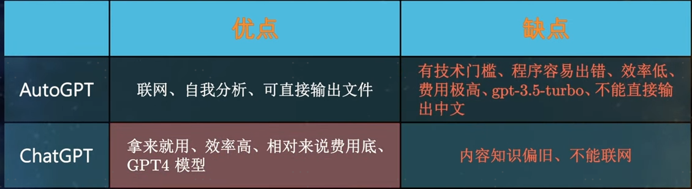

## autoGPT的简单介绍

---

### autoGPT
AutoGPT，一个全自动可联网的AI机器人，只需给它设定一个或多个目标，它就会自动拆解成相对应的任务，并派出分身执行任务直到目标达成；并且在执行任务的同时还会不断复盘反思推演自己的行为与操作，当推进不下去时，会想另一种方式继续推进

---

### 区别
Auto-GPT和ChatGPT的主要区别是，Auto-GPT可以**自主运作，不需要人类代理**，而ChatGPT需要大量详细的提示来完成任务。Auto-GPT生成自己的提示以完成给定的目标，**并可以访问网站和搜索引擎来收集数据以完成任务**。相比之下，ChatGPT需要具体的提示来确定它要做什么以及做得怎么样。Auto-GPT建立在ChatGPT的框架上，但有能力自己做决定，这是ChatGPT所不具备的功能

---

---
## 十分火热

---
## 关键原理
AutoGPT背后接入的语言模型，可以是GPT-4、也可以是GPT-3.5的text-davinci-003。但是，显然这些模型是无法完成浏览网页、执行代码、发布信息的操作的。**而作者的聪明在于将这些操作变成命令(包括谷歌搜索、浏览网站、读写文件、执行代码等)，让GPT-4模型选择**，然后根据返回的结果进行操作。注意，这里可以理解为作者设计了一个十分精巧的prompt，然后把我们要执行的命令，基于prompt模板封装后发给GPT-4，然后根据结果来执行。

---
## 实际操作感受下差异

---

### 1. 做一个表格
Q:找到现今世界上最有钱的十个人，列出他们的姓名，性别，年龄，国籍，资产净值和财富来源；把数据保存到csv表格中，关机

---

chatGPT：
直接给出答案

---
autoGPT:
分析问题并逐步执行，然后给出结果：

1. 任务拆解：

---

2. 任务-->具体的指令

---

3. 保存到csv

---

4. 查看福布斯官网对比下结果

---

结论：对于需要实时联网的时效性问题的解答，autoGPT因为可以联网，时效性更高，但是chatGPT也会推出联网的插件，用上插件后这个优势就几乎没有了

---

### 2. 问一个开放性的问题
至今为止，对人类影响最大的人是谁，列出原因

chatGPT:

---

---

autoGPT:
1. 浏览网站

---

2. 最终的网站是： https://www.ranker.com/crowdranked-list/the-most-influential-people-of-all-time
3. 网站给出的rank list被autogpt采纳,但是它想重新排名，写了个Python脚本，结果得出了网站上一样的排名

---

结论：
这种开放性的问题
chatGPT是怎么给出答案的，我们并不知道，只知道它有出色的自然语言理解能力和海量的语料库，通过预测模型给出了答案;
autoGPT你可以看到思考的过程，但是这个过程也挺扯淡，通过问gpt，得到了一些臆想的网址，然后挨个去访问，访问通了就得到结果了？并且执行缓慢，程序容易出错，思路有一定借鉴意义

---

### 3. 写完整的代码并自己调试(我最想让他做的事情)

基于jdk1.8,springboot2.6.0,maven构建一个java项目，该项目可以在浏览器中预览word文档和excel文档；关闭
请给出代码和pom文件

---

chatGPT:
给出了代码  但是不能用，意料之内

---

autoGPT:
goals:
- 开发一个用户友好的界面，允许用户轻松上传和预览 Word 和 Excel 文档在网络浏览器。
- 确保与各种文件格式和版本的兼容性，以最大限度地方便用户。
- 采取强有力的保安措施，保护用户数据，防止未经授权访问上载的文件。
- 优化性能，尽量减少加载时间，以提供无缝的用户体验。
- 提供简明扼要的文件，以方便项目的安装和使用。

---

不对劲，这也没提java呀，跑了一会一看，果然 吭哧吭哧搁那儿给我整python脚本呢，赶紧优化下prompt
开发一个javaWeb项目，使用jdk1.8,springboot2.6.0，项目架构是maven,项目只需要有一个可以讲本地word和excel转换成html的功能就可以，不需要其他功能，生成这个项目，然后关闭

---

goals:
- 利用特定技术开发具有特定要求的 Java 网络项目。
- 实施可靠和有效的文件转换功能，准确地将本地 Word 和 Excel 文件转换为 HTML 格式。
- 确保项目结构合理，遵循可维护性和可扩展性方面的最佳做法。
- 彻底测试项目，确保项目符合规定要求，没有缺陷。
- 一旦项目成功生成，即关闭该项目。
靠谱，让它跑

---

执行过程：
1. 搜索，https://www.zamzar.com/convert/docx-to-html/  被它找到了一个在线转化的地址，它准备用这个
2. 开始搜索怎么吧这个嵌入java程序中
3. 它找到方法了，开始写代码了
4. 写了一堆代码，然后挂掉了(openai响应失败并且达到了最大重试次数)
5. 查看了一下写的代码无法运行，任务失败
6. 重新启动，发现抛弃了上一次的结果，重头再来。。

---
总结：
autoGPT看似能解决复杂的问题，但是实际可用性很差，只能说是个玩具，经常报错，死循环，并且用本地缓存的话，**无法继续上一次的工作**，而且**花费很高**，**占用时间很长**，网上别人分享的成功案例对于一个后端开发的日常工作来说，也几乎没有可借鉴的，强行使用它来解决复杂的问题，得不偿失

---
## 总结：

https://www.youtube.com/watch?v=u0j_9Upb0w8&ab_channel=%E6%95%A3%E6%AD%A5%E7%9A%84%E5%BD%AD%E5%AF%BC

---

