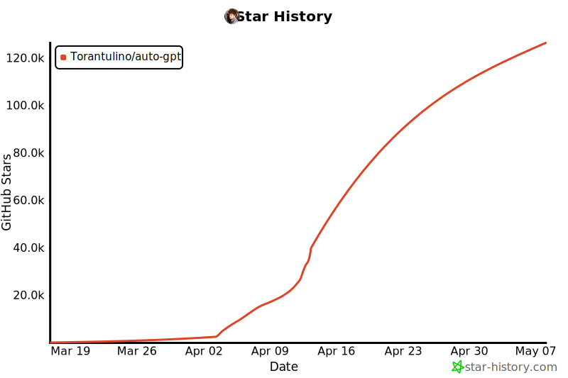
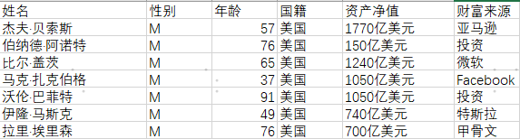
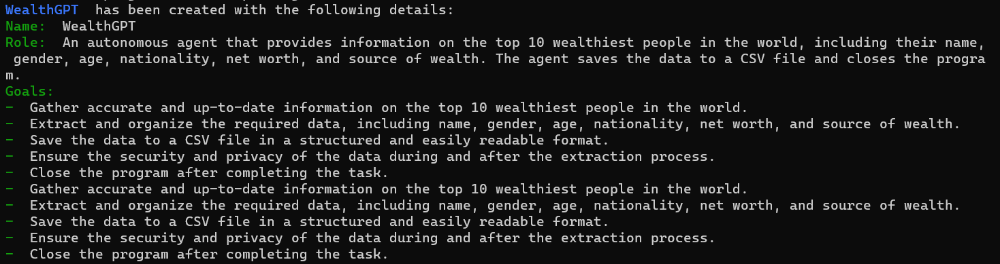
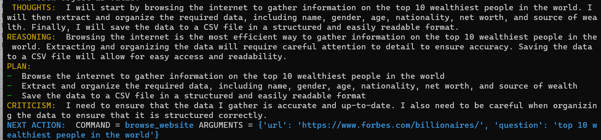
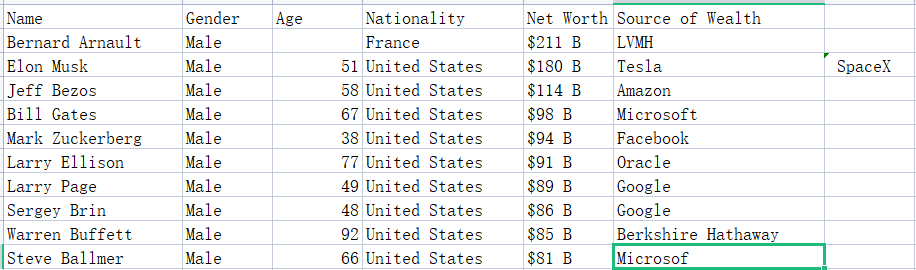
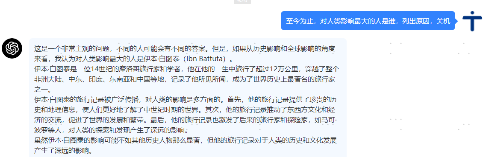
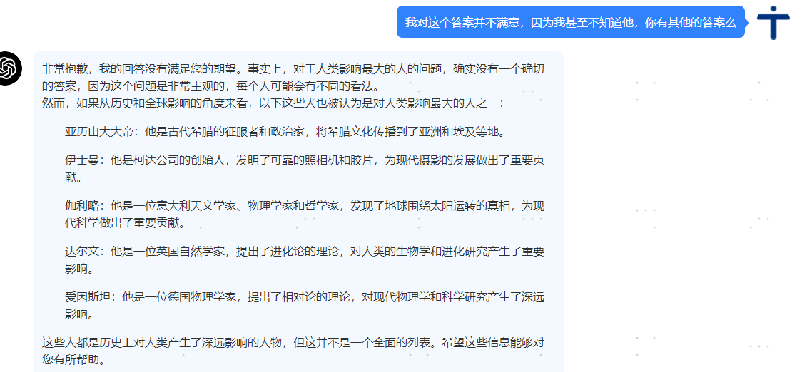
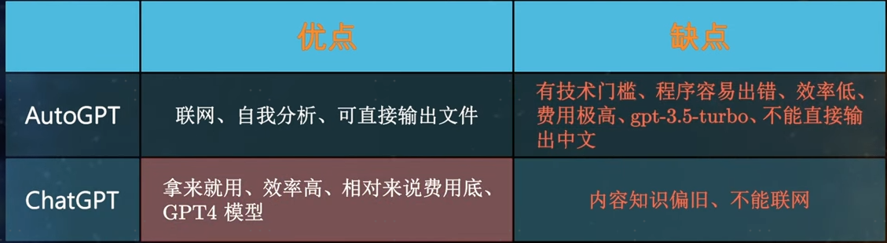

## 介绍

---

### chatGPT
ChatGPT是一个基于GPT架构的人工智能语言模型，它被设计用来在对话环境中产生类似人类的反应。它是在一个包括人类之间对话的大型文本数据库中训练出来的。ChatGPT可以针对各种应用进行微调，如聊天机器人开发、客户服务和个人助理。它被广泛用于自然语言处理领域，因为它有能力产生类似人类的反应，与上下文相关并吸引人

---

### autoGPT
AutoGPT，一个全自动可联网的AI机器人，只需给它设定一个或多个目标，它就会自动拆解成相对应的任务，并派出分身执行任务直到目标达成；并且在执行任务的同时还会不断复盘反思推演自己的行为与操作，当推进不下去时，会想另一种方式继续推进

---

### 区别
Auto-GPT和ChatGPT的主要区别是，Auto-GPT可以**自主运作，不需要人类代理**，而ChatGPT需要大量详细的提示来完成任务。Auto-GPT生成自己的提示以完成给定的目标，**并可以访问网站和搜索引擎来收集数据以完成任务**。相比之下，ChatGPT需要具体的提示来确定它要做什么以及做得怎么样。Auto-GPT建立在ChatGPT的框架上，但有能力自己做决定，这是ChatGPT所不具备的功能。Auto-GPT是[GPT-4](https://www.wbolt.com/how-to-use-gpt-4-free.html)和GPT-3.5的一个实验性开源接口，可以实现自我指导（自主）完成任务

---

---
## 十分火热

---
## 关键原理
AutoGPT背后接入的语言模型，可以是GPT-4、也可以是GPT-3.5的text-davinci-003。但是，显然这些模型是无法完成浏览网页、执行代码、发布信息的操作的。**而作者的聪明在于将这些操作变成命令(包括谷歌搜索、浏览网站、读写文件、执行代码等)，让GPT-4模型选择**，然后根据返回的结果进行操作。注意，这里可以理解为作者设计了一个十分精巧的prompt，然后把我们要执行的命令，基于prompt模板封装后发给GPT-4，然后根据结果来执行。

---
## 实际操作感受下差异

---

### 1. 做一个表格
Q:找到现今世界上最有钱的十个人，列出他们的姓名，性别，年龄，国籍，资产净值和财富来源；把数据保存到csv表格中，关机

---

chatGPT：
直接给出答案

---
autoGPT:
分析问题并逐步执行，然后给出结果：

1. 任务拆解：

---

2. 任务-->具体的指令

---

3. 保存到csv

---

4. 查看福布斯官网对比下结果

---

结论：对于需要实时联网的时效性问题的解答，autoGPT因为可以联网，所以准确性是可以保证的，但是chatGPT也会推出联网的插件，用上插件后这个优势就几乎没有了

---

### 2. 问一个开放性的问题
至今为止，对人类影响最大的人是谁，列出原因

chatGPT:

---

autoGPT:

---

---
## 总结：
