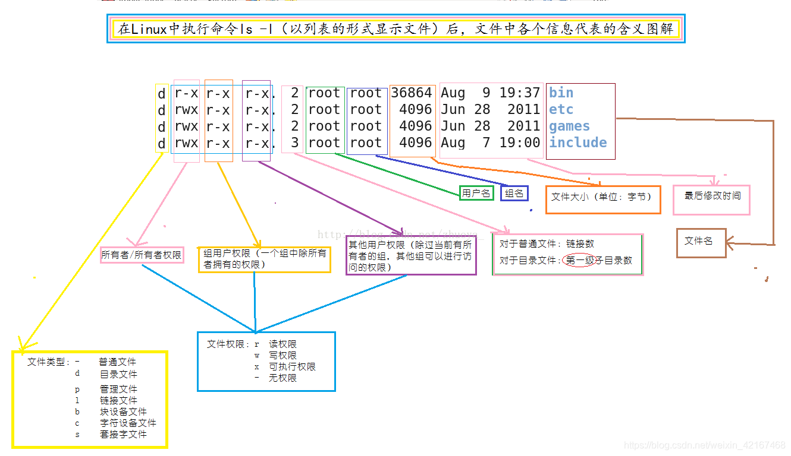

# 导航
pwd 
ls
cd

## ls
```bash
[root@VM-0-11-opencloudos bin]# ls -l /bin
lrwxrwxrwx 1 root root 7 Jan  8 04:59 /bin -> usr/bin
``` 
ls -l 一图解释 #flashcard 

<!--ID: 1718096044579-->
# 文件
## 指令 参数 空格
参数用空格来分隔 如果我们的参数里本身就带空格怎么办呢 用转义字符
 ```bash
 echo hello\ world
```
 或者用引号
 ```bash
echo "hello world"
```
 当我们创建文件 目录时，这个知识点比较有用
 ```bash
mkdir my photos 
```
 因为上面的命令会创建两个目录
 ```bash
 [root@VM-0-11-opencloudos home]# pwd
/home
[root@VM-0-11-opencloudos home]# ls
[root@VM-0-11-opencloudos home]# mkdir my photos
[root@VM-0-11-opencloudos home]# ls
my  photos
```

# 在程序间创建连接
`|` 管道符

# 软件管理
## 软件安装工具
ubuntu:
```bash
apt-get update 
apt-get install xxx
```
centos：
```bash
sudo yum install xxx
sudo yum update xxx
```