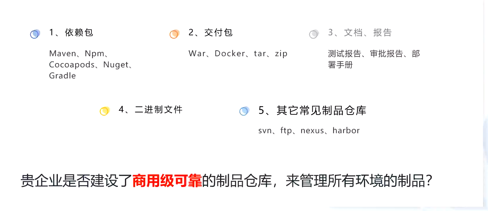
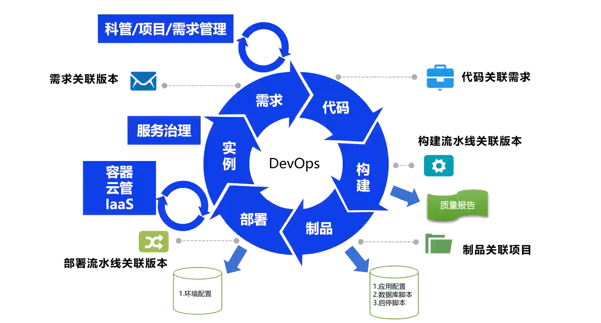

什么是制品

制品库顾名思义是**制品的仓库**，制品是**软件交付的成果性产物，通常是可运行的二进制形式**，因此制品库通常也被称之为二进制制品仓库

软件制品是指可在服务器上直接运行的二进制形式的文件，通常称之为二进制软件制品。 不同开发语言所产生的制品的获取、使用、共享方式不同，二进制制品仓库能够统一管理所有开发语言类型的二进制制品，同时无缝对接现有的标准化构建和发布工具。

业内： [jfrog](https://www.jfrogchina.com/blog/comprehend-artifactory/)   nexus

制品在流程中： 
